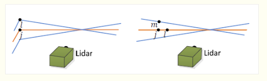
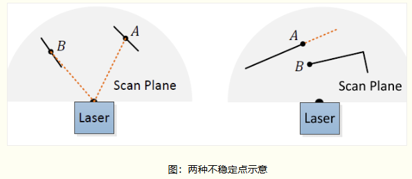
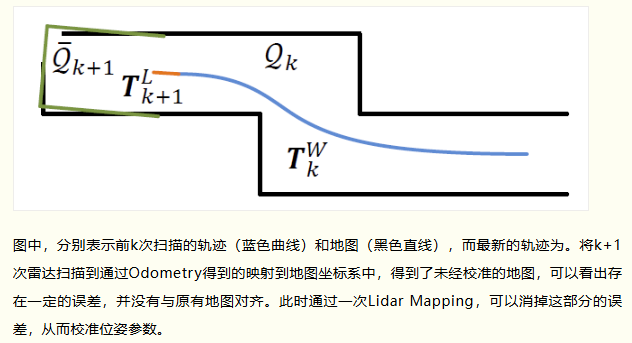
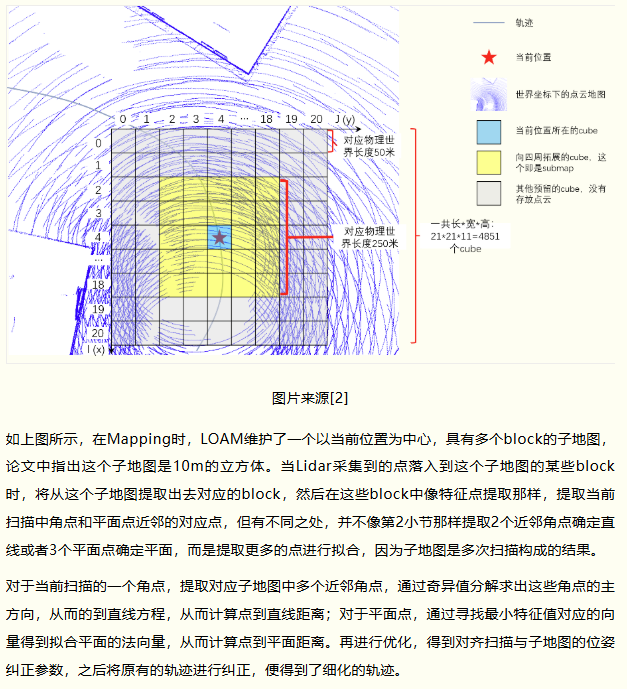

- [特征法LO](#特征法lo)
  - [LOAM lidar odometry part](#loam-lidar-odometry-part)
    - [计算角点到直线距离](#计算角点到直线距离)
    - [平面点到平面距离](#平面点到平面距离)
    - [其它细节](#其它细节)
  - [lidar mapping part](#lidar-mapping-part)

# 特征法LO

特征法激光雷达里程计（间接法激光雷达里程计）。先对点云提取一些简单的特征，对特征点进行配准，同时根据特征点本身的不同性质，采取不同的配准方法

LOAM(Lidar Odometry and Mapping)是经典的使用激光雷达完成定位与三维建图的算法,后续改进版本LeGO-LOAM，ALOAM，FLOAM，是自动驾驶行业中常用的开源方案，也是许多LIO系统的基础

对于一个多线激光雷达，应该提取什么样的特征

1. 特征应该能反应点云的特点
2. 可以使用ICP或NDT方法对这些特征点进行配准
3. 特征点提取不应占用太多计算资源
4. 整个系统应使用相同的计算机构，不希望数据在CPU和GPU上相互传输造成额外的耗时

## LOAM lidar odometry part

Lidar Odometry是通过Lidar的两次扫描匹配，使用icp计算这两次扫描之间Lidar的位姿变换，从而用作里程计Odometry,然而LOAM并没有采用全部的激光点进行匹配，而是筛选出了两类特征点，分别是角点和平面点

- 角点，是当前激光扫描线束上曲率较大的点(曲率$k=1/r$)；而平面点，即曲率较小的点
- 在匹配时，首先提取当前扫描中的角点和平面点，对于角点，可以认为是物理世界中直线元素的采样，所以计算到上一次扫描中对应直线的距离；而对于平面点，认为是物理世界平面元素的采样，所以计算到上一次扫描中对应平面的距离
- 通过不断优化，使距离最小，从而得到最优的位姿变换参数

### 计算角点到直线距离

假设：角点是雷达某个线束与物理世界两个平面夹角相交时的采样，那么这个线束相邻的雷达扫描线束也会与这个平面夹角相交，所以这个平面夹角的直线可以用前后两次扫描的角点进行标识

当获得当前某一个角点时，首先根据假设的运动参数（上一次运动参数作为这一次优化的初始），计算这个角点在上一次扫描时的坐标，之后查找上一次扫描中最近邻的角点，并在相邻的雷达扫描线束中搜索最近的角点，从而得到了直线方程，便能够计算点到之间距离

### 平面点到平面距离

计算平面点到对应平面距离时，也需要首先拿到平面的方程，即平面上一点与平面的法向量。与角点对应直线搜索方式类似，首先找上一次扫描中最近邻的平面点，之后在同一个扫描线数和不同的线束上各提取一个平面点，这样共得到了3个不共线的平面点，唯一确定了平面，从而计算平面点到平面的距离

### 其它细节

- 在角点和平面点的选择上，为了使分布更加均匀，通常将激光雷达一圈的扫描均匀分成几个部分，分别在每个部分中提取曲率最大（角点）和最小（平面点）的几个点。
- 在激光雷达的一次扫描过程中，由于运动，采集到的点云会有运动畸变，所以在LOAM中点云会通过预估的运动参数去畸变进行对齐
- 雷达扫描到的一些数据点是不稳定的，作者认为有两种不稳定数据点，如下图所示。一种是采集面与扫描面基本平行，另一种是被遮挡。在获得一次激光雷达扫描的点云后，这两种不稳定点会被首先去除

## lidar mapping part

Mapping部分的意义是，通过与多次扫描构成的地图进行匹配，得到Lidar Odometry中利用两帧之间计算位姿产生的漂移，从而对轨迹进行细化

LOAM一文中提出，可以通过IMU进行辅助。所谓“辅助”就是在激光雷达两次扫描之间，利用IMU得到较为准确的变化轨迹，从而进行点云畸变的去除，从而不需要靠上次扫描获得的运动参数插值对这次的畸变进行去除，能够提升精度
