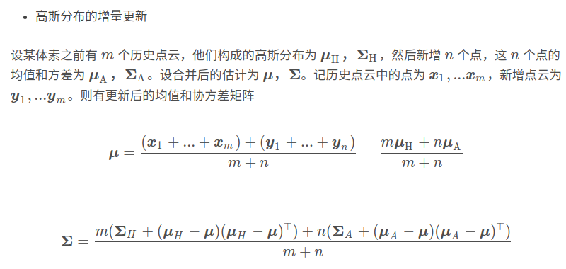

- [直接法激光里程计](#直接法激光里程计)
  - [直接式ndt](#直接式ndt)
  - [增量式ndt](#增量式ndt)

将多个点云配准、拼接在一起，形成局部地图，最终构建一个激光雷达里程计模块

# 直接法激光里程计

连续使用 Scan to Scan 方法，将下一帧数据与上一帧数据进行匹配，这种不需要提取特征点的激光雷达里程计被称为直接法激光雷达里程计

## 直接式ndt

## 增量式ndt

- 不必把过去的点云拼接在一起形成局部地图，而是把配准好的点云更新到NDT的每个体素内部
- 更新他们的高斯分布状态，再做下一步的配准
- 这种情况下，不必重新构建NDT内部状态，也不必重新构建Kd树
  - 在第一帧基础上划分体素，然后不断更新、增加体素，故称为增量式

两个关键：一是如何维护不断增加的体素，二是每个体素内的高斯参数应该如何改变

- 均值和方差的更新

- 体素的增量维护

除了体素内部的高斯分布应该随点云更新以外，由于机器人再运动，体素本身也应该随机器人运动增加．然而，如果考虑长时间使用这个里程计算法，我们应该将体素数量限制在一定范围内

- 设置一个队列,把最近更新的体素放到最前面。当整个队列超出预期容量时，就删除最旧的那部分体素
