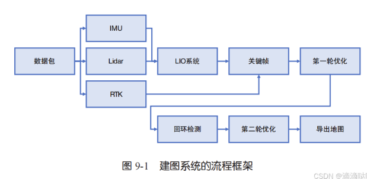
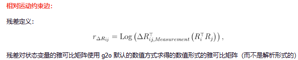

- [离线地图构建](#离线地图构建)
  - [点云建图](#点云建图)
  - [前端实现](#前端实现)
    - [前端流程](#前端流程)
  - [后端位姿图优化与异常值剔除](#后端位姿图优化与异常值剔除)
    - [两阶段优化流程](#两阶段优化流程)
  - [回环检测](#回环检测)
  - [地图导出](#地图导出)
  - [地图分块](#地图分块)
- [reference](#reference)

# 离线地图构建

完整的点云建图可以看成是一个 RTK、IMU、轮速计、激光的综合优化问题。大部分 L4 级别的自动驾驶任务都需要一张完整的、与 RTK 对准的点云地图来进行地图标注、高精定位等任务

## 点云建图

与在线 SLAM 系统不一样，地图构建系统完全可以工作在离线模式下。离线系统的一大好处是有很强的确定性。模块与模块之间也没有线程、资源上的调度问题，而在线系统往往要考虑线程间的等待关系



1. 解析IMU、RTK 和激光数据
2. 在 LIO 系统中按照一定距离来收集点云关键帧，然后按照 RTK 或组合导航的位姿给每个关键帧赋一个 RTK 位姿，作为观测（注意rtk是单天线还是双天线方案，单天线方案，仅有平移信息而不含位姿信息）
3. 使用 LIO 作为相邻帧运动观测，使用 RTK 位姿作为绝对坐标观测，优化整条轨迹并判定各关键帧的 RTK 有效性。这称为第一阶段优化。
   1. 如果 RTK 正常，此时我们会得到一条和 RTK 大致符合的轨迹。然而在实际环境中，RTK 会存在许多无效观测，我们也需要在算法中加以判定
4. 在上一步的基础上对地图进行回环检测。检测算法可以简单地使用基于位置（欧氏距离）的回环检测，并使用 NDT 或常见的配准算法计算它们的相对位姿。本例使用多分辨率的 NDT 匹配作为回环检测方法
5. 最后，我们再把这些信息放到统一的位姿图中进行优化，消除累计误差带来的重影，同时也移除 RTK 失效区域。这称为第二阶段优化
   1. 在确定了位姿以后，我们就按照这些位姿来导出点云地图。为了方便地图加载与查看，我们还会对点云地图进行切片处理。处理完之后的点云就可以用来进行高精定位或者地图标注了

## 前端实现

前端代码运行后会得到 每个关键帧对应的 LIO 位姿、RTK 位姿以及扫描到的点云 scan

### 前端流程

1. 将 ROS 包中的 RTK 数据提取出来，放在 RTK 消息队列中，按采集时间排序
2. 用第一个有效的 RTK 数据作为地图原点，将其他 RTK 读数减去地图原点后，作为 RTK 的位置观测
3. 用 IMU 和激光数据运行 IESKF LIO，得到当前 State (current_time_, R_, p_, v_, bg_, ba_)。然后根据当前 State 通过 Frontend::ExtractKeyFrame() 函数按照距离和角度阈值判断当前雷达 scan 是否为关键帧。如果是关键帧的话，通过插值获取当前 State 的 RTK 位姿

## 后端位姿图优化与异常值剔除

后端图优化需要包含以下因子

- RTK 因子：3 维的单元边（称为绝对位姿约束边），连接到每个关键帧，即顶点。误差为GNSS 估计位姿（由雷达位姿转换而来）与 RTK 位姿的平移差。当 RTK 存在外参（RTK 不在车辆中心）时，它的平移观测需要经过转换之后才能正确作用于车体的位移
- 雷达里程计因子：6 维的二元边（称为相对运动约束边），对每个关键帧，连接当前关键帧和后续 5 个关键帧。误差为两帧之间的相对运动差$T_{w1}^{-1} T_{w2}$
- 回环因子：和雷达里程计因子是同一种边，对所有的回环候选关键帧对添加相对运动约束边



### 两阶段优化流程

优化分为两阶段，顺序为 第一阶段优化$\rightarrow$回环检测$\rightarrow$第二阶段优化。在每阶段的优化中，又分别进行了两次优化

1. 首先使用 Optimization::Init() 函数初始化优化问题，加载关键帧参数及配置参数。若为第二阶段，则加载筛选后的回环检测。随后进入 Optimization::Run() 函数进行优化处理
2. 如果是单天线 RTK 方案（没有姿态信息），且处于第一阶段，就调用一次 ICP 将雷达位姿和 RTK 位姿对齐
3. 建立优化问题，包括优化器的创建、顶点（第一阶段使用 LIO 位姿作为顶点位姿估计值，这也是第一阶段第一次优化前 lidar 误差为 0 的原因；第二阶段使用第一阶段优化后的位姿作为估计值）创建、RTK 边创建（①带有鲁棒核函数②第二阶段的信息矩阵添加了0.01的乘积因子，降低了权重）、LIO 边的创建（没有鲁棒核函数）。若为第二阶段，则进行回环检测边的创建（带有鲁棒核函数）
4. 进行第一次优化，此时 RTK 边和 回环检测边 带有鲁棒核函数
5. 遍历回环检测边和 RTK 边，通过阈值筛选异常边，将异常边的等级设置为 1（表示不优化）；对于非异常边，去掉其鲁棒核函数
6. 进行第二次优化，得到某一阶段的最终优化结果
7. 保存结果。第一阶段优化结果保存到 opti_pose_1_，第二阶段优化结果保存到 opti_pose_2_

## 回环检测

使用基于位置（欧氏距离）的回环检测

1. 遍历第一阶段优化轨迹中的关键帧，对每两个在空间上相隔较近，但时间上存在一定距离的关键帧，进行一次回环检测。我们称这样一对关键帧为检查点。为了防止检查点数量太大，我们设置一个 ID 间隔，即每隔多少个关键帧取一次检查。实验当中这个间隔取 5
   1. 对每个关键帧 kf_first，遍历其之后的关键帧 kf_second，检查是否满足回环条件（距离小于 30 米）。若满足回环条件，则将其添加到候选回环对中
   2. 在整个过程中，使用 check_first 和 check_second 跟踪之前已添加为候选对的关键帧对，如果正在检查的关键帧 kf_first 离 check_first 的距离太近（ID 间隔小于 5），则跳过此关键帧进行下一个 kf_first
   3. 当 kf_first 满足距离条件，进而判断 kf_second 是否同时满足与 check_second （ID 间隔小于 5）以及 kf_first （ID 间隔小于 100）的距离条件
      1. 如果都满足则使用第一阶段优化位姿来计算并判定 kf_first 和 kf_second 之间的平移距离是否满足回环条件（距离小于 30 米），满足则添加到回环候选对当中
2. 并发计算候选回环对是否成立，对于每个候选回环对，我们使用 scan to map 的配准方式
   1. 对候选回环对中第一个关键帧 kf1 建立子地图（前后各 40 个关键帧，每隔 4 个关键帧选取一帧，共计 20 帧点云拼接，建立在世界坐标系下）
   2. 对第二个关键帧 kf2 只取其一帧点云。将点云与子地图进行多分辨率 NDT 配准，得到 kf2 世界坐标系下的位姿
   3. 与里程计方法不同，在回环检测配准过程中，我们经常要面对初值位姿估计很差的情况，希望算法不太依赖于给定的位姿初值。因此使用由粗至精的配准过程，即**多分辨率 NDT 配准**（体素分辨率 10.0, 5.0, 4.0, 3.0）
   4. 最后判断配准后的候选回环对中的 ndt_score_ 是否满足阈值，满足则视为成功的候选回环对
3. 记录所有成功经过筛选的回环候选对，并在第二阶段优化时读取回环检测的结果

## 地图导出

## 地图分块

在多数应用中，我们希望控制实时点云的载入规模，例如只加载自身周围 200 米范围内的点云，其他范围的点云则视情况卸载，这样可以控制实时系统的计算量。因此需要对大地图进行分块处理

地图分块的流程是：遍历每一个关键帧。对于当前关键帧，遍历其每一个点，对每个点的 x,y 坐标进行处理，判断其所属的网格并将其插入到对应的子地图块中

这里对每个点的 x,y 坐标进行如下处理

```cpp
// floor()：向下取整。-50 是为了使包含原 (0,0) 的区域不被分开,形成以 (0,0) 为中心的块
int gx = floor((pt.x - 50.0) / 100);
int gy = floor((pt.y - 50.0) / 100);
```

# reference

-[自动驾驶车辆的离线地图构建](https://blog.csdn.net/m0_49384824/article/details/145064956)
