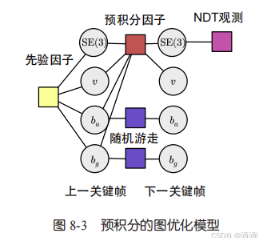
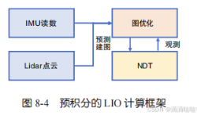
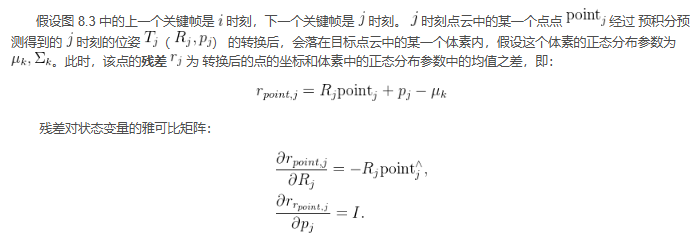
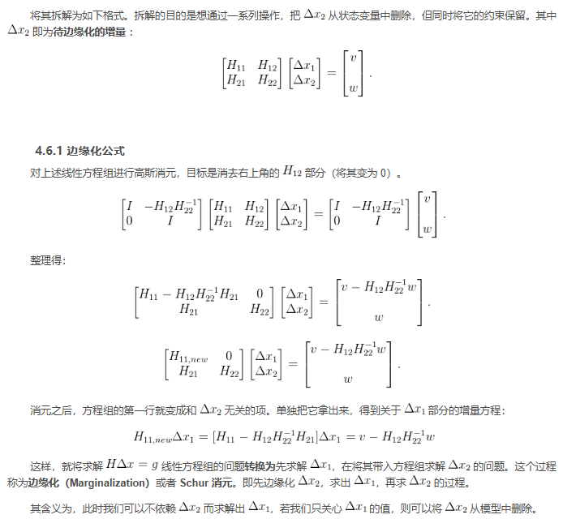
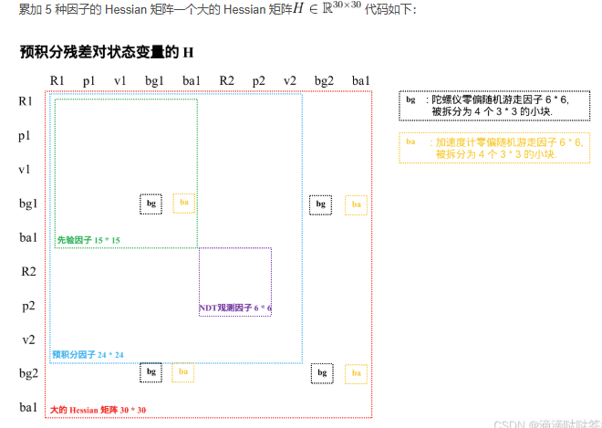
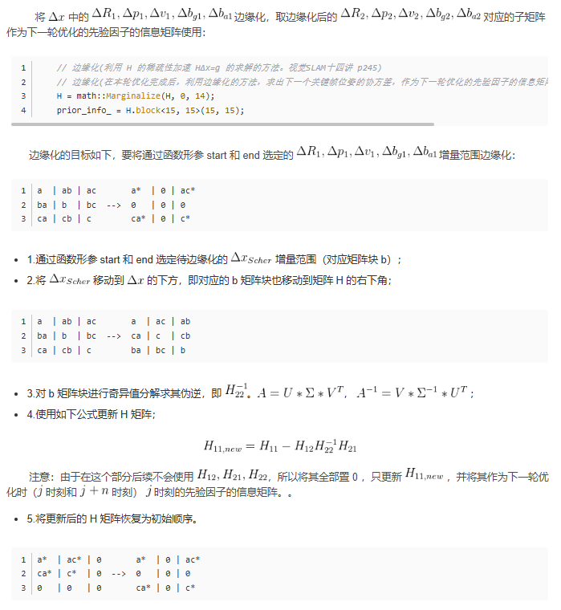

- [tightly coupled 紧耦合](#tightly-coupled-紧耦合)
  - [紧耦合与松耦合](#紧耦合与松耦合)
- [based IEKF LIO](#based-iekf-lio)
  - [IEKF LIO 系统流程](#iekf-lio-系统流程)
  - [IESKF 的状态变量和运动过程](#ieskf-的状态变量和运动过程)
  - [预测过程](#预测过程)
  - [观测过程](#观测过程)
  - [更新过程](#更新过程)
  - [紧耦合 LIO 系统的主要流程](#紧耦合-lio-系统的主要流程)
  - [紧耦合系统的配准](#紧耦合系统的配准)
- [基于预积分和图优化的紧耦合 LIO 系统](#基于预积分和图优化的紧耦合-lio-系统)
  - [预积分应用的经验](#预积分应用的经验)
  - [预积分图优化的顶点和边](#预积分图优化的顶点和边)
    - [ndt残差边(观测值维度为 3 维的单元边)](#ndt残差边观测值维度为-3-维的单元边)
  - [基于预积分和图优化 LIO 系统的实现](#基于预积分和图优化-lio-系统的实现)
    - [imu静止初始化](#imu静止初始化)
    - [使用预积分预测](#使用预积分预测)
    - [使用 IMU 预测位姿进行运动补偿](#使用-imu-预测位姿进行运动补偿)
    - [位姿配准](#位姿配准)
    - [图优化](#图优化)
    - [边缘化](#边缘化)
      - [边缘化过程](#边缘化过程)
- [reference](#reference)

# tightly coupled 紧耦合

只要状态估计系统考虑了个传感器的内在性质，而非模块化的将它们的输出进行融合，就能称为紧耦合

- imu（或INS）的紧耦合:考虑imu观测噪声和零偏的系统
- 激光的紧耦合:考虑激光的配准残差
- 视觉的紧耦合:考虑视觉特征点的重投影误差
- rtk的紧耦合:考虑RTK的搜星数、细分状态


## 紧耦合与松耦合

若各算法工作正常，紧耦合与松耦合可能没有显著差异，然而在实际系统中往往不现实。单独的imu系统若没有速度和位置的观测，会很快发散；单独的雷达与视觉里程计，在场景结构不良的场合，也可能出现丢失退化问题。

- 在松耦合系统中，若一个模块失效，就必须在逻辑上识别它的失效再想办法恢复正常状态
- 在紧耦合系统中，一个模块的工作状态能够直接反映到另一个模块，帮助它们更好约束自身的工作维度
  - 在松耦合LIO中车辆经过某段退化区域，那么单独以点云匹配方式推算雷达里程计容易失效，解空间存在额外自由度，会给出错误的位姿估计，带偏整个系统
  - 而紧耦合中的状态还会收到其它传感器的约束，这些自由度会被别的模块约束在一个固定范围，使系统仍然工作在有效状态

# based IEKF LIO

||紧耦合LIO (IESKF)|松耦合|
|---|---|---|
|预测|使用imu读数预测得到先验位姿|同|
|观测|使用滤波器预测得到先验位姿（首次）和更新后位姿（后续迭代）计算点云残差|使用点云配准部分迭代优化得到的位姿作为观测值，观测过程本身不迭代|
|更新|多次迭代，直到更新量dx满足要求，每次迭代都会以上一次更新的位姿来重新计算点云残差|一次更新|

## IEKF LIO 系统流程

基于 IESKF 的紧耦合 LIO 系统的流程图如下所示


## IESKF 的状态变量和运动过程

 IESKF 的状态变量及运动过程 和 前文介绍过的 ESKF 的状态变量及运动过程完全相同，包括：① 对名义状态变量的预测 ②对误差状态变量的预测及对协方差矩阵的递推

## 预测过程

对名义状态变量的预测

对误差状态变量的预测以及均值、协方差矩阵的递推


这里的协方差矩阵就是对各变量的jacobian矩阵

离散时间下误差状态变量的运动方程如下


## 观测过程

在紧耦合中需要把ndt或者icp的残差直接写入观测方程，这会让观测方程维度变大，可以参考卡尔曼滤波器中的（SMW恒等式）


## 更新过程

- NDT 和 卡尔曼滤波的联系

紧耦合 LIO 系统看成带 IMU 预测的高维 NDT 或 ICP，并且这些预测分布还会被推导至下一时刻

IESKF 的更新过程的流程图如下


## 紧耦合 LIO 系统的主要流程

紧耦合 LioIEKF 类持有一个 IncNdt3d（增量 NDT，与松耦合不同）对象，一个 ESKF 对象，一个 MessageSync 对象 处理同步之后的点云和 IMU

1. 当 MeasureGroup 到达后，在 IMU 未初始化时，使用第 3 章的静止初始化来估计 IMU 零偏。初始化完毕后，先使用 IMU 数据进行预测，再用预测数据对点云去畸变，最后对去畸变的点云做配准
   1. imu静止初始化与松耦合的不同点：IESKF 协方差矩阵初始化时设置了R部分的协方差矩阵
2. 使用 IMU 预测：与松耦合相同
3. 使用 IMU 预测位姿进行雷达点云运动补偿：与松耦合相同
4. 紧耦合系统的配准

## 紧耦合系统的配准

1. 得到去畸变的点云后，将其作为 source 部分传递给增量 NDT 类 IncNdt3d ，然后开始滤波器的更新过程
2. 在滤波器更新过程的第 i 次迭代过程中，首先调用IncNdt3d::ComputeResidualAndJacobians() 计算函数在 NDT 内部使用滤波器预测得到的先验位姿（首次）和更新后位姿（后续迭代）的计算点云残差$H_{i}^{T}V^{-1}H_{i}$与$H_{i}^{T}V^{-1}r_{i}$
3. $H_{i}^{T}V^{-1}H_{i}$与$H_{i}^{T}V^{-1}r_{i}$(对照gauss-newton增量方程：前者类似H矩阵，后者类似b矩阵 H$\delta x=b$)(和松耦合中不同，没有使用 增量 NDT 中的 IncNdt3d::AlignNdt() 配准函数迭代优化位姿)
4. 然后将这两个表示点云残差的值传递到 IESKF 中，结合预测协方差矩阵$P$计算得到当前迭代过程的增量$\partial x$ ，最后将增量代入名义状态变量$x_{i+1} = x_i + \partial x$，进而得到下一次迭代的$x_{i+1} P_{i+1}$直到滤波器收敛
5. 滤波器收敛后再根据卡尔曼公式计算得到后验位姿作为当前雷达 scan 的位姿
6. 最后根据当前雷达 scan 的位姿判断 scan 是否为关键帧，若为关键帧则添加到 local map中
7. 在这个过程中滤波器部分和 NDT 部分是耦合的，是将点云残差写入到了滤波器的观测过程中


# 基于预积分和图优化的紧耦合 LIO 系统

相比滤波器方法来说，预积分因子可以更方便地整合到现有的优化框架中，从开发到实现都更为便捷

- 在实现当中，预积分的使用方式是相当灵活的，要设置的参数也比 EKF 系统更多
- LIO-SAM 把预积分因子与雷达里程计的因子相结合，来构建整个优化问题
- 在 VSLAM 系统里，也可以把预积分因子与重投影误差结合起来去求解 Bundle Adjustment

## 预积分应用的经验

1. 预积分因子通常关联两个关键帧的高维状态(典型的15维状态 $p,r,v,b_g,b_a$ )
   1. 在转换为图优化问题时，我们可以选择
      1. 把各顶点分开处理，例如 SE(3) 一个顶点，v 占一个顶点，然后让一个预积分边关联到 8 个顶点上（选择这种散装形式）
      2. 也可以选择把高维状态写成一个顶点，而预积分边关联两个顶点，但雅可比矩阵含有大量的零块
2. 由于预积分因子关联的变量较多，且观测量大部分是状态变量的差值，我们应该对状态变量有足够的观测和约束，否则整个状态变量容易在零空间内自由变动
   1. 例如预积分的速度观测描述了两个关键帧速度之差。如果我们将两个关键帧的速度都增量固定值，也可以让速度项误差保持不变，而在位移项施加一些调整，还能让位移部分观测保持不变
   2. 因此，在实际使用中，我们会给前一个关键帧施加先验约束，给后一个关键帧施加观测约束，让整个优化问题限制在一定的范围内
3. 预积分的图优化模型如下图
   1. 我们在对两个关键帧计算优化时，为上一个关键帧添加一个先验因子
   2. 然后在两个帧间添加预积分因子和零偏随机游走因子
   3. 最后在下一个关键帧中添加 NDT 观测的位姿约束
   4. 在本轮优化完成后，我们利用边缘化方法，求出下一关键帧位姿的协方差矩阵，作为下一轮优化的先验因子来使用



4. 注意到雷达里程计的观测位姿是依赖预测数据（初始值）的，这和 RTK 的位姿观测（绝对位姿观测）有着本质区别
   1. 如果 RTK 信号良好，我们可以认为 RTK 的观测有着固定的精度，此时滤波器和图优化器都可以保证在位移和旋转方面收敛
   2. 然而，如果雷达里程计使用一个不准确的预测位姿，它很有可能给出一个不正常的观测位姿，进而使整个 LIO 发散
   3. 导致了基于图优化的 LIO 系统调试难度要明显大于 GINS 系统
5. 我们仍然使用前文所用的 LIO 框架，只是将原先 IESKF 处理的预测和观测部分，变为预积分器的预测和观测部分（在实际的系统中，也可以将滤波器作为前端，把图优化当成关键帧后端来使用）
   1. 整个 LIO 的计算框架图如下图所示。我们会在两个点云之间使用预积分进行优化
   2. 当然，预积分的使用方式十分灵活，也可以使用更长时间的预积分优化，或者将 NDT 内部的残差放到图优化中
   3. 但相对的，由于预积分因子关联的顶点较多，实际调试会比较困难，容易造成误差发散的情况。从一个现有系统出发再进行后端优化是个不错的选择



## 预积分图优化的顶点和边

图优化的顶点为15维$p,r,v,b_g,b_a$

图优化边包括

1. 预积分边（观测值维度为 9 维的多元边）
2. 零偏随机游走边（观测值维度为 3 维的双元边）
3. 先验因子边（观测值维度为 15 维的多元边）
4. NDT 观测边（观测值维度为 6 维的单元边）：和双天线的 GNSS 观测边一致

### ndt残差边(观测值维度为 3 维的单元边)

在iekf中考虑了 IMU 的观测噪声和零偏，又考虑了激光的配准残差（NDT 残差），所以可以称之为紧耦合的 LIO 系统；但是在这里，我们只考虑的 IMU 的观测噪声和零偏，并没有考虑点云的配准残差，严格来说不能称之为紧耦合的 LIO 系统



## 基于预积分和图优化 LIO 系统的实现

基于预积分的紧耦合 LioPreinteg类 持有一个 IncNdt3d 对象，一个 IMUPreintegration 对象，一个 MessageSync 对象 处理同步之后的点云和 IMU。

该类处理流程非常简单：当 MeasureGroup 到达后，在 IMU 未初始化时，使用静止初始化估计 IMU 零偏。初始化完毕后，预积分 IMU 数据进行预测，再用预测数据对点云去畸变，最后对去畸变的点云做配准

### imu静止初始化

1. 当 MeasureGroup 到达后，在 IMU 未初始化时，调用 StaticIMUInit::AddIMU() 函数进行 IMU的静止初始化
2. 当 IMU 初始化成功时，在当前 MeasureGroup 中使用 IMU 静止初始化结果初始化了 陀螺仪和加速度计的噪声标准差、初始的$b_g b_a$
3. 预积分类IMUPreintegration（在其构造中使用陀螺仪和加速度计的噪声方差初始化了 IMU 测量噪声的协方差矩阵）

### 使用预积分预测

和基于 IESKF 的紧耦合 LIO 系统不同，这里使用了 IMU 预积分进行预测

```cpp
void LioPreinteg::Predict() {
    // 这里会清空 imu_states_ ，所以在每接收一个 MeasureGroup 时，imu_states_ 中会存储 measures_.imu_.size() + 1 个数据，用于去畸变
    imu_states_.clear();
    imu_states_.emplace_back(last_nav_state_);
 
    /// 对IMU状态进行预测
    for (auto &imu : measures_.imu_) {
        if (last_imu_ != nullptr) {
            preinteg_->Integrate(*imu, imu->timestamp_ - last_imu_->timestamp_);
        }
 
        last_imu_ = imu;
        imu_states_.emplace_back(preinteg_->Predict(last_nav_state_, imu_init_.GetGravity()));
    }
}
```

### 使用 IMU 预测位姿进行运动补偿

### 位姿配准

- 在配准时，使用预积分给出的预测位姿作为增量NDT里程计的初始位姿输入
- 迭代得到优化后的位姿，将优化后的位姿作为观测值进行优化(即作为$R_j p_j$的初始估计值)

### 图优化

图优化部分基本上和基于预积分和图优化的gins一样，但有以下不同之处

1. 使用了NDT优化后的位姿作为j时刻位姿顶点的初始估计值，而没有使用预积分预测的位姿
2. 在优化过程中，使用`setFixed`函数将j时刻的$b_g b_a$节点作为固定节点，不进行优化
3. 对于$H \Delta x = g$ 我们想将 $\Delta x $ 中的 $\Delta R_1$ $\Delta p_1$ $\Delta v_1$ $\Delta b_{g1}$ $\Delta b_{a1}$　边缘化（对应 Hessian 矩阵中 15x15 的$H_{22}$ ，要求其逆，从而消去$H_{12}$，边缘化$\Delta x_{Scher}$，得到 j 时刻状态的信息矩阵(更新后的15*15$H_{11,new}$)作为下一轮优化时(j时刻和j+n时刻)j时刻先验因子的信息矩阵
4. 对速度进行限制

### 边缘化

优化问题具有如下通用形式

$$
H \Delta x = g
$$



#### 边缘化过程

图优化完毕后，把5种因子（预积分因子、2个零偏随机游走因子、先验因子和NDT观测因子）的海塞 (Hessian) 矩阵按照顺序累加组合成一个大的 Hessian 矩阵H(30*30)

- 对于$H \Delta x = g$，想将$\Delta x$中的$\Delta R_1$ $\Delta p_1$ $\Delta v_1$ $\Delta b_{g1}$ $\Delta b_{a1}$边缘化(将待边缘化的变量移动到$\Delta x$下后方，对应hessian矩阵中15*15的 $H_{22}$，要求其逆，从而消去$H_{12}$,边缘化$\Delta x_{Scher}$)
- 得到 j 时刻状态的信息矩阵（更新后15*15的$H_{11,new}$）作为下一轮优化时(j时刻和j+n时刻)j时刻先验因子的信息矩阵



```cpp
    // gauss-newton 迭代中累加Hessian和error,计算dx类似。一共 5 种类型的边，在累加Hessian都要考虑上。
    // 计算当前时刻先验
    // 构建hessian
    // 15x2，顺序：v0_pose, v0_vel, v0_bg, v0_ba, v1_pose, v1_vel, v1_bg, v1_ba
    //            0       6        9     12     15        21      24     27
    Eigen::Matrix<double, 30, 30> H;
    H.setZero();
 
    // ①添加 预积分因子的 Hessian 矩阵
    H.block<24, 24>(0, 0) += edge_inertial->GetHessian();
 
    // ②添加 陀螺仪零偏随机游走因子 的 Hessian 矩阵
    Eigen::Matrix<double, 6, 6> Hgr = edge_gyro_rw->GetHessian();
    // 行: bg1 列: bg1 
    H.block<3, 3>(9, 9) += Hgr.block<3, 3>(0, 0);
    // 行: bg1 列: bg2
    H.block<3, 3>(9, 24) += Hgr.block<3, 3>(0, 3);
    // 行: bg2 列: bg1
    H.block<3, 3>(24, 9) += Hgr.block<3, 3>(3, 0);
    // 行: bg2 列: bg2
    H.block<3, 3>(24, 24) += Hgr.block<3, 3>(3, 3);
 
    // ③添加 加速度计零偏随机游走因子 的 Hessian 矩阵
    Eigen::Matrix<double, 6, 6> Har = edge_acc_rw->GetHessian();
    H.block<3, 3>(12, 12) += Har.block<3, 3>(0, 0);
    H.block<3, 3>(12, 27) += Har.block<3, 3>(0, 3);
    H.block<3, 3>(27, 12) += Har.block<3, 3>(3, 0);
    H.block<3, 3>(27, 27) += Har.block<3, 3>(3, 3);
 
    // ④添加 先验因子 的 Hessian 矩阵
    H.block<15, 15>(0, 0) += edge_prior->GetHessian();
    // ⑤添加 NDT 观测因子的 Hessian 矩阵
    H.block<6, 6>(15, 15) += edge_ndt->GetHessian();
 
    // 边缘化(利用 H 的稀疏性加速 HΔx=g 的求解的方法。视觉SLAM十四讲 p245)
    // 边缘化(在本轮优化完成后，利用边缘化的方法，求出下一个关键帧位姿的协方差，作为下一轮优化的先验因子的信息矩阵使用。sad p320)
    H = math::Marginalize(H, 0, 14);
    prior_info_ = H.block<15, 15>(15, 15);
```



具体代码如下

```cpp
/**
 * 边缘化。视觉SLAM十四讲。p 249
 * @param H
 * @param start
 * @param end
 * @return
 */
inline Eigen::MatrixXd Marginalize(const Eigen::MatrixXd& H, const int& start, const int& end) {
    // ① 通过函数形参 start 和 end 选定待边缘化的 Δx_(Scher) 增量范围（对应矩阵块 b）
    // Goal
    // a  | ab | ac       a*  | 0 | ac*
    // ba | b  | bc  -->  0   | 0 | 0
    // ca | cb | c        ca* | 0 | c*
 
    // Size of block before block to marginalize 
    const int a = start;
    // Size of block to marginalize
    const int b = end - start + 1;
    // Size of block after block to marginalize
    const int c = H.cols() - (end + 1);
 
    // ② 将 Δx_(Scher) 移动到 Δx 的下方，即对应的 b 矩阵块也移动到矩阵 H 的右下角
    // Reorder as follows:
    // a  | ab | ac       a  | ac | ab
    // ba | b  | bc  -->  ca | c  | cb
    // ca | cb | c        ba | bc | b
 
    Eigen::MatrixXd Hn = Eigen::MatrixXd::Zero(H.rows(), H.cols());
    // block函数：block(startRow, startCol, rows, cols);
    if (a > 0) {
        Hn.block(0, 0, a, a) = H.block(0, 0, a, a);
        Hn.block(0, a + c, a, b) = H.block(0, a, a, b);
        Hn.block(a + c, 0, b, a) = H.block(a, 0, b, a);
    }
    if (a > 0 && c > 0) {
        Hn.block(0, a, a, c) = H.block(0, a + b, a, c);
        Hn.block(a, 0, c, a) = H.block(a + b, 0, c, a);
    }
    if (c > 0) {
        Hn.block(a, a, c, c) = H.block(a + b, a + b, c, c);
        Hn.block(a, a + c, c, b) = H.block(a + b, a, c, b);
        Hn.block(a + c, a, b, c) = H.block(a, a + b, b, c);
    }
    Hn.block(a + c, a + c, b, b) = H.block(a, a, b, b);
 
    // ③ 对 b 矩阵块进行奇异值分解求其伪逆，即 H22^-1。A = U*Σ*V^T    A^-1 = V*Σ^-1*U^T
    // Perform marginalization (Schur complement)
    Eigen::JacobiSVD<Eigen::MatrixXd> svd(Hn.block(a + c, a + c, b, b), Eigen::ComputeThinU | Eigen::ComputeThinV);
    // 返回奇异值矩阵 Σ，即对角矩阵，其中每个对角元素都是 b 矩阵块 的奇异值。
    Eigen::JacobiSVD<Eigen::MatrixXd>::SingularValuesType singularValues_inv = svd.singularValues();
    // 计算 Σ^-1
    for (int i = 0; i < b; ++i) {
        if (singularValues_inv(i) > 1e-6) singularValues_inv(i) = 1.0 / singularValues_inv(i);
        else
            singularValues_inv(i) = 0;
    }
    // 使用奇异值分解法求 b 矩阵块的伪逆。A^-1 = V*Σ^-1*U^T
    Eigen::MatrixXd invHb = svd.matrixV() * singularValues_inv.asDiagonal() * svd.matrixU().transpose();
    // ④ 使用公式更新 H 矩阵
    // H11 = H11 - H12 * H22^-1 * H21
    // H12 = 0
    // H21 = H21
    // H22 = H22
    Hn.block(0, 0, a + c, a + c) =
        Hn.block(0, 0, a + c, a + c) - Hn.block(0, a + c, a + c, b) * invHb * Hn.block(a + c, 0, b, a + c);
    Hn.block(a + c, a + c, b, b) = Eigen::MatrixXd::Zero(b, b);
    Hn.block(0, a + c, a + c, b) = Eigen::MatrixXd::Zero(a + c, b);
    Hn.block(a + c, 0, b, a + c) = Eigen::MatrixXd::Zero(b, a + c);
 
    // ⑤将更新后的 H 矩阵恢复为初始顺序
    // Inverse reorder
    // a*  | ac* | 0       a*  | 0 | ac*
    // ca* | c*  | 0  -->  0   | 0 | 0
    // 0   | 0   | 0       ca* | 0 | c*
    Eigen::MatrixXd res = Eigen::MatrixXd::Zero(H.rows(), H.cols());
    if (a > 0) {
        res.block(0, 0, a, a) = Hn.block(0, 0, a, a);
        res.block(0, a, a, b) = Hn.block(0, a + c, a, b);
        res.block(a, 0, b, a) = Hn.block(a + c, 0, b, a);
    }
    if (a > 0 && c > 0) {
        res.block(0, a + b, a, c) = Hn.block(0, a, a, c);
        res.block(a + b, 0, c, a) = Hn.block(a, 0, c, a);
    }
    if (c > 0) {
        res.block(a + b, a + b, c, c) = Hn.block(a, a, c, c);
        res.block(a + b, a, c, b) = Hn.block(a, a + c, c, b);
        res.block(a, a + b, b, c) = Hn.block(a + c, a, b, c);
    }
 
    res.block(a, a, b, b) = Hn.block(a + c, a + c, b, b);
 
    return res;
}
```

# reference

- [基于 IESKF 的紧耦合 LIO 系统](https://blog.csdn.net/m0_49384824/article/details/145100537)
- [基于预积分和图优化的紧耦合 LIO 系统](https://blog.csdn.net/m0_49384824/article/details/145231150)
