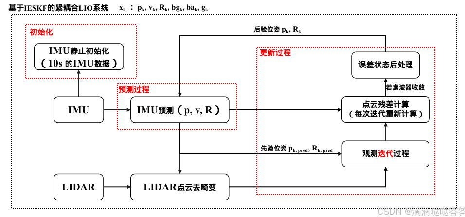
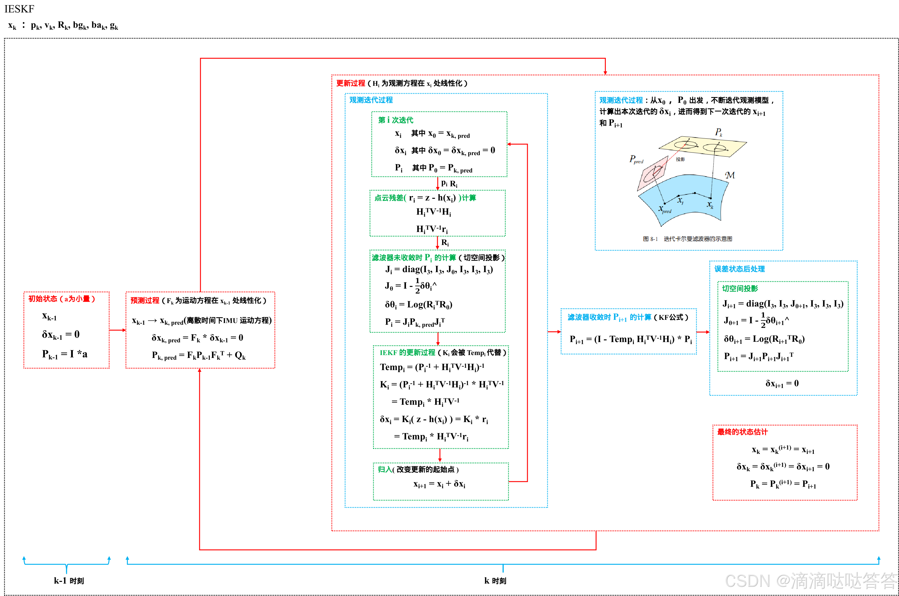
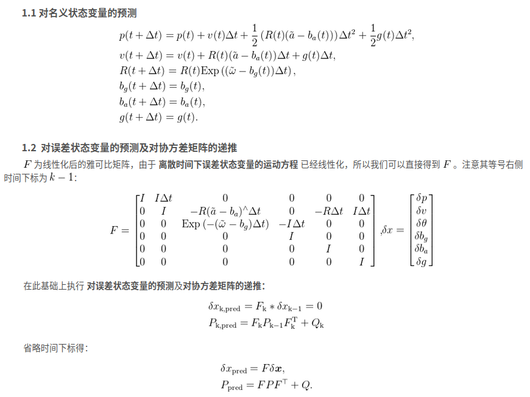
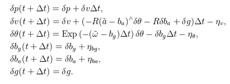
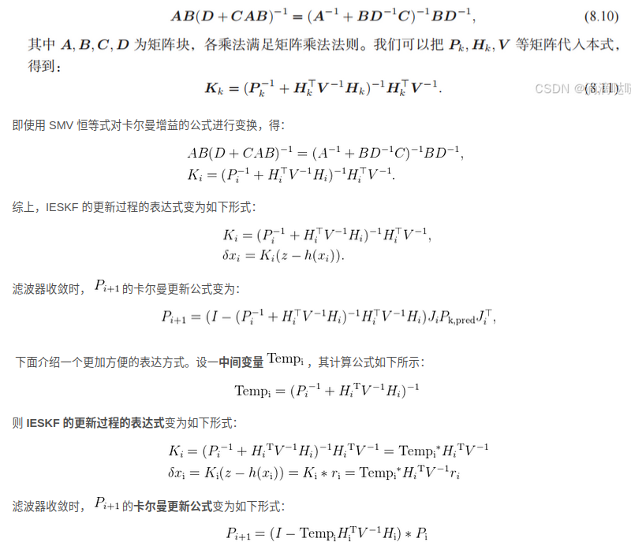
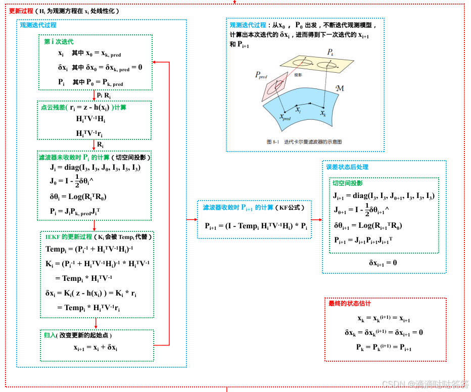
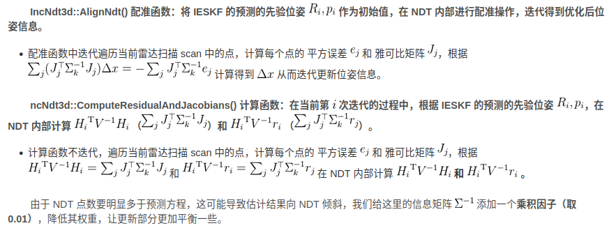

- [tightly coupled 紧耦合](#tightly-coupled-紧耦合)
  - [紧耦合与松耦合](#紧耦合与松耦合)
- [based IEKF LIO](#based-iekf-lio)
  - [IEKF LIO 系统流程](#iekf-lio-系统流程)
  - [IESKF 的状态变量和运动过程](#ieskf-的状态变量和运动过程)
  - [预测过程](#预测过程)
  - [观测过程](#观测过程)
  - [更新过程](#更新过程)
  - [紧耦合 LIO 系统的主要流程](#紧耦合-lio-系统的主要流程)
  - [紧耦合系统的配准](#紧耦合系统的配准)

# tightly coupled 紧耦合

只要状态估计系统考虑了个传感器的内在性质，而非模块化的将它们的输出进行融合，就能称为紧耦合

- imu（或INS）的紧耦合:考虑imu观测噪声和零偏的系统
- 激光的紧耦合:考虑激光的配准残差
- 视觉的紧耦合:考虑视觉特征点的重投影误差
- rtk的紧耦合:考虑RTK的搜星数、细分状态

## 紧耦合与松耦合

若各算法工作正常，紧耦合与松耦合可能没有显著差异，然而在实际系统中往往不现实。单独的imu系统若没有速度和位置的观测，会很快发散；单独的雷达与视觉里程计，在场景结构不良的场合，也可能出现丢失退化问题。

- 在松耦合系统中，若一个模块失效，就必须在逻辑上识别它的失效再想办法恢复正常状态
- 在紧耦合系统中，一个模块的工作状态能够直接反映到另一个模块，帮助它们更好约束自身的工作维度
  - 在松耦合LIO中车辆经过某段退化区域，那么单独以点云匹配方式推算雷达里程计容易失效，解空间存在额外自由度，会给出错误的位姿估计，带偏整个系统
  - 而紧耦合中的状态还会收到其它传感器的约束，这些自由度会被别的模块约束在一个固定范围，使系统仍然工作在有效状态

# based IEKF LIO

||紧耦合LIO (IESKF)|松耦合|
|---|---|---|
|预测|使用imu读数预测得到先验位姿|同|
|观测|使用滤波器预测得到先验位姿（首次）和更新后位姿（后续迭代）计算点云残差|使用点云配准部分迭代优化得到的位姿作为观测值，观测过程本身不迭代|
|更新|多次迭代，直到更新量dx满足要求，每次迭代都会以上一次更新的位姿来重新计算点云残差|一次更新|

## IEKF LIO 系统流程

基于 IESKF 的紧耦合 LIO 系统的流程图如下所示

## IESKF 的状态变量和运动过程

 IESKF 的状态变量及运动过程 和 前文介绍过的 ESKF 的状态变量及运动过程完全相同，包括：① 对名义状态变量的预测 ②对误差状态变量的预测及对协方差矩阵的递推

## 预测过程

对名义状态变量的预测

对误差状态变量的预测以及均值、协方差矩阵的递推

这里的协方差矩阵就是对各变量的jacobian矩阵

离散时间下误差状态变量的运动方程如下

## 观测过程

在紧耦合中需要把ndt或者icp的残差直接写入观测方程，这会让观测方程维度变大，可以参考卡尔曼滤波器中的（SMW恒等式）

## 更新过程

- NDT 和 卡尔曼滤波的联系

紧耦合 LIO 系统看成带 IMU 预测的高维 NDT 或 ICP，并且这些预测分布还会被推导至下一时刻

IESKF 的更新过程的流程图如下

## 紧耦合 LIO 系统的主要流程

紧耦合 LioIEKF 类持有一个 IncNdt3d（增量 NDT，与松耦合不同）对象，一个 ESKF 对象，一个 MessageSync 对象 处理同步之后的点云和 IMU

1. 当 MeasureGroup 到达后，在 IMU 未初始化时，使用第 3 章的静止初始化来估计 IMU 零偏。初始化完毕后，先使用 IMU 数据进行预测，再用预测数据对点云去畸变，最后对去畸变的点云做配准
   1. imu静止初始化与松耦合的不同点：IESKF 协方差矩阵初始化时设置了R部分的协方差矩阵
2. 使用 IMU 预测：与松耦合相同
3. 使用 IMU 预测位姿进行雷达点云运动补偿：与松耦合相同
4. 紧耦合系统的配准

## 紧耦合系统的配准

1. 得到去畸变的点云后，将其作为 source 部分传递给增量 NDT 类 IncNdt3d ，然后开始滤波器的更新过程
2. 在滤波器更新过程的第 i 次迭代过程中，首先调用IncNdt3d::ComputeResidualAndJacobians() 计算函数在 NDT 内部使用滤波器预测得到的先验位姿（首次）和更新后位姿（后续迭代）的计算点云残差$H_{i}^{T}V^{-1}H_{i}$与$H_{i}^{T}V^{-1}r_{i}$
3. $H_{i}^{T}V^{-1}H_{i}$与$H_{i}^{T}V^{-1}r_{i}$(对照gauss-newton增量方程：前者类似H矩阵，后者类似b矩阵 H$\delta x=b$)(和松耦合中不同，没有使用 增量 NDT 中的 IncNdt3d::AlignNdt() 配准函数迭代优化位姿)
4. 然后将这两个表示点云残差的值传递到 IESKF 中，结合预测协方差矩阵$P$计算得到当前迭代过程的增量$\partial x$ ，最后将增量代入名义状态变量$x_{i+1} = x_i + /partial x$，进而得到下一次迭代的$x_{i+1} P_{i+1}$直到滤波器收敛
5. 滤波器收敛后再根据卡尔曼公式计算得到后验位姿作为当前雷达 scan 的位姿
6. 最后根据当前雷达 scan 的位姿判断 scan 是否为关键帧，若为关键帧则添加到 local map中
7. 在这个过程中滤波器部分和 NDT 部分是耦合的，是将点云残差写入到了滤波器的观测过程中

