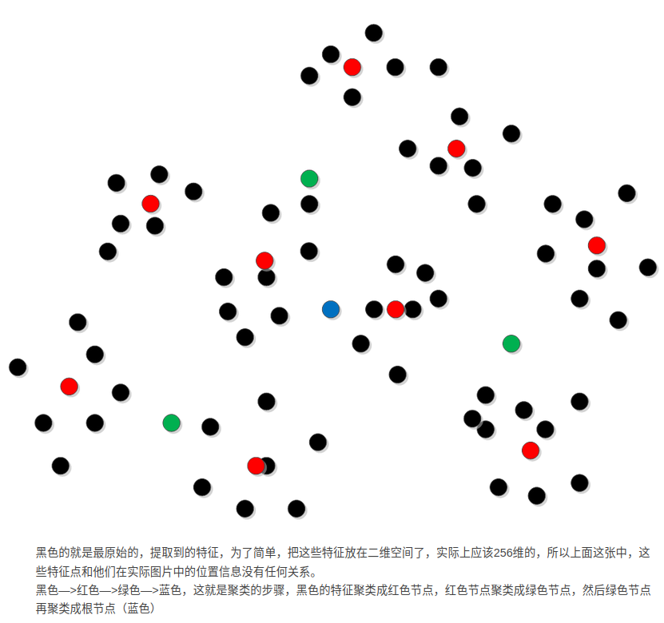
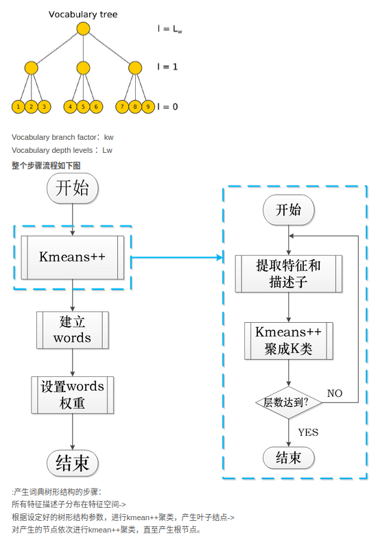
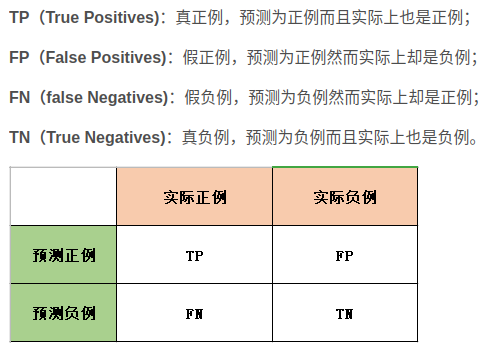
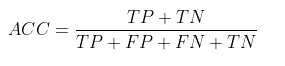
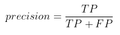
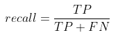
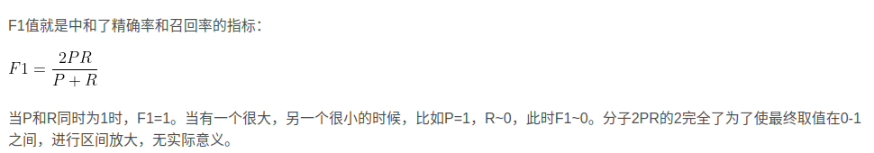

- [install DBoW3](#install-dbow3)
- [loop colsure detection 回环检测](#loop-colsure-detection-回环检测)
- [词袋模型](#词袋模型)
- [精确率 召回率](#精确率-召回率)
- [DBoW3 比较图片相似性](#dbow3-比较图片相似性)

## install DBoW3

```bash
git clone https://github.com/rmsalinas/DBow3.git
cd DBow3
mkdir build && cd build
cmake ..
make -j4
sudo make install
```

## loop colsure detection 回环检测

前端提供特征值，轨迹，地图的初值，后端负责对这些数据进行优化。若只考虑相邻时间上的关键帧，则过程会对误差进行累计，长期结果不可靠。
- 回环检测能给出除了相邻帧的一些，时间间隔更久远的约束，为长时间的估计提供多一层检测
- 利用回环检测进行重定位
  - 事先对某个场景录制轨迹并建图，重定位可以帮助确定自身在这条轨迹上的位置，提高系统精度

回环检测实现方法
1. 对任意两幅图像做特征匹配
2. 基于里程计(Odometry based)的几何关系
   1. 当发现相机运动到之前某个位置附近，检测有没有回环
3. 基于外观的几何关系
   1. 进根据两幅图像的相似性确定回环。这样可以摆脱累积误差，是视觉slam的主流做法
4. 使用GPS提供的位置信息判断汽车是否回到某个点，室外可行，也要看GPS精度，室内GPS信号不好

基于外观的回环检测，核心问题是计算图像间的相似性

## 词袋模型

Bag-of-Words，BoW 把特征当成一个个单词，通过比较两张图片中出现的单词是否一致，来判断这两张图片是否是同一场景。
使用K-mean对特征点进行聚类，产生单词。聚类数量由所选择的树形结构决定





## 精确率 召回率

准确度(accuracy)、精确率（precision)、召回率（recall）作为评估指标，经常用到分类效果的评测上



准确率



精确率：以预测结果为判断依据，预测为正例的样本中预测正确的比例，用此标准来评估预测正例的准确度



召回率：以实际样本为判断依据，实际为正例的样本中，被预测正确的正例占总实际正例样本的比例。实际为正例的样本中，要么在预测中被预测正确TP，要么在预测中预测错误FN。评估所有实际正例是否被预测出来的覆盖率占比多少



F1值：



## DBoW3 比较图片相似性

DBoW3为我们提供了两种计算相似性的方式，第一种是直接对两张图片比较；第二种是把图片集构造成一个数据库，再与另一张图片比较

图片越相似，评分越接近1。我们可以根据这个评分来判断两张图片是否是同一场景。但是直接给定一个绝对的阈值并不合适。通常，如果当前帧与之前某帧的相似度超过当前帧与上一个关键帧相似度的3倍，就认为可能存在回环，或者使用其它判定回环的方式
