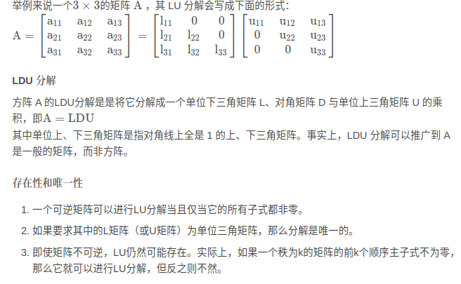

- [LU分解](#lu分解)
- [LU分解与矩阵高斯消元法](#lu分解与矩阵高斯消元法)
- [高斯消元](#高斯消元)
  - [矩阵消元例子](#矩阵消元例子)
  - [消元矩阵](#消元矩阵)
  - [逆](#逆)
- [杜尔里特 UR分解](#杜尔里特-ur分解)

# LU分解

对于可逆方阵A, 可以将其分解为一个下三角矩阵L和上三角矩阵U的乘积（不可逆的方阵有些也可以进行LU分解），有时需要再乘上一个置换矩阵P

- LU分解可以被视为高斯消元法的矩阵形式。在数值计算上，LU分解经常被用来解线性方程组、且在求逆矩阵和计算行列式中都是一个关键的步骤

# LU分解与矩阵高斯消元法

- LU分解在本质上是高斯消元法的一种表达形式。实质上是将A通过初等行变换变成一个上三角矩阵，其变换矩阵就是一个单位下三角矩阵。杜尔里特算法（Doolittle algorithm）
- 从下至上地对矩阵A做初等行变换，将对角线左下方的元素变成零，然后再证明这些行变换的效果等同于左乘一系列单位下三角矩阵，这一系列单位下三角矩阵的乘积的逆就是L矩阵，它也是一个单位下三角矩阵。

下面介绍一下高斯消元法

# 高斯消元

高斯消元法：是为了求解线性方程组的。应用消元法求解的时候，通常会应用以下三种变换，并且每一种变换都不会改变方程组的解

- 交换方程组中任意两个方程的位置
- 用一个数乘某一个方程的左右两边
- 将一个方程的两边乘一个数然后加到另一个方程上

高斯消元步骤

1. 构造增广矩阵。即系数矩阵 A 加上常数向量 b，也就是 (A|b)
2. 通过以交换行、某行乘以非负常数和两行相加这三种初等变化将原系统转化为更简单的三角形式
3. 得到简化的三角方阵组
4. 带入求解相关系数

## 矩阵消元例子

这个例子中最后我们的到了U上三角矩阵，R矩阵并不直观

## 消元矩阵

以下面这个例子简单计算R矩阵

那么R矩阵就是$(E_{32}E_{21})^{-1}$

消元还经常用到置换矩阵 (permutation matrix)

$$
\begin{bmatrix}
    0&1\\1&0
\end{bmatrix}

\begin{bmatrix}
    a&b\\c&d
\end{bmatrix}

\begin{bmatrix}
    c&d\\a&b
\end{bmatrix}
$$

- 原矩阵两行进行了互换

$$
\begin{bmatrix}
    a&b\\c&d
\end{bmatrix}

\begin{bmatrix}
    0&1\\1&0
\end{bmatrix}

\begin{bmatrix}
    b&a\\d&c
\end{bmatrix}
$$

- 原矩阵两列进行了互换

## 逆

假设这些初等变换是可逆的，则有

# 杜尔里特 UR分解

参考文章

- [高斯消元1](https://www.cnblogs.com/horizonshd/p/15365988.html#algebra2.1)
- [高斯消元2](https://blog.csdn.net/justidle/article/details/108794887)
- [待定系数](https://zhuanlan.zhihu.com/p/363948873)
- [矩阵的分解——LU分解](https://blog.csdn.net/qq_28972011/article/details/123935820?utm_medium=distribute.pc_relevant.none-task-blog-2~default~baidujs_baidulandingword~default-0-123935820-blog-138027566.235^v43^control&spm=1001.2101.3001.4242.1&utm_relevant_index=3)
