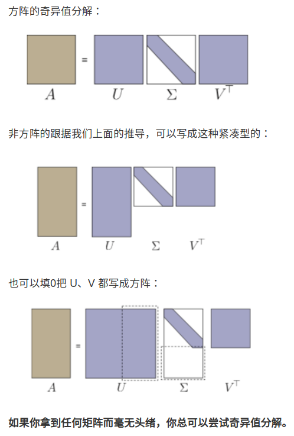
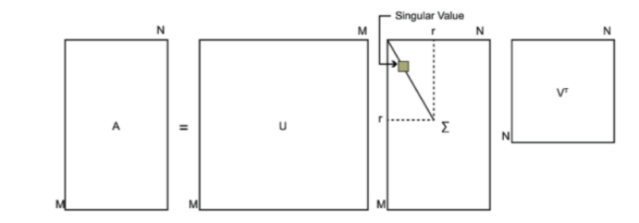
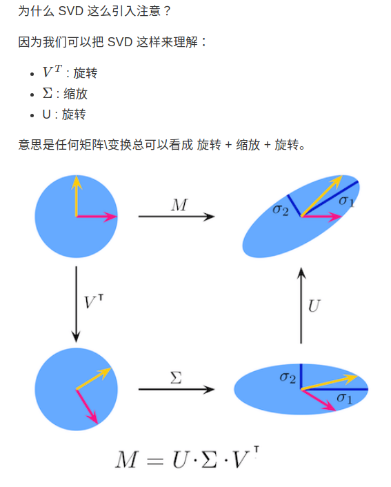
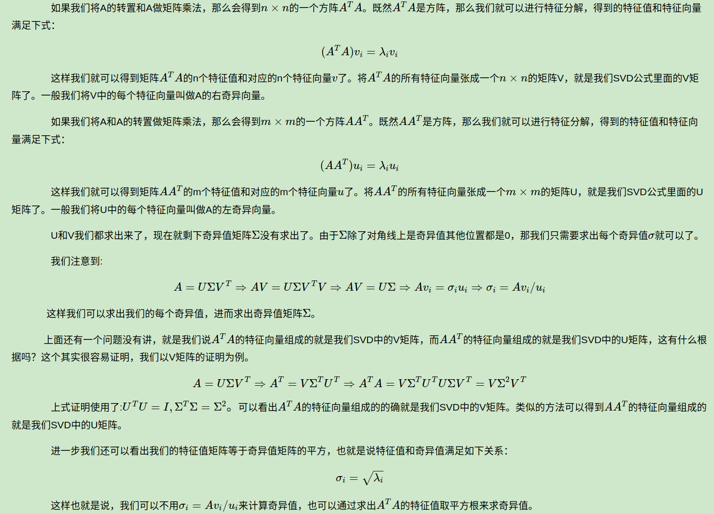
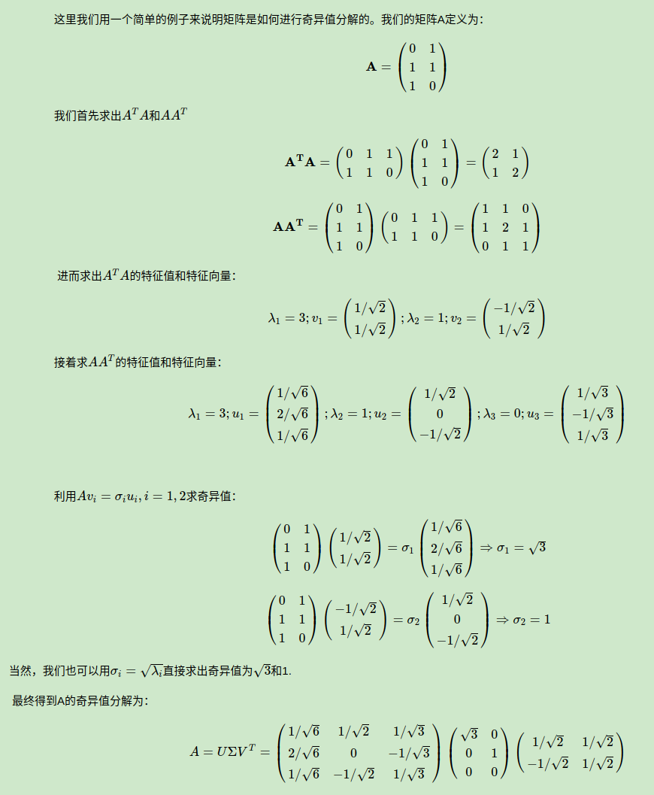
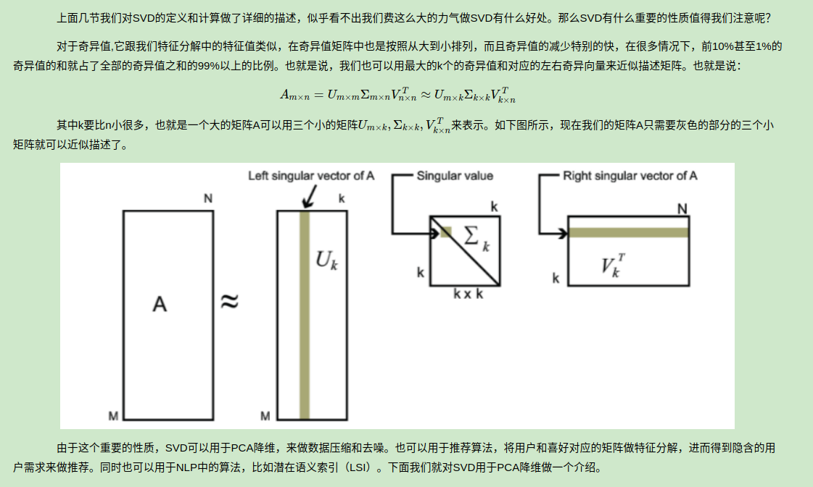
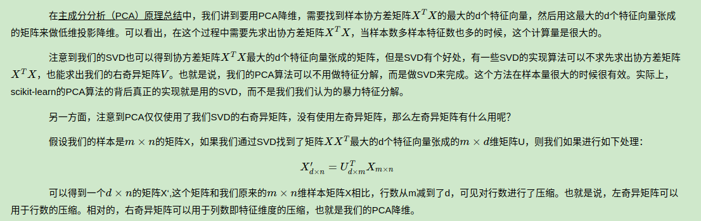

- [奇异值分解 (Singular Value Decomposition，SVD)](#奇异值分解-singular-value-decompositionsvd)
- [回顾特征值分解](#回顾特征值分解)
- [Singular Value Decomposition 奇异值分解](#singular-value-decomposition-奇异值分解)
  - [特征值分解和奇异值分解的不同](#特征值分解和奇异值分解的不同)
- [SVD 计算与性质](#svd-计算与性质)
  - [SVD计算举例](#svd计算举例)
  - [用最大的k个的奇异值和对应的左右奇异向量来近似描述矩阵](#用最大的k个的奇异值和对应的左右奇异向量来近似描述矩阵)
  - [SVD与PCA降维](#svd与pca降维)
- [Eigen jacobian SVD](#eigen-jacobian-svd)


# 奇异值分解 (Singular Value Decomposition，SVD)

奇异值分解 (Singular Value Decomposition，SVD) 是一种矩阵因子分解方法，是线性代数的概念。应用于数据降维、推荐系统和自然语言处理等领域，在机器学习中被广泛适用

# 回顾特征值分解

设$A$为n阶方阵，若存在一个实数$\lambda$和一个非零的n*1向量x满足

$$
Ax = \lambda x \tag{1}
$$

则称$\lambda$是A的一个特征值，x是对应$\lambda$A的特征向量

计算出$A$的n个特征值$\lambda_1<=\lambda_2<=...<=\lambda_n$，以及这 n 个特征值所对应的特征向量${p_1,p_2, ...,p_n}$，如果这n个特征值线性无关，那么矩阵$A$就可以用下式的特征分解表示：$A=P\Lambda P^{-1}$

- 其中P是这n个特征向量所张成的n * n矩阵
- $\Lambda$是以n个特征值为主对角线的n * n矩阵

一般的会把P的n个特征向量标准化，此时这n个特征向量为标准正交基，满足$P^TP=I, P^T=P^-{1}$ 这样特征值分解表达式可以写成

$A=P\Lambda P^{T}$

要进行特征值分解，矩阵Ａ必须是方阵，若行列不等，则只能进行奇异值分解

# Singular Value Decomposition 奇异值分解

singular 有几个意思： single（单个）、special（特别/不常见）的意思

- 矩阵的奇异值分解是一定存在的 (但不唯一)

SVD也是对矩阵进行分解，但是和特征分解不同，SVD并不要求要分解的矩阵为方阵

我们没有给 A 加上任何条件，它无需对称、无需正定、无需是实数

假设矩阵Ａ为m*n,则定义A的SVD为

$$
A=U \Sigma V^T
$$



其中Ｕ是m阶正交矩阵,V是n阶正交方阵,$\Sigma$是由降序排列的非负的对角线元素组成的m*n矩形对角矩阵，满足

$$
UU^T=I\\
VV^T=I\\
\Sigma = diag(\sigma_1, \sigma_2, \sigma_3,...,\sigma_p)\\
\sigma_1 >=\sigma_2 >=\sigma_3>=...>=\sigma_p>=0\\
p=min(m,n)
$$

- $\sigma_i$称为矩阵A的奇异值
- U的列向量称为左奇异向量
- V的列向量称为右奇异向量（注意这里是Ｖ不是$V^T$）



## 特征值分解和奇异值分解的不同

对称阵特征向量分解的基础是谱分析，而奇异值分解则是谱分析理论在任意矩阵上的推广



# SVD 计算与性质

把矩阵$A$和$A^T$凑出方阵，进行特征值分解



## SVD计算举例



## 用最大的k个的奇异值和对应的左右奇异向量来近似描述矩阵



## SVD与PCA降维



# Eigen jacobian SVD

```cpp
MatrixXf m = MatrixXf::Random(3,2);
cout << "Here is the matrix m:" << endl << m << endl;
JacobiSVD<MatrixXf, ComputeThinU | ComputeThinV> svd(m);
cout << "Its singular values are:" << endl << svd.singularValues() << endl;
cout << "Its left singular vectors are the columns of the thin U matrix:" << endl << svd.matrixU() << endl;
cout << "Its right singular vectors are the columns of the thin V matrix:" << endl << svd.matrixV() << endl;
Vector3f rhs(1, 0, 0);
cout << "Now consider this rhs vector:" << endl << rhs << endl;
cout << "A least-squares solution of m*x = rhs is:" << endl << svd.solve(rhs) << endl;
```

参考文章

- [Singular Value Decomposition](https://www.cnblogs.com/sun-a/p/13543735.html)
- [SVD Decomposition](https://o-o-sudo.github.io/numerical-methods/cholesky-cholesky-decomposition.html)
- [奇异值分解(SVD)原理与在降维中的应用](https://www.cnblogs.com/pinard/p/6251584.html)
