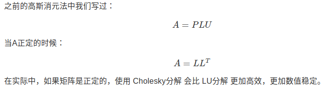
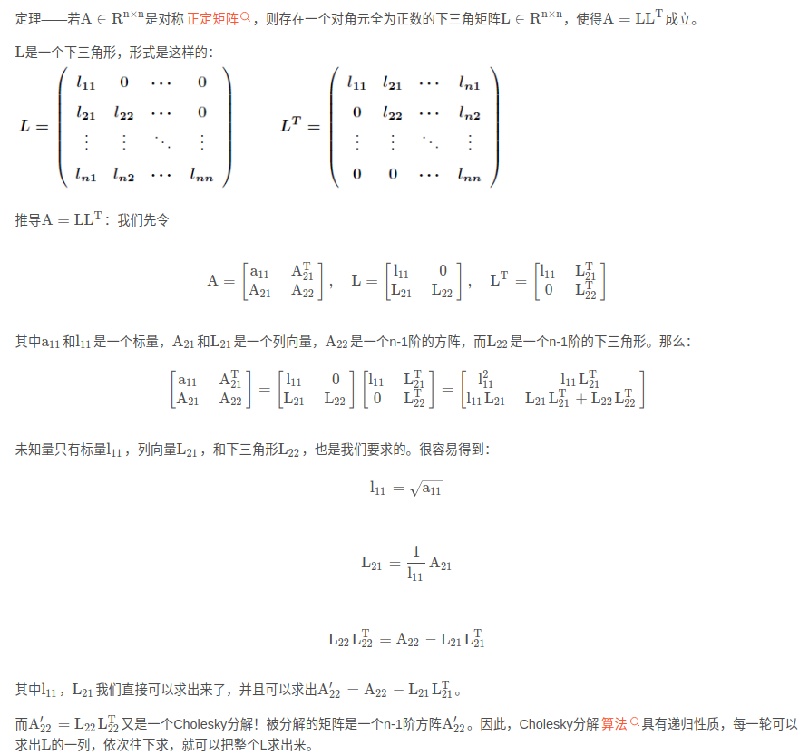
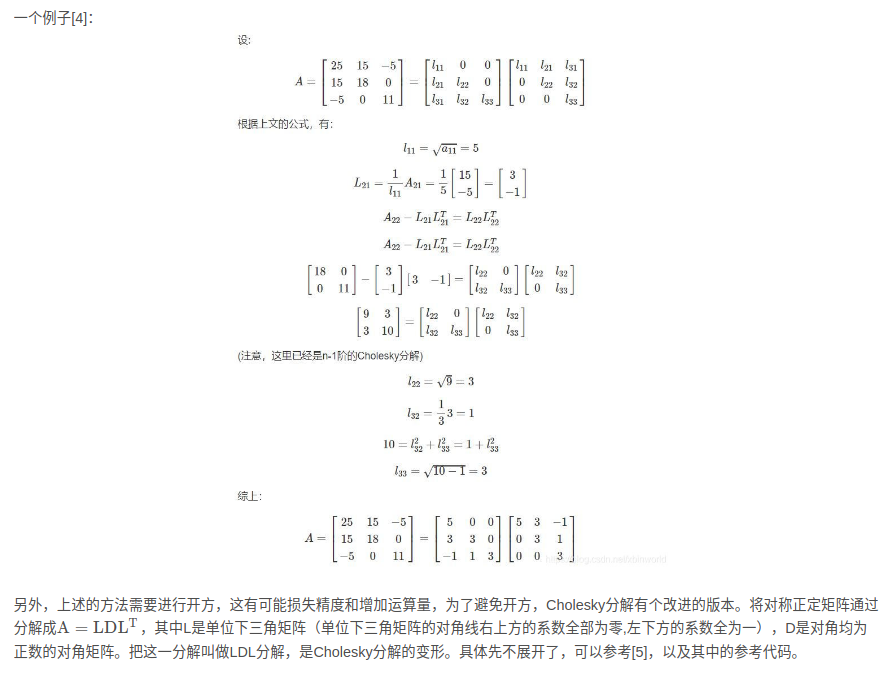
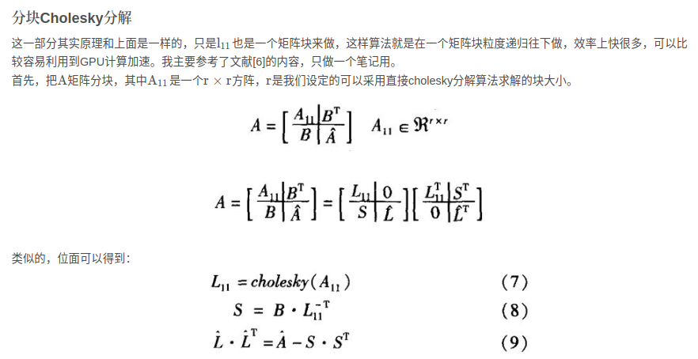
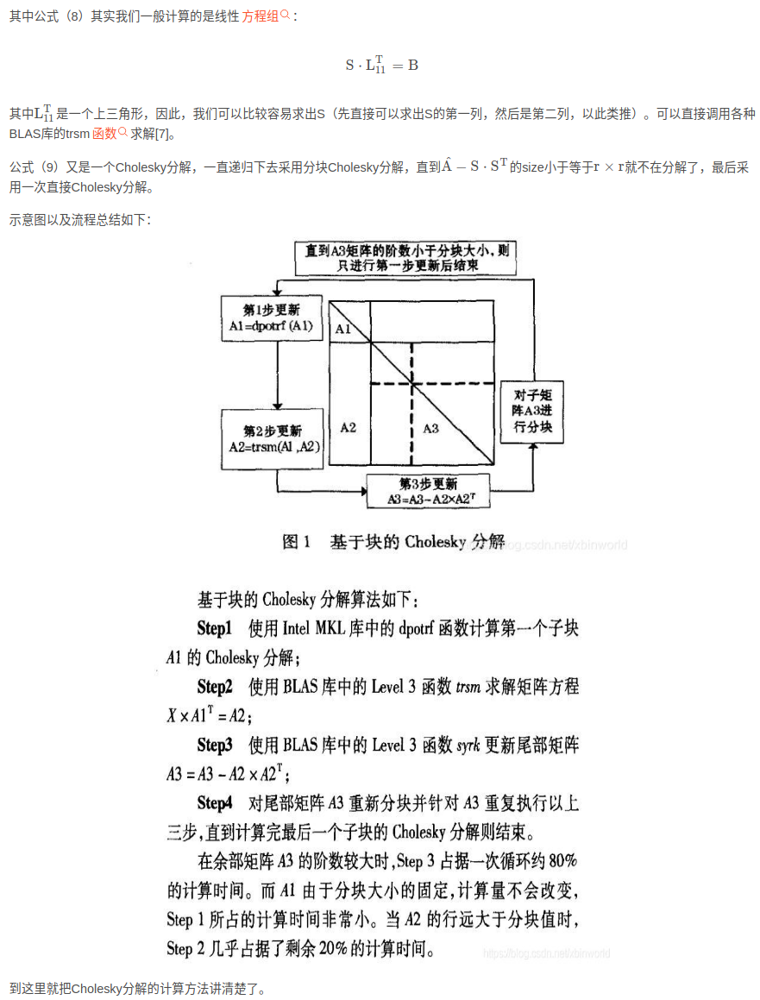
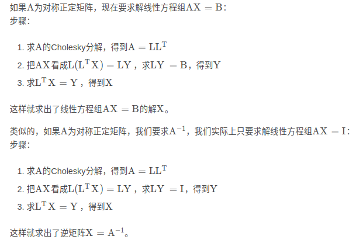

- [Cholesky Decomposition](#cholesky-decomposition)
  - [对称正定矩阵](#对称正定矩阵)
  - [Cholesky Decomposition 特点](#cholesky-decomposition-特点)
  - [直接Cholesky分解](#直接cholesky分解)
- [Cholesky分解应用于求解线性方程组，以及矩阵求逆](#cholesky分解应用于求解线性方程组以及矩阵求逆)
  - [实现](#实现)


# Cholesky Decomposition

Cholesky 分解是将一个对称正定矩阵A SPD`[real Symmetric positive definite matrix]` 分解为一个下三角矩阵L和其转置的乘积的算法

## 对称正定矩阵

- 对称: $A_{ij}=A_{ji}$
- 正定: 矩阵的所有特征值都为正

性质

1. 行列式恒为正：正定矩阵的行列式恒为正
2. 特征值全为正：正定矩阵的特征值都是正数
3. 合同性质：正定矩阵与单位矩阵合同，即存在可逆矩阵C，使得AC=CA=E
4. 运算性质：两个正定矩阵的和也是正定矩阵，正定矩阵的逆矩阵也是正定矩阵

## Cholesky Decomposition 特点

- 对于一个n阶对称正定矩阵A，存在唯一的下三角矩阵L，使得$A = LL^T$
- 稳定性：它是一种数值稳定的算法，特别是在解决线性系统时。
- 效率：相比于高斯消元法，Cholesky 分解在计算上更加高效。
- 对称正定矩阵：它仅适用于对称正定矩阵，这是许多实际问题中的常见情况




## 直接Cholesky分解









# Cholesky分解应用于求解线性方程组，以及矩阵求逆



## 实现

```python
import numpy as np

# Cholesky分解函数
def CholeskyDecompose(A):
    r,c = A.shape                                           # 获取矩阵的行数、列数
    L = np.zeros((r,r))                                     # 初始化L
    L[0,0] = np.sqrt(A[0,0])                                # 计算L11
    L[:,0] = A[:,0]/L[0,0]                                  # 计算L第1列的其余元素
    for i in range(1,r):                                    # 逐列计算
        L[i,i] = np.sqrt(A[i,i]-sum(L[i,:i+1]*L[i,:i+1]))   # 计算第i列的对角元素Lii
        L[:,i] = (A[:,i]-L[:,:i]@L[i,:i].T)/L[i,i]          # 计算第i列的非对角元素
    return L                                                # 返回结果

# 测试样例
if __name__ == "__main__":
    # 生成要分解的A
    np.random.seed(0)                                       # 设置随机种子
    rnd_mat = np.random.randint(0,10,(5,5))                 # 生成一个随机矩阵
    L_true = np.tril(rnd_mat,0)                             # 将上三角置0,即得到下三角矩阵
    A = L_true@L_true.T                                     # 将L*L^T组合成A
												            
    # Cholesky分解                                          
    L = CholeskyDecompose(A)                                # 调用函数对A进行Cholesky分解
    print('\n----生成的L-----:\n',L_true)                   # 打印生成的L
    print('\n----LL^T组合成的A-----:\n',A)                  # 打印由LL^T得到的A
    print('\n----从A分解得到的L-------:\n',L)               # 打印从A中分解得到的L
```

```python
import numpy as np
from scipy import linalg

a = np.array([[4, 12, -16],
              [12, 37, -43],
              [-16, -43, 98]])
              
L = linalg.cholesky(a, lower=True) # 默认计算 upper， 所以指定 lower = True

# array([[ 2.,  0.,  0.],
#       [ 6.,  1.,  0.],
#       [-8.,  5.,  3.]])

np.allclose(np.dot(L, L.T) , a) # 验证计算
```

参考文章

- [Cholesky decomposition](https://o-o-sudo.github.io/numerical-methods/cholesky-cholesky-decomposition.html)
- [三十分钟理解：矩阵Cholesky分解](https://blog.csdn.net/xbinworld/article/details/104663481)
- [Cholesky分解](https://www.bbbdata.com/text/297)
