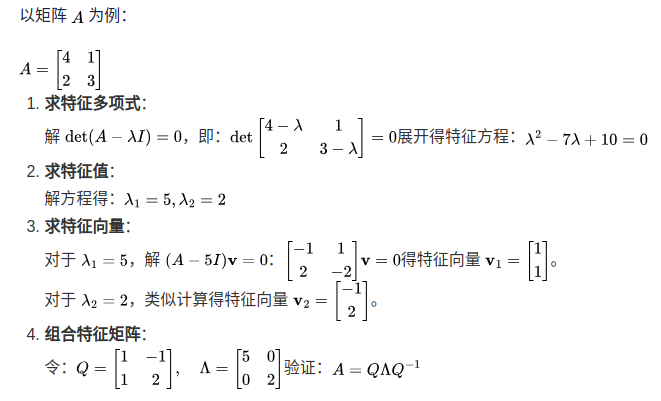

- [eigenvalue decomposition](#eigenvalue-decomposition)
- [Definition](#definition)
- [性质与拓展](#性质与拓展)
- [应用场景](#应用场景)
- [奇异值分解与特征值分解的区别](#奇异值分解与特征值分解的区别)
- [为什么特征值分解只适用于方阵](#为什么特征值分解只适用于方阵)
- [如何快速判断一个矩阵是否可以特征值分解](#如何快速判断一个矩阵是否可以特征值分解)
- [特征值分解在机器学习中的具体应用有哪些](#特征值分解在机器学习中的具体应用有哪些)
- [如果特征值为复数，该如何分解矩阵](#如果特征值为复数该如何分解矩阵)
- [特征值分解在物理学中有哪些典型应用](#特征值分解在物理学中有哪些典型应用)
- [如何利用特征值分解优化线性代数计算](#如何利用特征值分解优化线性代数计算)
- [为什么对称矩阵的特征值一定是实数](#为什么对称矩阵的特征值一定是实数)
- [如何验证特征值分解的正确性](#如何验证特征值分解的正确性)
- [特征值分解和对角化的关系](#特征值分解和对角化的关系)
- [计算特征值时，数值误差如何影响结果](#计算特征值时数值误差如何影响结果)
- [如果矩阵中含有随机噪声，特征值分解是否稳定](#如果矩阵中含有随机噪声特征值分解是否稳定)
- [特征值的几何意义和代数意义是什么](#特征值的几何意义和代数意义是什么)

# eigenvalue decomposition

[eigenvalue and eigenvector see here](./eigenvalue_eigenvector.md) 该篇主要将特征值的计算，这里讲述特征值分解

# Definition

- 矩阵特征值分解是一种将矩阵分解为特征值和特征向量的方法，通常用于描述矩阵的线性变换性质
- 特征值分解是对于一个$n * n$矩阵Ａ，如果存在一个非零向量v和一个标量$\lambda$使得$Av = \lambda v$ 则称$\lambda$是A的特征值，v是A的特征向量
- 特征值分解的目标是将矩阵A分解为$A=Q\Lambda Q^{-1}$ 其中Q是由特征向量组成的矩阵，$\Lambda$是对角阵，对角线上元素是特征值

计算过程

# 性质与拓展

- 若矩阵$A$是对称矩阵，则特征向量构成的矩阵Q是正交矩阵$Q^{-1}=Q^T$
- 特征值分解只适用于方阵，非方阵通常使用奇异值分解

# 应用场景

- 数据压缩 主城分分析利用协方差矩阵的特征值分解将维
- 微分方程 通过特征值分解解决线性常系数微分方程
- 动力系统 特征值决定系统稳定性

# 奇异值分解与特征值分解的区别

奇异值分解（Singular Value Decomposition, SVD）和特征值分解（Eigenvalue Decomposition, EVD）都用于矩阵分解，但适用场景和分解形式不同。

- 奇异值分解将任意矩阵$A$表示为: $A=U\Sigma V^T$ 其中：
  - $U$ 是左奇异向量矩阵，列向量正交；
  - $V$ 是右奇异向量矩阵，列向量正交；
  - $\Sigma$ 是对角矩阵，对角线上是奇异值。

区别：

- 适用范围：特征值分解只适用于方阵，而奇异值分解可用于任意矩阵（方阵或非方阵）。
- 分解形式：特征值分解需要矩阵满足某些条件（如对称矩阵保证实特征值），奇异值分解无此限制。
- 数值稳定性：奇异值分解在数值计算上更稳定，广泛用于实际应用。

# 为什么特征值分解只适用于方阵

特征值和特征向量的定义基于线性变换保持向量方向不变，而这通常需要矩阵是方阵

- 特征值分解依赖于特征方程：$\det(A-\lambda I)=0$ 这个方程要求A和单位矩阵I都是 $n \times n$ 的方阵，才能定义行列式。因此，特征值分解仅适用于方阵
- 对于非方阵，通常使用奇异值分解（SVD）替代

# 如何快速判断一个矩阵是否可以特征值分解

检查矩阵是否为方阵，以及是否满足某些性质，如可对角化

- 是否是方阵：非方阵不能进行特征值分解
- 是否可对角化：若矩阵的特征值是重复的，可能不可对角化（但可进行广义特征值分解）
- 是否对称：对称矩阵总是可对角化

# 特征值分解在机器学习中的具体应用有哪些

- 主成分分析（PCA）：通过特征值分解协方差矩阵，选择主要特征降维
- 特征提取：提取具有最大方差的数据方向
- 数据压缩：通过仅保留主要特征值简化数据表示
- 谱聚类：在图数据中分割群体
- 线性回归：通过特征值分解优化正则化问题

# 如果特征值为复数，该如何分解矩阵

复数特征值的处理依赖于矩阵性质，如是否为厄米矩阵

如果特征值是复数：

- 构造复数特征向量；
- 保留复数特征值的共轭对；
- 分解形式可写为： $A = Q \Lambda Q^{-1}$ 其中 $Q$ 和 $\Lambda$ 中包含复数

在实际应用中，复特征值常见于动态系统的描述

# 特征值分解在物理学中有哪些典型应用

物理系统的对称性和守恒量往往与矩阵的特征值分解有关

- 量子力学：哈密顿算符的特征值代表能量本征态
- 振动分析：系统的特征频率由特征值确定
- 光学：偏振光的描述与矩阵特征分解相关
- 热传导：矩阵特征值描述稳态和动态过程

# 如何利用特征值分解优化线性代数计算

特征值分解将复杂运算转化为对角化形式，简化计算

- 幂次运算：计算 $A^k$ 时，通过对角化简化为 $Q \Lambda^k Q^{-1}$
- 线性方程求解：通过特征分解快速计算逆矩阵
- 稳态求解：特征值分解直接确定系统的平衡状态

# 为什么对称矩阵的特征值一定是实数

设 $A$ 是对称矩阵，特征向量 $\mathbf{v}$ 满足： $A \mathbf{v} = \lambda \mathbf{v}$ 取共轭转置： $\mathbf{v}^T A \mathbf{v} = \lambda \|\mathbf{v}\|^2$ 因为 $A = A^T$，左边为实数，因此 $\lambda$ 必为实数

# 如何验证特征值分解的正确性

1. 验证还原：检查 $A = Q \Lambda Q^{-1}$ 是否成立
2. 验证特性：检查 $Q$ 是否正交，$\Lambda$ 是否对角

# 特征值分解和对角化的关系

特征值分解是对角化的基础，若矩阵 $A$ 可对角化，则： $A = Q \Lambda Q^{-1}$ 即对角化的过程

# 计算特征值时，数值误差如何影响结果

数值计算中存在精度问题，尤其是迭代方法

1. 特征值接近时，可能误差较大
2. 小的特征值容易受舍入误差影响

# 如果矩阵中含有随机噪声，特征值分解是否稳定

- 对称矩阵对噪声较稳定
- 非对称矩阵分解结果可能剧烈变化

# 特征值的几何意义和代数意义是什么

- 几何意义：特征值描述变换的尺度，特征向量描述变换方向。
- 代数意义：特征值是特征方程的根。

参考文章

- [矩阵特征值分解的原理、计算与应用](https://blog.51cto.com/yingnanxuezi/12617095)
- [数值分析](https://o-o-sudo.github.io/numerical-methods/-eigen-decomposition.html)
