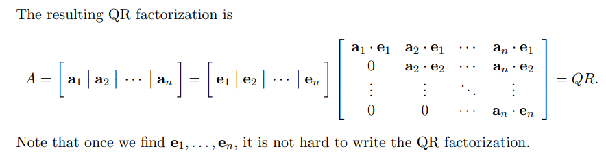
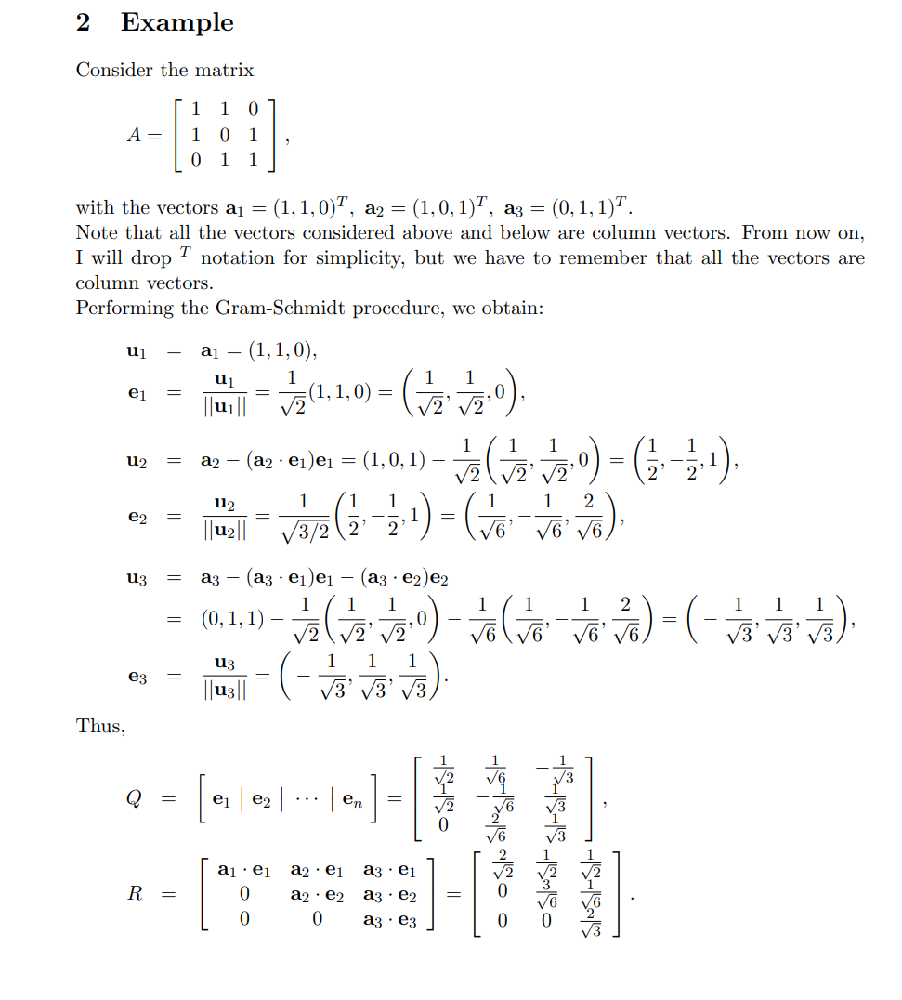
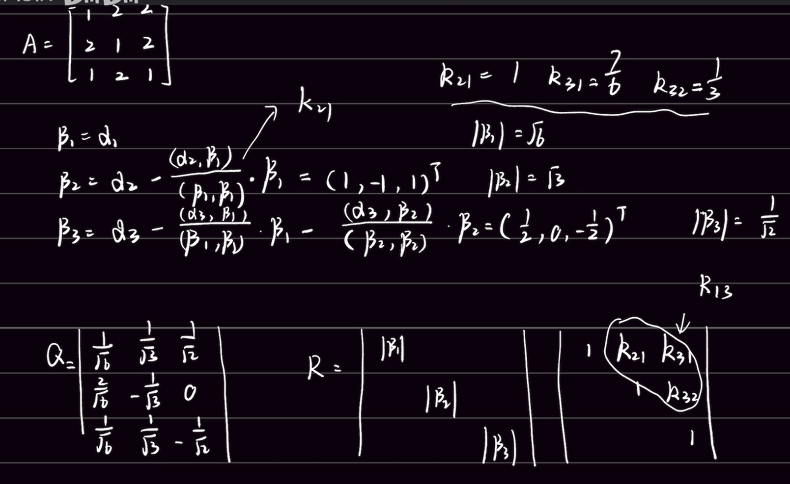
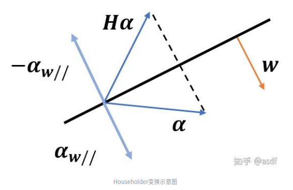
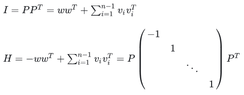
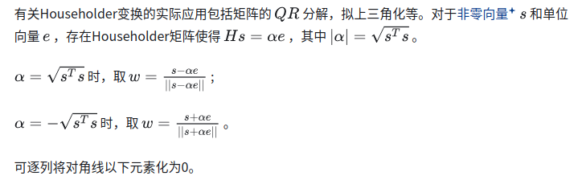
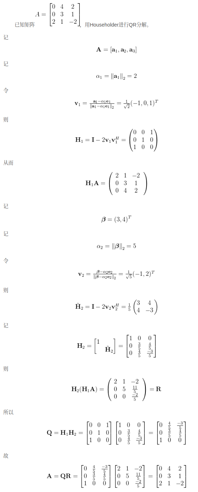

- [QR分解](#qr分解)
  - [QR分解步骤](#qr分解步骤)
    - [Example](#example)
  - [Householder变换](#householder变换)
    - [几何角度](#几何角度)
    - [代数角度](#代数角度)
    - [Householder 实际应用](#householder-实际应用)
  - [基于 Householder 变换的QR分解](#基于-householder-变换的qr分解)

# QR分解

- 矩阵A可以分解为正交矩阵Q~n*n~乘以非奇异上三角矩阵R~n*n~,A=QR
- 对于m*n的列满秩矩阵A，有A~m*n~=Q~m*n~ * R~n*n~ 其中Q为正交向量组，R为非奇异上三角矩阵，该分解也叫做QR分解
- QR分解用于求解A的特征值、A的逆，最小二乘等问题

## QR分解步骤

1. 列出矩阵A的列向量(a1,a2,a3)
2. 施密特正交化得到(b1,b2,b3)
3. 单位化(b1,b2,b3)，得到矩阵Q
4. 把矩阵A列向量表达为(b1,b2,b3)的线性组合，则系数矩阵为R矩阵（上三角矩阵）

### Example

## Householder变换

Householder (豪斯霍尔德)变换是一种简洁而有意思的线性变换，也可称为镜面反射变换

### 几何角度

设$w$为单位向量，$w^T w=1$,　则Householder 变换为$H = I-2ww^T$ , H称为Householder矩阵如何理解这个矩阵，可以考虑如下两个向量：

$w, w^Tw=1$，则, $Hw=(I-2w{w^T})w = w-2w({w^T}w) = -w$
$v, w^Tv=1$，则, $Hv=(I-2w{w^T})v = v-2w({w^T}v) = v$

- 这说明对于平行于$w$的向量w ，Householder矩阵的作用是将其反向;
- 对于垂直于向量$w$的向量$v$，Householder矩阵对其不产生改变

那么对于一般向量$\alpha$经过Householder矩阵作用后，平行于$w$的分量反向，垂直于$w$的分量保持不变，其整体作用是将向量$\alpha$关于法向量$w$的平面进行镜面对称

于是也可以得到， Householder 变换不改变向量模长，是一种正交变换。两次镜面变换后将反射为自身，同时也是一种对合变换,即$HH^T = I, {H^2} = I$

### 代数角度

上式表明1,-1为 Householder 矩阵的特征值，对于向量$w$可以找到$n-1$个向量$v_1,v_2,...,v_{n-1}$构成n维欧式空间的一组标准正交基．记P=$[w1,v_1,v_2, ..., v_{n-1}]$

上式给出了 Householder 的对角化过程，通过秩为1的矩阵$ww^T$改变了单位矩阵的一个特征值，进而改变其一个特征向量上的缩放变换

### Householder 实际应用

## 基于 Householder 变换的QR分解

参考资料

- [Householder变换](https://zhuanlan.zhihu.com/p/576026040)
- [基于Householder变换完成QR分解](https://blog.csdn.net/m0_66360845/article/details/137052786)
