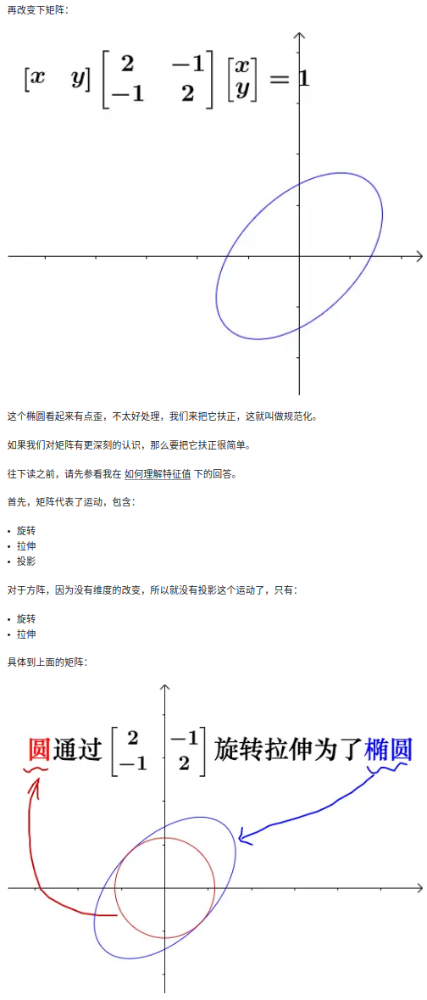

- [quadratic\_form](#quadratic_form)
  - [圆锥曲线与二次型](#圆锥曲线与二次型)
  - [正定](#正定)
- [主轴定理](#主轴定理)
- [在函数极值中的应用](#在函数极值中的应用)
  - [参考文章](#参考文章)

# quadratic_form

quadratic_form 二次型,含有n个变量的二次多项式称为二次型，即在一个多项式中，未知数的个数为任意多个，但每一项的次数都为2的多项式

举例
$$
f(x_1,x_2,x_3) = x_1^2 + 5x_2^2 - 4x_3^2 - 2x_1 x_2 + 6x_1 x_3
$$

就是未知数的次幂始终是2，这就是二次型

通过矩阵来研究二次函数（方程），这就是线性代数中二次型的重点

定义:含有 n 个变量的二次齐次函数

**二次型的矩阵形式**

**二次型的秩**　二次型的秩就是对称矩阵的秩

**二次型的标准型**　二次型只包含平方项，不包含交叉项

$$
f(x_1,x_2,...,x_n) = d_1 x_1^2 + d_2 x_2^2 + ... + d_n x_n^2
$$

**二次型的规范型**

## 圆锥曲线与二次型

圆、椭圆、双曲线统称为圆锥曲线，都是圆锥体和平面的交线．圆、椭圆、双曲线之间关系很紧密的，统称为圆锥曲线，都是圆锥体和平面的交线

二次型对圆的变换

- 规范化

实际就是把这个旋转变换进行特征值分解，对角矩阵的对角线上是特征值，一个矩阵表示的线性变换，只有特征值才有拉伸作用，拉伸方向就是对应的特征向量方向，显然特征值越大拉伸得越长，其它方向上的拉伸都是“被动拉伸”，所以椭圆的长轴就是最大特征值的拉伸结果

## 正定

正定是对二次函数有效的一个定义，对方程无效

用矩阵判断二次型是否正定：**特征值都大于0，则二次型正定**

# 主轴定理

主轴定理是指在几何学和线性代数中，与椭圆和双曲线的长轴和短轴有关的线。这些轴能够将椭圆和双曲线准确的描述出来，它们是正交的

在代数上，主轴定理是完全平方公式的泛化。在线性代数和泛函分析中，它是谱定理的几何等价物

# 在函数极值中的应用

## 参考文章

- [二次型 马同学](https://www.zhihu.com/question/38902714/answer/195435181)
- [二次型](https://zealscott.com/notes/linearalgebra/quadratic%20form.html)
