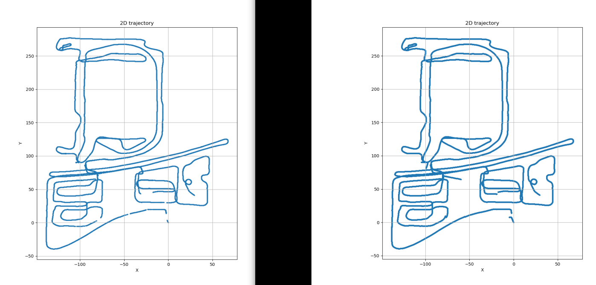

个人项目展示
======

sensor lab
----
- https://github.com/gyyc233/sensor_lab
- 这是我在github创建的repository，里面记录了一些我了解过的计算机视觉，感知，多传感器融合，SLAM，路径规划，路径跟踪等领域常见方法的代码实现和学习记录
- 同时也可以从这里了解我最近的活动与技术能力，代码习惯
- 以下是部分成果展示，里面的演示数据大多源自网络上的开源数据集

IMU GNSS ESKF Mapping
----

- 基于imu直接积分, gnss, odom，使用eskf gins的数据融合（下方左图）
- 在上述基础上改用imu预积分进行数据融合（下方右图） 可见由gnss信号差引起的轨迹中断情况减少

<table>
    <tr>
        <td >

</td>
    </tr>
</table>

Loosely coupled LIO
----

下图为增量式NDT松耦合雷达里程计建图演示(没有回环检测)

<table>
    <tr>
        <td >

</td>
    </tr>
</table>

2D Lidar mapping
----

单线激光雷达建立栅格地图

<table>
    <tr>
        <td >

</td>
    </tr>
</table>
