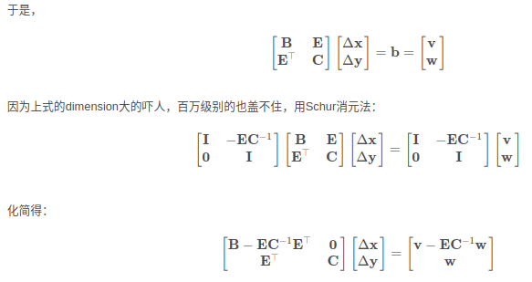

[SLAM从0到1——12. 理解BA问题的稀疏性和边缘化](https://zhuanlan.zhihu.com/p/133125532)
[Visual SLAM的BA问题：H矩阵的稀疏性现象及求逆](https://blog.csdn.net/wubobupt2/article/details/127805885)
[SLAM中的marginalization 和 Schur complement](https://blog.csdn.net/heyijia0327/article/details/52822104)

## BA(Bundle Adjustment)问题

- BA的思想就是根据视觉图像同时估计相机位姿和空间点位置通过构造相应的最小二乘问题进行优化求解
- 又由于SLAM问题天然适合使用图优化表示，因此往往是使用图优化的方式进行优化求解
- 我们可以称BA为带有相机位姿和空间点的图优化

## Ｈ矩阵的稀疏性

海塞矩阵$H=J^TJ$ 因此H矩阵的稀疏性直接来源于雅克比矩阵J,J矩阵是代价函数e对相机位姿和路标点进行求导得到的．一个相机位姿在一个时刻看到的路标点是少数有限个，因此求导后J矩阵含有很多0项，因此Ｈ矩阵是非常稀疏的

## 边缘化

这里讨论的边缘化不同於VINS中的边缘化．在这里是指使用Ｈ矩阵的稀疏性加速矩阵求逆，先固定路标点，求解相机位姿，再利用相机位姿计算路标点，进而加速求解增量方程

$$

H {\Delta x} = b\\

J^T J {\Delta x} = -J^T e

$$

1. 根据H矩阵的稀疏性对H矩阵进行区域划分,以下假设有m个相机位姿，共检测到n个不同的路标点.同时把增量$\Delta x=[\Delta x_c, \Delta x_p]$ c 表示相机位姿增量，p表示3D点增量

上式等效为

2. 由于我们的根本目标是求解增量方程，因此想让H求逆更简单，也就是想让其变为对角阵
3. 对线性方程组进行高斯消元，右上角的区域变为0了，因此方程组的第一行与路标点的增量无关，这就相当于把路标点边缘化了．
4. 在对路标点边缘化后得到的方程中，稀疏矩阵S被称为位姿的协方差矩阵

边缘化特征点的时候，我们要marg那些不被其他帧观测到的特征点。因为他们不会显著的使得H变得稠密。对于那些被其他帧观测到的特征点，要么就别设置为marg，要么就宁愿丢弃