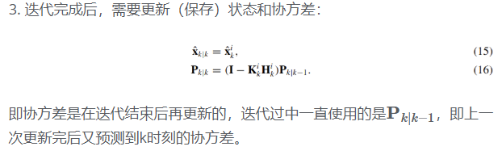
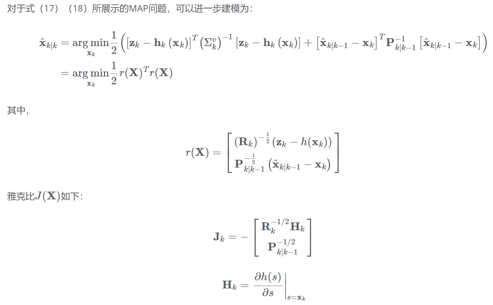

# IEKF

1. IEKF计算状态估计不是作为近似条件平均值(就像EKF那样)，而是作为最大后验(MAP)估计
2. EKF是仅用一次GN方法迭代的IEKF的特例

## 系统描述

## EKF

- 对于非线性函数f_k,h_k,EKF基于一阶泰勒级数展开

- EKF算法步骤如下

对于具有轻度非线性函数f_k,h_k的EKF，性能良好，但是如果测量方程(2)是强非线性的（例如在纯方位跟踪问题中）滤波器的性能就会恶化。在这种情况下，IEKF往往比EKF提供更准确的估计

## IEKF

- IEKF的想法是在存在显著非线性的情况下改进参考轨迹，从而改进估计
- 这些改进是通过EKF测量更新的局部迭代实现的

具体步骤

1. 初始化

2. 测量更新迭代

3. 状态更新，迭代完成后，需要更新（保存）状态和协方差

## 对迭代扩展卡尔曼过滤算法的改进

- IEKF可以看作是求解非线性最小二乘问题的GN方法的一种应用
- 因此，在IEKF中可以使用对GN方法的改进来提高方法的性能和收敛性，以提高估计的质量。改变步长是常用的改进措施之一
- 首先介绍IEKF最小化的MAP准则（这段没看懂）

对MAP问题进行增量方程建模

## reference

- [IEKF迭代扩展卡尔曼滤波器](http://epsilonjohn.club/2022/02/28/Fast-LIO%E7%B3%BB%E5%88%97/IEKF%E8%BF%AD%E4%BB%A3%E6%89%A9%E5%B1%95%E5%8D%A1%E5%B0%94%E6%9B%BC%E6%BB%A4%E6%B3%A2%E5%99%A8/#performance-evaluation-of-iterated-extended-kalman-filterwith-variable-step-length)
- [The Iterated Kalman Filter Update as a Gauss-Newton Method.]
- [Performance evaluation of iterated extended Kalman filter with variable step-length.]
