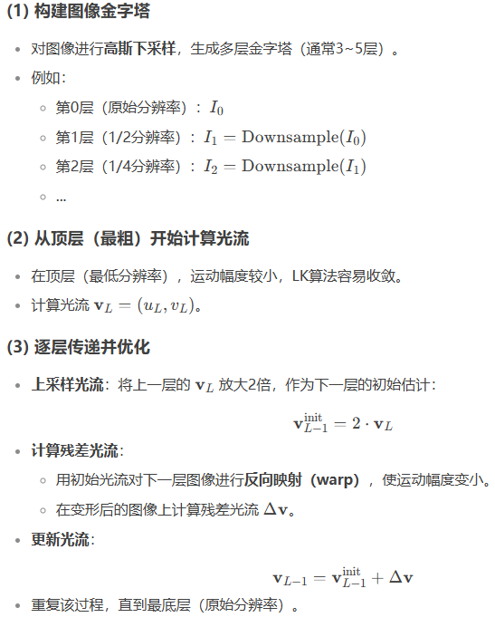

- [传统LK光流](#传统lk光流)
  - [算法步骤](#算法步骤)
- [金字塔LK光流](#金字塔lk光流)
  - [金字塔LK光流算法流程](#金字塔lk光流算法流程)
- [二阶图像梯度](#二阶图像梯度)
- [特征点法，光流法和直接法](#特征点法光流法和直接法)
  - [三者一般区别](#三者一般区别)
- [直接法](#直接法)
- [reference](#reference)

## 传统LK光流

光流：描述像素随时间在图像之间运动的方法

- 稀疏光流：计算部分像素运动。以Lucas-Kanade光流（LK光流）为代表
- 稠密光流：计算所有像素运动。以Horn-Schunck光流为代表

1. 基本假设

- 亮度不变性，同一物体点在连续帧中的亮度不变，即$I(x,y,t)=I(x+dx,y+dy,t+dt)$
- 小运动假设，位移很小，可以用泰勒级数一阶近似，即$I(x,y,t)\approx I(x,y,t)+\frac{\partial I}{\partial x}dx+\frac{\partial I}{\partial y}dy+\frac{\partial I}{\partial t}dt$ 得到后面三项和为0的方程
- 结合两个假设得到光流基本方程 $I_x u+I_y v +I_t=0$， $u=\frac{\partial x}{\partial t}$, $v=\frac{\partial y}{\partial t}$为光流向量，$I_x$, $I_y$, $I_t$为图像在x,y,t方向的梯度

2. 局部平滑性

- LK方法假设在一个小窗口（如5×5像素）内，所有像素具有相同的运动(u,v)
- 通过最小二乘法求解窗口内所有像素的联合方程，得到最优光流

### 算法步骤

1. 计算图像梯度 使用Sobel等算子计算当前帧和下一帧的时空梯度$I_x$, $I_y$, $I_t$
2. 构建局部方程


3. 最小二乘解

解为$v=(A^{T}A)^{-1}A^{T}b$要求矩阵$A^{T}A$(结构张量)可逆，即角点区域需具有足够的梯度变化

## 金字塔LK光流

金字塔LK光流（Pyramidal LK）是经典LK光流法的扩展，用于解决大位移运动（large motion）问题，它通过构建图像金字塔（多层缩放图像）逐层优化光流估计，从而在保持计算效率的同时提高运动估计的准确性

经典LK光流的局限性

- 小运动假设：传统LK方法假设相邻帧之间的运动很小（几个像素），如果物体移动较大，泰勒展开的一阶近似失效，导致光流估计不准确
- 局部窗口限制：在纹理单一或大位移情况下，局部窗口内的梯度信息不足以正确求解运动

金字塔LK的解决方案

- 分层处理：在图像金字塔（从粗到细的多尺度图像）上逐层计算光流
  - 粗层（低分辨率）：捕捉大范围运动（但精度低）
  - 细层（高分辨率）：修正运动细节，提升精度
- 由粗到细（Coarse-to-Fine）优化
  - 先在低分辨率层计算粗略光流
  - 将粗略光流上采样，作为下一层的初始估计
  - 在高分辨率层进行精细化调整

### 金字塔LK光流算法流程




## 二阶图像梯度

1. 当物体运动较大时，一阶泰勒近似（仅用$I_x$, $I_y$, $I_t$）可能很不准确，由此引入二阶梯度($I_{xx}$, $I_{yy}$, $I_{xy}$)提高运动模型精度


2. 光照变化（Illumination Variations）亮度恒常性假设在光照变化时失效，引入梯度恒常性假设，梯度方向/幅值不变），计算更多方向的梯度


```python
import cv2
import numpy as np

# 计算一阶梯度
Ix = cv2.Sobel(img, cv2.CV_64F, 1, 0, ksize=3)
Iy = cv2.Sobel(img, cv2.CV_64F, 0, 1, ksize=3)
It = img_next - img_prev  # 时间梯度

# 计算二阶梯度（可选）
Ixx = cv2.Sobel(Ix, cv2.CV_64F, 1, 0, ksize=3)
Iyy = cv2.Sobel(Iy, cv2.CV_64F, 0, 1, ksize=3)
Ixy = cv2.Sobel(Ix, cv2.CV_64F, 0, 1, ksize=3)
```

## 特征点法，光流法和直接法

### 三者一般区别

- 特征点一般包括了两部分：关键点和描述子（SIFT,SURF,FAST-ORB）,计算描述子比较耗时
- 光流法：先追踪特征点位置，再确定相机运动，无法保证全局最优
- 直接法：以寻找相机帧I1中像素点p1更相似的相机帧I2中像素点p2的方式，优化相机的位姿运动，（最终求解的是相机运动位姿）
  - 直接法是已知点的空间3D坐标以及两帧的像素坐标

## 直接法


以上是求偏导的链式法则


## reference

1. [LK光流、直接法](https://zhuanlan.zhihu.com/p/749128544)
