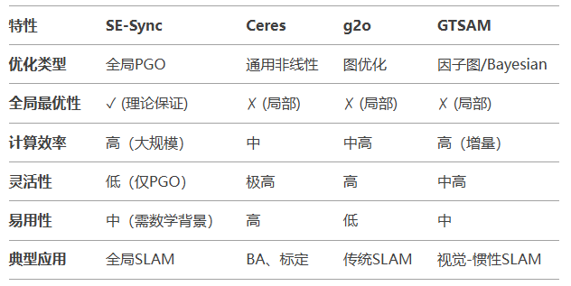

- [SE-Sync](#se-sync)
  - [适用场景](#适用场景)
- [Ceres Solver](#ceres-solver)
  - [适用场景](#适用场景-1)
- [g2o](#g2o)
  - [适用场景](#适用场景-2)
- [GTSAM（Georgia Tech Smoothing and Mapping）](#gtsamgeorgia-tech-smoothing-and-mapping)
  - [适用场景](#适用场景-3)
- [对比总结](#对比总结)
- [选择建议](#选择建议)

对SE-Sync、Ceres Solver、g2o 和 GTSAM 在位姿图优化（Pose Graph Optimization, PGO）和其他非线性优化问题中的对比

# SE-Sync

- 专为Pose Graph Optimization PGO 设计: 基于半定规划（SDP）和黎曼流形优化，专注于位姿图同步问题
- 全局最优: 通过凸松弛和验证机制，保证解的最优性（理论保证）
- 高效性: 利用矩阵分解和流形优化，适合大规模问题

优点

1. 避免局部极小值，适合闭环检测等高噪声场景
2. 在SLAM和SfM中表现优异，尤其对全局一致性要求高的任务

缺点

1. 通用性较低，主要针对SE(2)/SE(3)同步问题，不支持其他类型的优化
2. 实现复杂度较高，需依赖特定的数学工具（如SDP求解器）

## 适用场景

大规模SLAM的全局位姿优化、多机器人协同定位

# Ceres Solver

- 通用非线性优化库：支持最小二乘、鲁棒核函数、自动微分等
- 灵活性高：可自定义参数块和损失函数，适用于各类优化问题（如BA、PGO、拟合等）
- 接口友好：支持C++和Python，易于集成

优点

1. 广泛的社区支持和文档
2. 支持多种求解器（如Levenberg-Marquardt、Dogleg）
3. 适合快速原型开发和复杂问题的灵活建模

缺点

1. 对PGO的全局最优性无特殊处理，可能陷入局部极小
2. 性能发挥依赖参数调优（如线性求解器选择）

## 适用场景

通用优化问题（如BA、传感器标定）、中小规模SLAM

# g2o

- 专为图优化设计：针对SLAM中的位姿图、BA等问题优化
- 模块化架构：支持顶点（变量）和边（约束）的灵活定义
- 高效稀疏求解：利用稀疏矩阵加速求解

优点

- SLAM社区广泛使用，集成多种线性求解器（如PCG、Cholmod）
- 对PGO有针对性优化，性能优于通用库（如Ceres）

缺点

- 代码结构复杂，学习曲线陡峭
- 全局优化能力有限，依赖初始值
- 维护更新较慢（社区活跃度下降）

## 适用场景

传统SLAM（如ORB-SLAM）、中等规模位姿图优化

# GTSAM（Georgia Tech Smoothing and Mapping）

- 基于因子图：统一建模SLAM中的平滑（Smoothing）与映射（Mapping）
- 贝叶斯推断：支持概率建模和增量式优化（iSAM2）
- 现代C++设计：类型安全，接口清晰

优点

- 实时性高（iSAM2支持增量更新）
- 内置IMU预积分、视觉因子等SLAM专用模块
- 对噪声模型和协方差的处理更严谨

缺点

- 对全局最优性的处理不如SE-Sync
- 配置复杂，依赖第三方线性代数库（如Eigen）

## 适用场景

视觉-惯性SLAM（如VINS-Fusion）、动态环境下的增量优化

# 对比总结

# 选择建议

1. 需要全局最优解（如大规模闭环）：优先选 SE-Sync
2. 快速原型开发/通用问题：用 Ceres
3. 传统位姿图优化（如激光SLAM）：选 g2o
4. 增量/传感器融合SLAM（如VIO）：选 GTSAM（iSAM2）
