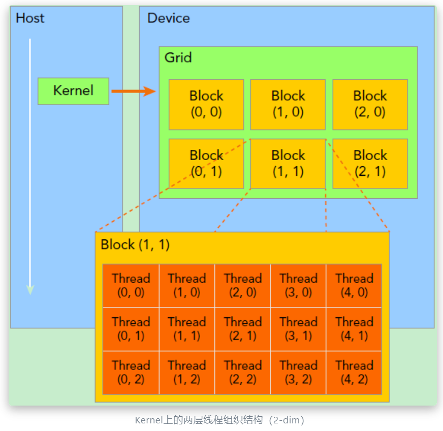
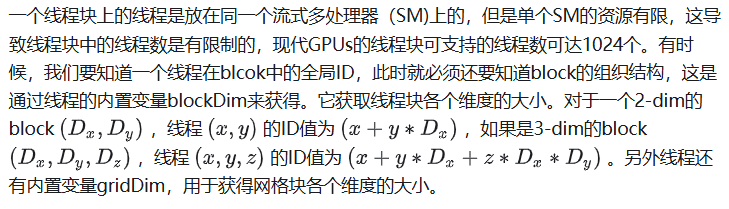
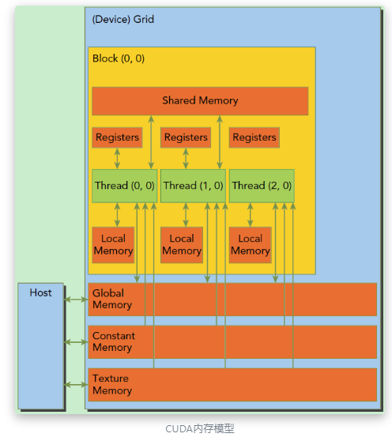

## CUDA 编程模型

- 在 CUDA 中，host 和 device 是两个重要的概念，host 是指 CPU 及其内存，device 是指 GPU 及其内存。CUDA 程序中既包含 host 程序，也包含 device 程序，他们分别在 CPU 和 GPU 上运行，同时互相之间可以通信
- 典型的 CUDA 程序执行流程如下
  - 分配 host 内存，并进行数据初始化
  - 分配 device 内存，并从 host 内存中拷贝数据到 device
  - 调用 CUDA 核函数在 device 上完成指定运算
  - 从 device 内存中拷贝数据到 host 内存
  - 释放 device 和 host 内存
- kernel 是 CUDA 中一个重要的概念，是在 device 上线程中并行执行的函数，核函数用global符号声明，在调用时需要用`<<<grid, block>>>`来指定 kernel 要执行的线程数量。在 CUDA 中，每一个线程都要执行核函数，并且每个线程会分配一个唯一的线程号 thread ID，这个 ID 值可以通过核函数的内置变量 threadIdx 来获得
- CUDA 中通过函数类型限定词来区分host与device上的函数，主要的三个函数类型限定词如下
  - __host__：在host上执行，仅可以从host上调用，一般省略不写，不可以和__global__同时用，但可和__device__，此时函数会在device和host都编译
  - __device__：在device上执行，单仅可以从device中调用，不可以和__global__同时用
  - __global__：在device上执行，从host中调用（一些特定的GPU也可以从device上调用），返回类型必须是void，不支持可变参数参数，不能成为类成员函数
    - __global__ 定义的kernel是异步的，这意味着host不会等待kernel执行完就执行下一步
- grid 和 block
  - kernel 在 device 上执行时实际上是启动很多线程，一个 kernel 启动的所有线程，称为一个网格(grid)，同一个 grid 上的线程共享相同的全局内存空间
  - grid 中包含很多块(block)，每个 block 中包含很多线程（thread）
  - 因此 kernel 的执行需要指定 grid 和 block 的数量，一般通过 dim3 来指定

```cpp
dim3 grid(3, 2);
dim3 block(5, 3);
kernel_fun<<< grid, block >>>(prams...);
```



所以，一个线程需要两个内置的坐标变量（blockIdx，threadIdx）来唯一标识，它们都是dim3类型变量，其中blockIdx指明线程所在grid中的位置，而threaIdx指明线程所在block中的位置，如图中的Thread (1,1)满足：

```cpp
threadIdx.x = 1
threadIdx.y = 1
blockIdx.x = 1
blockIdx.y = 1
```



## CUDA 内存

- CUDA 内存层次结构图如下



- 全局内存(Global Memory)
  - 全局内存是所有 GPU 上的线程都可以访问的内存，全局内存中存储了程序中所有的数据
  - 访问速度最慢，但是所有 GPU 线程都可以访问
- 共享内存(Shared Memory)
  - 共享内存是每个线程块中所有线程都可以访问的内存
  - 访问速度介于全局内存和寄存器之间，但是只能被一个线程块中的所有线程访问
- 寄存器内存(Register Memory)
  - 每个线程有自己独立的寄存器内存，访问速度最快

```cpp
/* main.cu */
#include <iostream>
#include <time.h>
#include "opencv2/highgui.hpp"  //实际上在/usr/include下
#include "opencv2/opencv.hpp"
using namespace cv;
using namespace std;

//内核函数
__global__ void rgb2grayincuda(uchar3 * const d_in, unsigned char * const d_out,
                                uint imgheight, uint imgwidth) {
    const unsigned int idx = blockIdx.x * blockDim.x + threadIdx.x;
    const unsigned int idy = blockIdx.y * blockDim.y + threadIdx.y;
    //有的线程会跑到图像外面去，不执行即可
    if (idx < imgwidth && idy < imgheight) {
        uchar3 rgb = d_in[idy * imgwidth + idx];
        d_out[idy * imgwidth + idx] = 0.299f * rgb.x + 0.587f * rgb.y + 0.114f * rgb.z;
    }
}

//用于对比的CPU串行代码
void rgb2grayincpu(unsigned char * const d_in, unsigned char * const d_out,
                                uint imgheight, uint imgwidth) {
    for(int i = 0; i < imgheight; i++) {
        for(int j = 0; j < imgwidth; j++) {
            d_out[i * imgwidth + j] = 0.299f * d_in[(i * imgwidth + j)*3]
                                     + 0.587f * d_in[(i * imgwidth + j)*3 + 1]
                                     + 0.114f * d_in[(i * imgwidth + j)*3 + 2];
        }
    }
}

int main(void) {
    Mat srcImage = imread("./test.jpg");
    imshow("srcImage", srcImage);
    waitKey(0);

    const uint imgheight = srcImage.rows;
    const uint imgwidth = srcImage.cols;

    Mat grayImage(imgheight, imgwidth, CV_8UC1, Scalar(0));

    uchar3 *d_in;   //向量类型，3个uchar
    unsigned char *d_out;

    //首先分配GPU上的内存
    cudaMalloc((void**)&d_in, imgheight*imgwidth*sizeof(uchar3));
    cudaMalloc((void**)&d_out, imgheight*imgwidth*sizeof(unsigned char));

    //将主机端数据拷贝到GPU上(d_in)
    cudaMemcpy(d_in, srcImage.data, imgheight*imgwidth*sizeof(uchar3), cudaMemcpyHostToDevice);

    //每个线程处理一个像素
    dim3 threadsPerBlock(32, 32);
    dim3 blocksPerGrid((imgwidth + threadsPerBlock.x - 1) / threadsPerBlock.x,
        (imgheight + threadsPerBlock.y - 1) / threadsPerBlock.y);

    clock_t start, end;
    start = clock();

    //启动内核
    rgb2grayincuda<< <blocksPerGrid, threadsPerBlock>> >(d_in, d_out, imgheight, imgwidth);

    //执行内核是一个异步操作，因此需要同步以测量准确时间
    cudaDeviceSynchronize();
    end = clock();

    printf("cuda exec time is %.8f\n", (double)(end-start)/CLOCKS_PER_SEC);

    //拷贝回来数据
    cudaMemcpy(grayImage.data, d_out, imgheight*imgwidth*sizeof(unsigned char), cudaMemcpyDeviceToHost);

    //释放显存
    cudaFree(d_in);
    cudaFree(d_out);

    imshow("grayImage", grayImage);
    waitKey(0);

    return 0;
}
```

