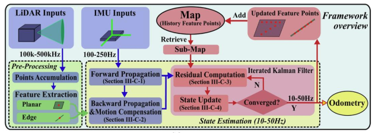

- [Fast LIO Overview](#fast-lio-overview)
  - [流形](#流形)
  - [整体框架图示](#整体框架图示)
  - [算法步骤](#算法步骤)

# Fast LIO Overview

FAST-LIO 是一种基于紧耦合激光雷达-IMU融合的高效里程计框架，其核心思想是通过迭代卡尔曼滤波（IEKF）实时优化机器人状态（位置、速度、姿态等），同时利用IMU数据校正LiDAR的运动畸变

固态激光雷达给SLAM带来了新的挑战

1. 固态激光雷达视场角小，更容易退化
2. 高分辨率的点云融合到IMU中需要巨大的计算资源
3. 无人机螺旋桨和发动机的持续旋转也给IMU测量带来了显著的噪声，同时引起点云的运动畸变



- 激光雷达的输入被送入特征提取模块，以获得平面和线特征点
- imu前向传播,进行EKF预测（积分），然后后向传播（求导，四元数球面线性插值），进行点云运动补偿
- 通过IEKF进行更新（将点云注册到全局地图），输出里程计状态
- 估计的姿势将特征点注册到全局框架，并将它们与到目前为止构建的特征点地图合并
- 在下一步中，最终使用更新后的地图来配准进一步的新点

## 流形

- 在流形上的每个点，我们可以定义一个与该点相切的线性空间，这个空间就是正切空间，正切空间是局部近似流形的一个线性空间
- 在姿态中，旋转矩阵的李群就是一个SO(3)流形，其局部对应的欧氏空间是李代数so(3)，为了避免奇异性和保持结构特性，使用流形进行运算

## 整体框架图示

```
  +-------------------+     +-------------------+     +-------------------+
  |                   |     |                   |     |                   |
  |    IMU 数据       | --> |   IMU 前向传播    | --> |   状态预测        |
  |  (高频, 100Hz+)   |     |  (运动学积分)     |     |   (位置/速度/姿态)|
  +-------------------+     +-------------------+     +-------------------+
                                                           |
                                                           v
  +-------------------+     +-------------------+     +-------------------+
  |                   |     |                   |     |                   |
  |   LiDAR 点云      | --> |   运动补偿        | --> |   点云匹配        |
  |  (低频, 10Hz~20Hz)|     |   (去畸变)       |     |   (Scan-to-Map)   |
  +-------------------+     +-------------------+     +-------------------+
                                                           |
                                                           v
  +-------------------+     +-------------------+     +-------------------+
  |                   |     |                   |     |                   |
  |   全局地图        | <-- |   IKF 状态更新    | <-- |   残差计算        |
  |   (ikd-Tree)      |     |   (迭代优化)      |     |   (点-面/点-线)   |
  +-------------------+     +-------------------+     +-------------------+
```

## 算法步骤

静止初始化

输入: 
1. 上一个scan的最优状态估计$x_{k-1}, p_{k-1}$
2. 当前scan对应imu数据
3. 当前scan的激光特征点（平面和线特征）

主体流程

1. 基于前向传播得到状态预测值和先验误差的协方差矩阵 (涉及IEKF的预测与更新)
2. 基于后向传播得到运动补偿后的3D激光点
3. 迭代
   1. 计算imu前向传播先验一阶jacobian J矩阵 和 先验误差的协方差矩阵
   2. 计算点云匹配残差（平面点匹配平面,边缘点匹配边缘）（点到最邻近平面或边缘）和残差的一阶jacobian H矩阵
   3. 更新状态估计和kalman gain
   4. 结束: 当本次误差与上次误差之间的差值小于阈值
4. 更新状态估计值和后验估计协方差矩阵

输出状态估计和后验估计协方差矩阵，转换为位姿变换，然后将雷达点云转到全局坐标系下，再添加到全局地图中
