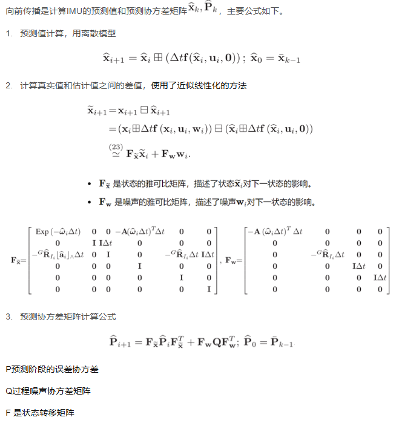
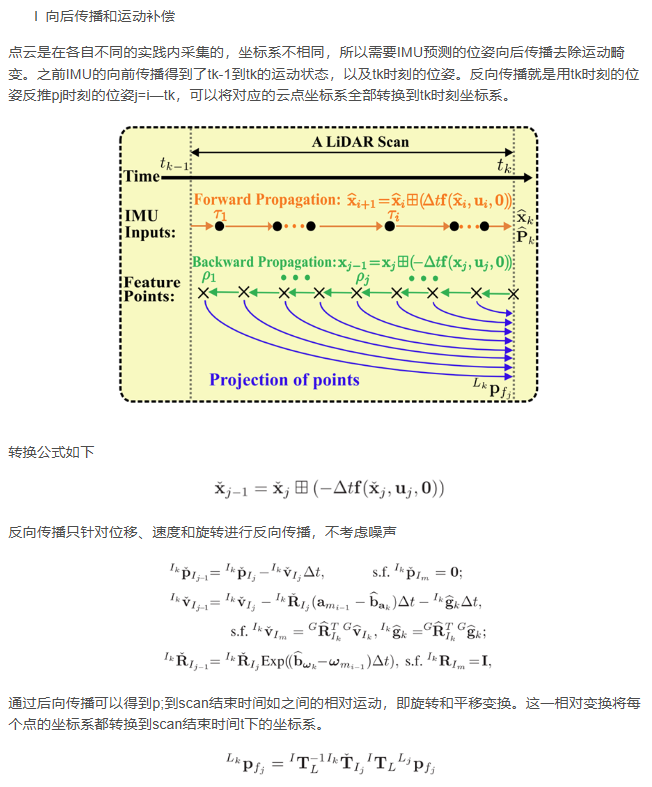
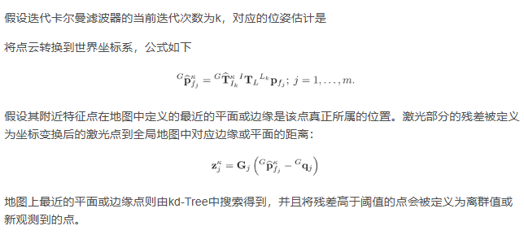
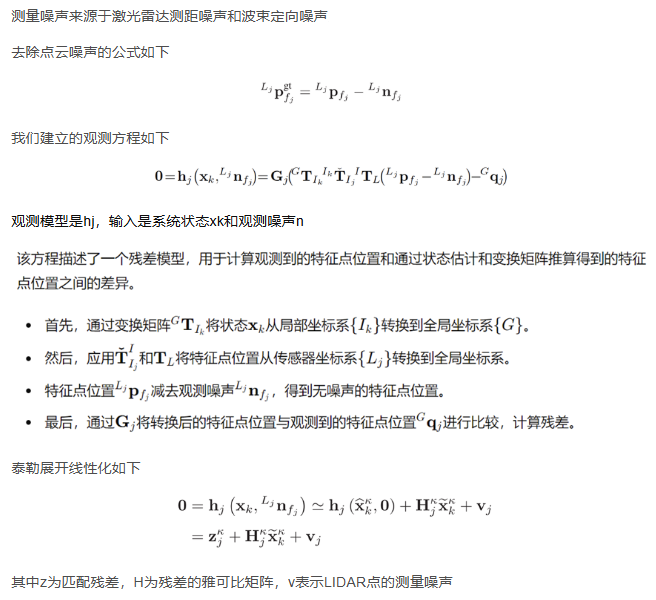
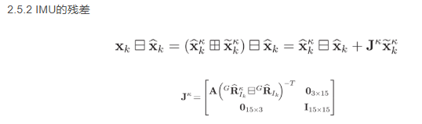
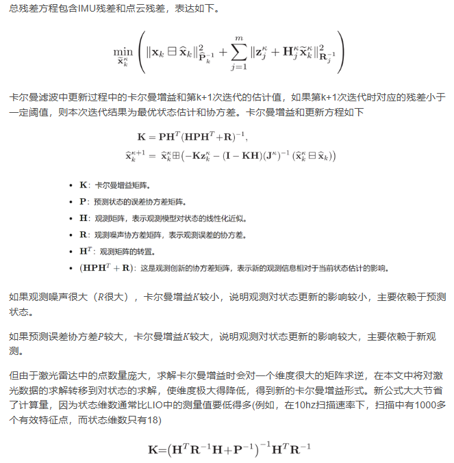
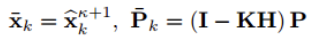

# iekf

fast-lio中使用了iekf 迭代扩展卡尔曼滤波器

## 前向传播

前向过程其实就是卡尔曼滤波的预测过程，有两个方程：状态变量的预测方程，以及协方差矩阵的预测方程

前向传播中也计算了误差状态变量的先验值（预测）和协方差矩阵的预测

误差状态变量$x = [\delta r, \delta p,\delta v, \delta b_g, \delta b_a,\delta g]$

- 计算x的先验，误差状态的先验，协方差矩阵的先验

## 后向传播

点云是在各自不同的实践内采集的，坐标系不相同，所以需要IMU预测的位姿向后传播去除运动畸变

## 计算残差

## 迭代残差

为了融合激光点云匹配残差z和上述IMU前向传播得到的当前状态估计x和误差协方差矩阵P。需要将点云残差与真实状态和LIDAR的测量噪声相关联

### 点云残差

状态量的真值和点云真值残差为0
之前计算的误差状态量先验值在这里用于计算点云残差

### imu残差

迭代时也能更新jacobian,将下式迭代至较小值退出

### 迭代更新

计算K与后验

该公式可以大大降低卡尔曼增益计算的复杂度

## 后验

