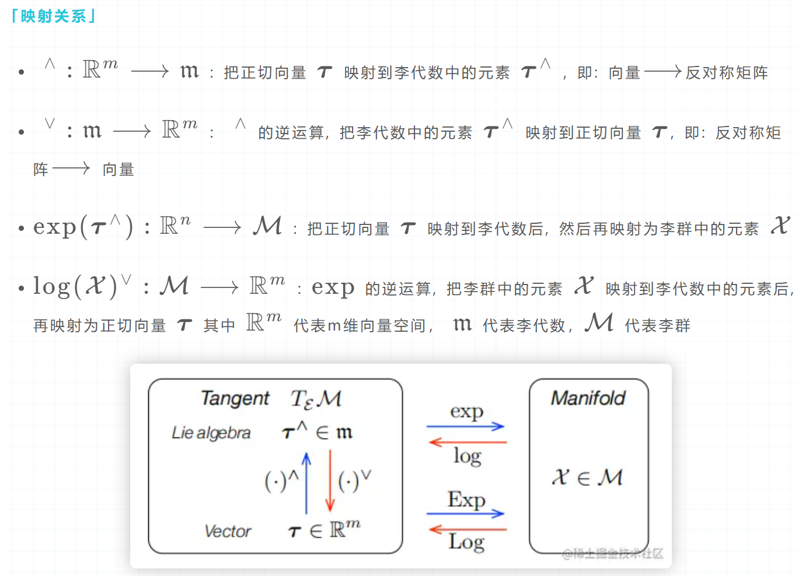
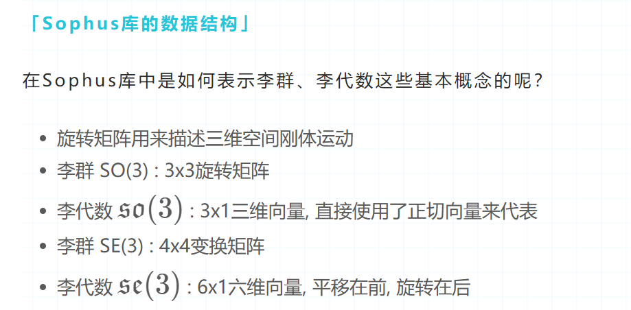

## 李群李代数 基本概念



- 旋转向量也叫角轴(angle axis),本身是SO(3)对应的李代数so(3)
- 由于so(3)是SO(3)的切空间，因此旋转向量也可以表达角速度
- 从旋转向量到旋转矩阵的转换关系可以通过罗德里格斯公式或者SO(3)上的指数映射描述
- 旋转矩阵到旋转向量由对数映射描述

[全文翻译 A micro Lie theory for state estimation robotics, JohnSola](https://zhuanlan.zhihu.com/p/799121299)



## 常见场景

### 根据轴角定义旋转矩阵

```cpp
// eigen
// 旋转向量: 第一个参数为旋转角度，第二个参数哪个为1就绕哪轴旋转
Eigen::Matrix3d rotation_matrix = Eigen::AngleAxisd( 
                    M_PI / 4, Eigen::Vector3d(0, 0, 1)).toRotationMatrix();
cout << "用沿Z轴转90度的Eigen旋转向量构造Eigen旋转矩阵:\n" << rotation_matrix << endl;

// sophus
const double Pi = Sophus::Constants<double>::pi();
Sophus::SO3d R3 = Sophus::SO3d::rotZ( Pi / 4);
cout << "用沿Z轴转90度的SO3d构造Eigen旋转矩阵:\n" << R3.matrix() << endl;
```

### eigen旋转矩阵-->SO3

- 用Eigen的旋转矩阵, 构造Sophus李群旋转矩阵SO3
- 旋转矩阵转单位四元数

```cpp
Sophus::SO3d SO3_rotation_matrix(rotation_matrix);
cout << "用Eigen的旋转矩阵构造Sophus李群旋转矩阵SO3:\n" 
     << SO3_rotation_matrix.matrix() << endl;
Eigen::Vector3d x; 
x << 0.0, 0.0, 1.0;
cout << "SO3*x\n" << SO3_rotation_matrix * x << endl;
cout << "uniq auaternion:\n" 
     << SO3_rotation_matrix.unit_quaternion().coeffs() << endl;
```

### 对数映射 求SO3对应的so3

- 求SO3对应的so3(正切向量)

```cpp
Eigen::Vector3d so3 = SO3_rotation_matrix.log();
cout << "对数映射求李群SO3的李代数so3 = " << so3.transpose() << endl;
```

### 指数映射 求so3对应的SO3

- 求李代数的李群旋转矩阵

```cpp
Sophus::SO3d SO3_rotation_matrix1 = Sophus::SO3d::exp(so3);
cout << "指数映射求李代数so3的李群SO3 = \n" << SO3_rotation_matrix1.matrix() << endl;
```

### 李代数-->反对称矩阵

- 由李代数计算对应旋转反对称矩阵

```cppp
cout << "hat 求向量到反对称矩阵 =\n" << Sophus::SO3d::hat(so3) << endl;
```

### 反对称矩阵-->李代数

```cpp
cout << "vee 求反对称矩阵到向量 = " << Sophus::SO3d::vee(Sophus::SO3::hat(so3)).transpose() << endl;
```

### 旋转矩阵R+平移t -> SE3

通过旋转矩阵R和平移向量t构造Sophus的李群变换矩阵SE3

```cpp
// 平移向量: 沿X轴平移1
Eigen::Vector3d t(1, 0, 0);
Sophus::SE3d SE3_rotation_translation(rotation_matrix, t);
cout << "用旋转矩阵R,平移向量t构造Sophus表示的李群变换矩阵SE3= \n" 
     << SE3_rotation_translation.matrix() << endl;
```

###  对数映射 求SE3对应se3

se3=[平移，旋转] 6*1

```cpp
typedef Eigen::Matrix<double, 6, 1> Vector6d;
Vector6d se3 = SE3_rotation_translation.log();
cout << "李代数se3 是一个六维向量 李群SE3的对数映射求李代数se3 \n" << se3.transpose() << endl;
```

###  指数映射 求se3对应SE3

```cpp
Sophus::SE3d SO3_rotation_matrix2 = Sophus::SE3::exp(se3);
cout << "指数映射求李代数se3的李群SE3 = \n" << SO3_rotation_matrix2.matrix() << endl;
```

### 李代数se3求反对称矩阵

```cpp
cout << "se3 hat = \n" << Sophus::SE3::hat(se3) << endl;
```
