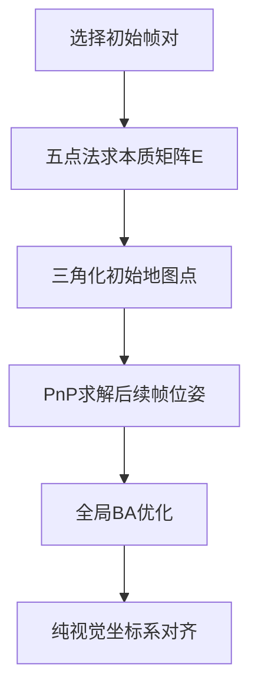

- [vins mono overview](#vins-mono-overview)
- [传感器数据预处理](#传感器数据预处理)
  - [图像处理管道](#图像处理管道)
- [紧耦合初始化](#紧耦合初始化)
  - [视觉SFM初始化](#视觉sfm初始化)
  - [视觉-惯性对齐](#视觉-惯性对齐)
- [滑动窗口优化](#滑动窗口优化)
  - [优化问题构建](#优化问题构建)
  - [边缘化策略](#边缘化策略)
- [回环检测与全局优化](#回环检测与全局优化)
  - [基于DBoW2的回环检测](#基于dbow2的回环检测)
  - [位姿图优化](#位姿图优化)
- [时间同步机制](#时间同步机制)
- [性能优化技巧](#性能优化技巧)
  - [特征提取并行化](#特征提取并行化)
  - [SIMD优化](#simd优化)
- [实际应用中存在的问题](#实际应用中存在的问题)
  - [极端环境下的尺度漂移问题](#极端环境下的尺度漂移问题)
  - [高速运动下的视觉退化](#高速运动下的视觉退化)
  - [动态物体干扰](#动态物体干扰)
  - [视觉-IMU时空标定误差](#视觉-imu时空标定误差)
  - [大场景回环检测失效](#大场景回环检测失效)
  - [多传感器时空同步](#多传感器时空同步)
  - [计算资源瓶颈](#计算资源瓶颈)
  - [初始化可靠性](#初始化可靠性)

# vins mono overview

# 传感器数据预处理

```cpp
// IMU回调函数（vins_estimator/src/estimator.cpp）
void Estimator::inputIMU(double t, const Vector3d &linearAcc, const Vector3d &angularVel)
{
    // 1. 数据缓冲
    imu_buf.push(make_pair(t, make_pair(linearAcc, angularVel)));
    
    // 2. 预积分计算（vins_estimator/src/factor/integration_base.h）
    if (prev_time > 0) {
        double dt = t - prev_time;
        imu_preintegrator->push_back(dt, linearAcc, angularVel);
        
        // 3. 传播状态（中值积分）
        predict(dt, linearAcc, angularVel);
    }
    prev_time = t;
    
    // 4. 发布IMU里程计
    pubIMUOdometry();
}
```

关键技术点：

- 采用中值积分保证数值稳定性
- 使用imu_preintegrator维护预积分结果
- 协方差传播考虑噪声模型：Q = Σ(F * Q * F^T + G * V * G^T)

## 图像处理管道

```cpp
// 图像回调函数（feature_tracker/src/feature_tracker.cpp）
void FeatureTracker::readImage(const cv::Mat &_img)
{
    // 1. 光流追踪
    vector<cv::Point2f> pts = trackFeatures(prev_img, _img);
    
    // 2. 特征点管理
    rejectWithF(pts);  // 基于基础矩阵剔除外点
    setMask(pts);      // 设置特征分布mask
    
    // 3. 新特征检测
    if (pts.size() < min_features) {
        cv::goodFeaturesToTrack(_img, new_pts, max_cnt - pts.size(), 0.01, MIN_DIST);
    }
    
    // 4. 去畸变并发布
    undistortPoints(pts);
    pubTrackImage(_img, pts);
}
```

# 紧耦合初始化

## 视觉SFM初始化



## 视觉-惯性对齐

- 陀螺仪偏置标定
- 速度/重力/尺度线性方程组
- 重力细化(在切线空间优化)

# 滑动窗口优化

## 优化问题构建

```cpp
// （vins_estimator/src/estimator.cpp）
void Estimator::optimization()
{
    // 1. 构建ceres问题
    ceres::Problem problem;
    
    // 2. 添加视觉残差
    for (auto &it_per_frame : feature_manager.feature) {
        ProjectionFactor *f = new ProjectionFactor(pts_2d);
        problem.AddResidualBlock(f, loss_function, para_Pose[imu_i], para_Pose[imu_j], para_Ex_Pose, para_Feature);
    }
    
    // 3. 添加IMU残差
    IntegrationBase *pre_integration = ...;
    IMUFactor *imu_factor = new IMUFactor(pre_integration);
    problem.AddResidualBlock(imu_factor, NULL, para_Pose[i], para_SpeedBias[i], para_Pose[j], para_SpeedBias[j]);
    
    // 4. 添加边缘化先验
    MarginalizationFactor *marginalization_factor = ...;
    problem.AddResidualBlock(marginalization_factor, NULL, last_marginalization_parameter_blocks);
    
    // 5. 执行优化
    ceres::Solve(options, &problem, &summary);
}
```

## 边缘化策略

Schur补边缘化过程


1. 构建hessian矩阵

```
H = [ H_mm H_mr ]
    [ H_rm H_rr ]
```

2. 计算schur补

```
H_marg = H_mm - H_mr*H_rr^-1*H_rm
```

3. 保留先验信息

```
b_marg = b_m - H_mr*H_rr^-1*b_r
```

# 回环检测与全局优化

## 基于DBoW2的回环检测

```cpp
// （loop_fusion/src/loop_closure.cpp）
void LoopClosing::detectLoop()
{
    // 1. 词袋查询
    DBoW2::QueryResults results;
    db.query(frame->bow_vec, results, 1);
    
    // 2. 时间一致性检查
    if (need_old_keyframe || results[0].Score > 0.05) {
        // 3. 几何验证
        findConnection(keyframe, old_keyframe);
    }
}
```

## 位姿图优化

优化变量

```
minΣ( ||r_p||Σp + ||r_loop||Σl )
```

- r_p：IMU预积分约束
- r_loop：回环相对位姿约束

# 时间同步机制

时间戳对齐算法

```cpp
// （vins_estimator/src/utility/utility.cpp）
bool syncSensorData(double img_t, vector<pair<double, Vector3d>> &imu_msgs)
{
    // 1. 查找时间窗口
    while (imu_buf.front().first <= img_t - 0.003) {
        imu_msgs.push_back(imu_buf.front());
        imu_buf.pop();
    }
    
    // 2. 线性插值
    double t1 = imu_buf.front().first;
    double t2 = imu_buf.back().first;
    Vector3d imu_data = lerp(img_t, t1, t2, imu_buf.front().second, imu_buf.back().second);
    
    // 3. 补偿时间偏移
    imu_data = compensateTimeOffset(imu_data, time_offset);
    return true;
}
```

# 性能优化技巧

## 特征提取并行化

```cpp
cv::parallel_for_(cv::Range(0, image.rows), [&](const cv::Range &range) {
    fast_detector->detect(image.rowRange(range), kps[range]);
});
```

## SIMD优化

- 使用Eigen向量化运算
- 启用AVX指令集编译

1. 根据场景调整特征点参数
2. 在动态环境中启用RANSAC
3. 对计算资源受限平台减小窗口大小
4. 定期监控系统健康状态指标

# 实际应用中存在的问题

VINS-Mono作为视觉惯性里程计（VIO）系统之一，在实际应用中仍存在一些具有挑战性的问题

## 极端环境下的尺度漂移问题

在长时间纯旋转运动或低纹理环境中，视觉无法提供尺度观测，导致IMU的加速度双积分误差累积

- 现有方法（如关键帧约束）无法完全抑制长期漂移

表现: 在50米以上的长廊环境中，轨迹可能产生5-10%的尺度收缩

## 高速运动下的视觉退化

当相机运动速度超过8m/s时，图像模糊导致特征跟踪失败率>70%，IMU积分误差呈二次方增长

## 动态物体干扰

动态物体占比>30%时

- 传统RANSAC剔除失效（内点率<20%）
- 语义分割+几何验证的组合方案计算量过大

## 视觉-IMU时空标定误差

标定精度瓶颈

- 时间同步误差>1ms时，定位误差增加30%
- 外参旋转标定误差>0.5°会导致每米0.8cm的位姿偏差

根本原因

- 标定目标的运动激励不足
- 工厂标定与在线标定结果不一致性问题

## 大场景回环检测失效

- 场景相似度>80%时（如办公楼重复结构），假阳性率>40%
- 尺度模糊导致位姿图优化发散

## 多传感器时空同步

同步误差来源

- 硬件触发抖动（典型值±0.5ms）
- 软件时间戳延迟（Linux系统默认精度仅10ms）

## 计算资源瓶颈

TX2平台

- 特征跟踪--30%--120m
- 滑动窗口优化--60%--300m
- 回环检测--45%--250

## 初始化可靠性

失败场景统计：

1. 静止初始化成功率：<20%
2. 纯旋转初始化成功率：<40%
3. 正常运动初始化成功率：85%

数学本质：
视觉SFM的尺度不确定性导致IMU参数估计病态
