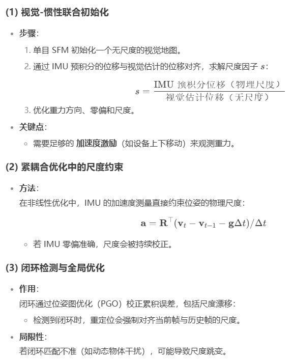
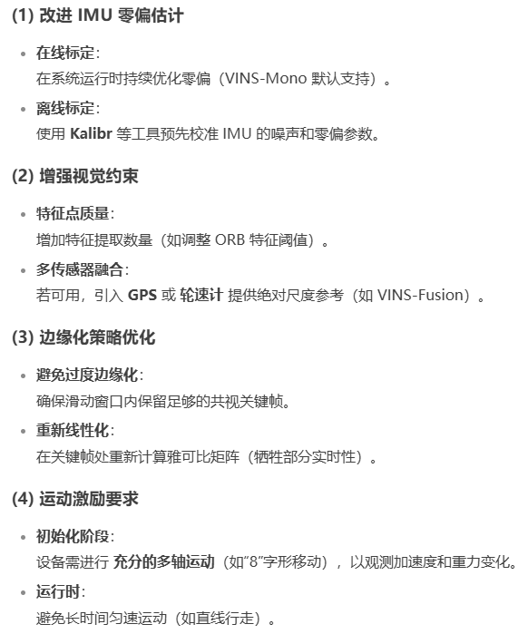

- [尺度漂移的主要原因](#尺度漂移的主要原因)
  - [IMU 零偏（Bias）估计不准确](#imu-零偏bias估计不准确)
  - [视觉退化场景](#视觉退化场景)
  - [边缘化（Marginalization）的误差传递](#边缘化marginalization的误差传递)
  - [闭环检测的影响](#闭环检测的影响)
  - [初始化不准确](#初始化不准确)
- [VINS-Mono 的尺度校正机制](#vins-mono-的尺度校正机制)
- [减小尺度漂移的实用方法](#减小尺度漂移的实用方法)
- [总结](#总结)

# 尺度漂移的主要原因

在 VINS-Mono 中，尺度漂移（Scale Drift） 是一个关键问题，尤其在长时间运行或动态环境中。由于单目视觉惯性系统（VIO）本身缺乏绝对尺度信息，尺度主要依赖 IMU 的加速度测量 来校正

## IMU 零偏（Bias）估计不准确

IMU 零偏$b_a, b_g$会随时间漂移，会导致

1. 加速度积分误差：位移和速度估计的尺度失真
2. 重力方向错误：影响视觉-惯性对齐的尺度计算

典型现象: 轨迹整体缩放（如实际 10 米的路径被估计为 8 米或 12 米）

## 视觉退化场景

在 低纹理环境、快速运动 或 动态物体干扰 时，视觉特征跟踪失效，导致

1. 视觉重投影误差增大，IMU 成为主导约束
2. 若 IMU 数据噪声大，尺度会随惯性积分漂移

典型现象: 尺度在转弯或遮挡时突然变化

## 边缘化（Marginalization）的误差传递

边缘化旧帧时，其约束会以 先验信息 形式保留。如果边缘化的线性化点（如使用 FEJ）与当前状态不一致，会导致

1. 先验约束的尺度与最新观测冲突
2. 尺度误差在滑动窗口内累积

典型现象: 尺度在闭环前逐渐漂移，闭环校正后跳变

## 闭环检测的影响

如果系统检测到 闭环（Loop Closure），并通过位姿图优化（Pose Graph Optimization）校正轨迹，可能会 调整全局尺度

闭环匹配的误差可能导致尺度突然跳变

## 初始化不准确

VINS-Mono 的初始化阶段通过 视觉-惯性对齐 估计初始尺度。若初始化时

- 运动激励不足（如纯旋转或低速运动）
- IMU 数据噪声大（如手持设备晃动）

会导致初始尺度错误，后续优化难以纠正

典型现象：系统启动后尺度立即偏离真实值

# VINS-Mono 的尺度校正机制

# 减小尺度漂移的实用方法

# 总结

- 根本原因：单目 VIO 的尺度依赖 IMU，零偏误差和视觉退化是漂移主因
- 解决方案
  - 提升 IMU 标定质量，加强视觉特征跟踪
  - 合理配置边缘化策略，避免误差累积
  - 在关键场景（如初始化、闭环）确保运动激励充足
- 融合 GPS 或改用 双目/RGB-D 传感器（如 VINS-Fusion 或 ORB-SLAM3），彻底消除尺度模糊性
