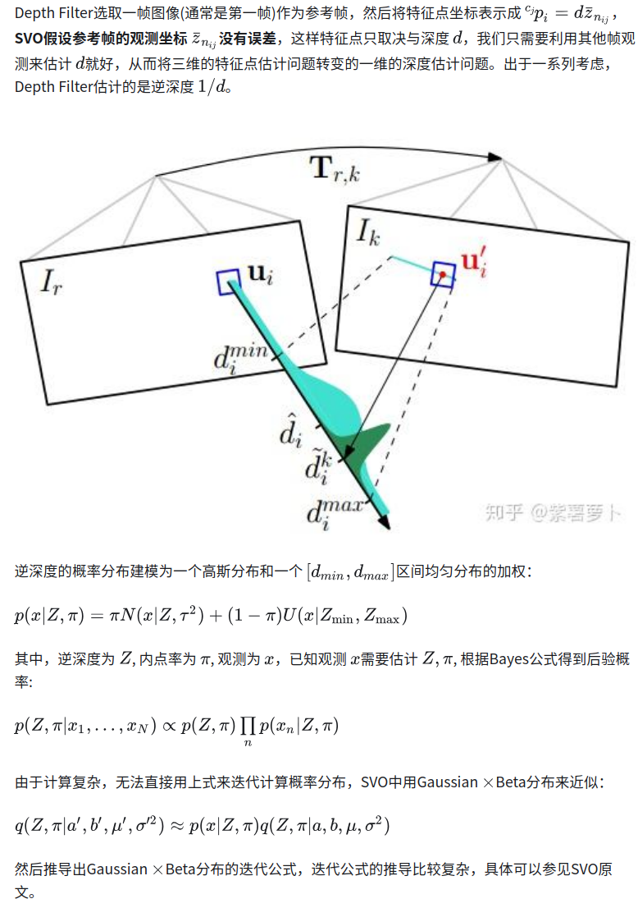

- [VSLAM　Triangulation](#vslamtriangulation)
  - [问题定义](#问题定义)
- [\\end{bmatrix}](#endbmatrix)
  - [闭式求解](#闭式求解)
    - [最小化3D距离](#最小化3d距离)
      - [3D射线方程](#3d射线方程)
    - [Direct Linear Transform](#direct-linear-transform)
    - [基于优化的方法](#基于优化的方法)
      - [既然已经有了闭式解法，为什么还要做优化迭代呢？](#既然已经有了闭式解法为什么还要做优化迭代呢)
    - [滤波方法](#滤波方法)
      - [EKF-SLAM](#ekf-slam)
      - [DEPTH FILTER](#depth-filter)
- [reference](#reference)

# VSLAM　Triangulation

特征点三角化（Triangulation）是VSLAM中一个非常基础的问题，它是根据特征点在多个相机下的投影恢复出特征点的3D坐标

- 特征点在某个相机中被观测到，根据相机位姿和观测向量可以得到3D空间中的一条从相机中心出发的观测“射线”
- 多个相机位姿观测会产生多条观测射线，理想情况下这些观测射线相交于空间中一点
- 求所有观测射线的交点就是特征点在3D空间的位置，这就是三角化

实际中由于噪声的存在，这些观测射线不可能刚好相交于一点，那如何求特征点坐标呢？有几种思路：

1. 找一个3D点与所有观测射线的距离都很近，以此作为特征点
2. 最小化重投影误差: 误差来源于2D图像观测，所以把特征点投影到每个2D相机平面，最小化所有2D投影点到对应观测点之间的距离
3. 很多时候三角化是在线（Online）运行的，并不是全部观测都拿到以后再进行求解，而是一边获取观测一边估计特征点
   1. 所以用一个滤波器来估计特征点的概率分布（通常是Gaussian）
   2. 旧的观测信息被隐式的存放在概率分布中，来了新的观测后，用新的观测来更新特征点的概率分布
   3. 这样能够节省很大的计算量，这就是滤波方法

## 问题定义

设3D特征点$^{w}p_i$ z=(x,y,z)，被Ｍ个相机拍摄，已知相机位姿{$^{w}R_i$, $^{w}t_i$},相机内参K，特征点在各相机的观测{$z_i$} $(u_i,v_i)$, 求t特征点的3D坐标(x,y,z)

$$
\{\{^{w_i}R_{c_i},^{w_i}t_{c_i},z_{i}\},K\} \rightarrow {^{w}p_i}
$$

不考虑误差的情况有如下投影关系（接下来的方法基本上都会用到该投影关系）：

$$
s\begin{bmatrix}
    {u_{i}}\\
    {v_{i}}\\
    1\\
\end{bmatrix}
=
K\begin{bmatrix}
    R, T
\end{bmatrix}

\begin{bmatrix}
    {x_{i}}\\
    {y_{i}}\\
    {z_{i}}\\
    1
\end{bmatrix}
$$

## 闭式求解

### 最小化3D距离

[Vision-Based State Estimation and Trajectory Control Towards High-Speed Flight with a Quadrotor.]

最小化3D距离的目标是：在世界坐标系下求一个3D点离所有观测射线的3D距离最近

1. 求观测射线的数学方程:像素坐标转相机坐标，再进行归一化
2. 计算3d射线方程
3. 计算特征点到射线的距离
4. 目标函数定义为特征点到所有观测距离的平方和最小

关于其中特征点到射线距离使用叉乘运算的理解

1. $^{w}t_{c}$表示相机坐标原点在世界坐标系下的position
2. ${u_{i}}$表示相机坐标系下射线的方向向量,$R{u_{i}}$则将其转到世界坐标系，如此射线源点和射线方向都转到世界坐标系下
3. 计算特征点到射线的距离，这里使用两个向量叉乘取模
   1. 向量叉乘会得到它们的法向量
   2. 同时它的模长等于由向量a和向量b构成的平行四边形的面积，且该平行四边形的底为1,则模场和高相等，即是平行四边形顶点到底的距离

#### 3D射线方程

三维射线方程是描述一个从某点出发，并沿某个方向延伸的线段的方程

在三维空间中，射线方程可以用参数化的方式表示为

$$
P(t)=P_0+tD
$$

- P(t)是射线上的点，在任意参数t处的位置
- P_{0}是射线的起点也叫射线的源点$(x_0,y_0,z_0)$
- D是射线的方向向量$(d_x,d_y,d_z)$表示射线沿哪个方向延伸。这个向量通常是单位向量，表示方向，但可以是任意长度的向量
- t是参数它表示射线上的位置，t 通常是非负的，因为射线是从原点出发并向某个方向延伸的

射线方程表示了一个从点$P_0$开始，沿着方向D延伸的所有点

### Direct Linear Transform

以上两种方法都是得到最小二乘意义下的闭式解，但解的形式确不一样，根本原因在于它们的目标函数不同，１中的目标函数是最小化3D特征点到所有观测射线之间的距离，而DLT用的目标函数是

### 基于优化的方法

优化方法基本都是最小化重投影误差（图像平面或Normalize平面），当然你也可以优化特征点到观测射线的3D距离，但这个有闭式解，没必要做优化迭代，而优化重投影误差是个非线性优化问题

#### 既然已经有了闭式解法，为什么还要做优化迭代呢？

实践证明，闭式求解确实不香，至少没有优化方法香。其实很好理解，我们把最小二乘解理解为将误差项建模为高斯分布情况下的最大似然估计，**闭式方法将高斯误差加在特征点到观测射线的距离上**，而**实际误差来源于图像观测，所以将高斯误差加在图像平面的距离上更符合实际**

因此一般做三角化都是先用闭式解得到初始值，然后在此基础上优化重投影误差，以获得比闭式解更高的精度

得到Jacobian之后，就是常规的非线性最小二乘求解了,常用的方法有高斯牛顿法、LM法、Dogleg法

### 滤波方法

#### EKF-SLAM

滤波方法将特征点表示成一个概率分布进行估计，通常是Gaussian分布，通过相机观测来估计特征的均值和协方差。 与优化方法类似，滤波方法也是推导重投影误差对特征点的Jacobian，但通常相机位姿也是不准的，所以会把相机位姿和特征点放到特征向量中一起估计，也就是EKF-SLAM，这是残差模型中的Jacobian包含两块：重投影误差对相机状态的Jacobian以及对特征状态的Jacobian：

$$
r_{ij}=J_{X}X+J_{f}p_{f}+n
$$

#### DEPTH FILTER

# reference

[特征点三角化](https://zhuanlan.zhihu.com/p/103694374)
