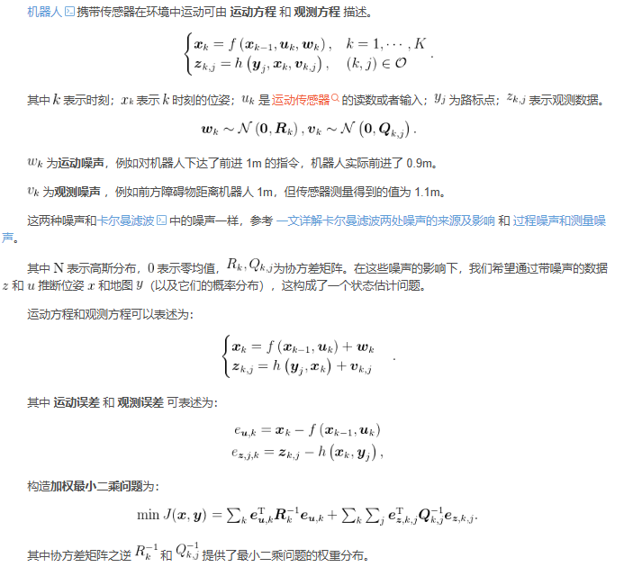
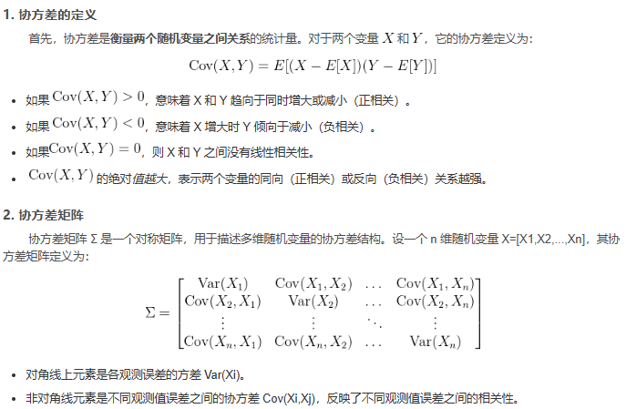
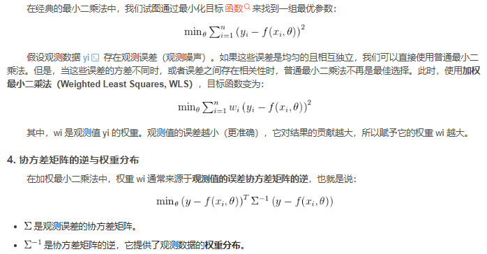
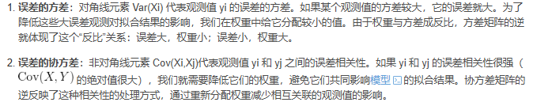

- [SLAM中的加权最小二乘](#slam中的加权最小二乘)
  - [数学描述](#数学描述)
  - [协方差矩阵之逆提供了最小二乘问题的权重分布](#协方差矩阵之逆提供了最小二乘问题的权重分布)
    - [最小二乘法与加权最小二乘法](#最小二乘法与加权最小二乘法)
    - [协方差的逆与权重分布](#协方差的逆与权重分布)
    - [为什么用协方差矩阵的逆提供权重分布？](#为什么用协方差矩阵的逆提供权重分布)
- [总结](#总结)
- [reference](#reference)

# SLAM中的加权最小二乘

## 数学描述

## 协方差矩阵之逆提供了最小二乘问题的权重分布

### 最小二乘法与加权最小二乘法

### 协方差的逆与权重分布

假设观测数据 yi 存在观测误差（观测噪声）。如果这些误差是均匀的且相互独立，我们可以直接使用普通最小二乘法。但是，当这些误差的方差不同时，或者误差之间存在相关性时，普通最小二乘法不再是最佳选择。此时，使用加权最小二乘法（Weighted Least Squares, WLS）

### 为什么用协方差矩阵的逆提供权重分布？

- 直观理解

协方差矩阵之逆 $\Sigma^{-1}$ 可以看作一个“校正因子”，用来对观测数据进行加权

1. 如果某些观测值的误差较小（方差小），它们的权重就大，意味着它们对拟合结果贡献更大
2. 如果某些观测值的误差较大（方差大），它们的权重就小，意味着它们对拟合结果的影响被减弱
3. 如果观测值之间存在相关性（非对角线协方差非零），协方差矩阵的逆会根据这些相关性调整每个观测的权重，避免相关性带来的重复信息影响结果

# 总结

协方差矩阵的逆在加权最小二乘法中起到了分配观测值权重的作用

1. 它通过对误差方差和相关性的分析，决定每个观测值对最终结果的影响力
2. 协方差矩阵之逆越大的元素，对应的观测值权重越大，意味着该观测值更“可信”或重要
3. 这种权重分布能够优化拟合过程，使得误差小、相互独立的观测值对结果贡献更大，而误差大、相互相关的观测值影响更小

# reference

