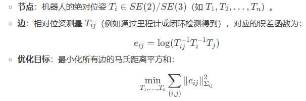
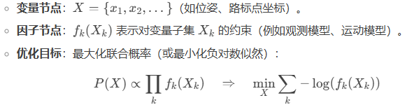
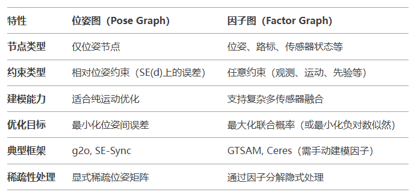

- [位姿图](#位姿图)
- [因子图](#因子图)
- [关键区别](#关键区别)
- [联系与转换](#联系与转换)
- [总结](#总结)

位姿图（Pose Graph）和因子图（Factor Graph）是SLAM（同时定位与建图）和机器人状态估计中常用的两种图模型

# 位姿图

用图结构表示机器人位姿（节点）与位姿之间的相对约束（边），通过优化节点位姿来最小化约束误差

数学形式

特点

1. 直观性：直接建模位姿之间的关系，适合描述机器人运动轨迹
2. 稀疏性：通常只有相邻位姿或闭环位姿之间存在边，矩阵稀疏
3. 应用场景
   1. 激光SLAM（如Cartographer）
   2. 纯运动估计（无特征点的情况）

# 因子图

一种二分图，包含变量节点（待估计的状态，如位姿、路标点）和因子节点（约束，如观测、里程计、先验）

数学形式

特点

1. 通用性：可统一表示多种约束（位姿、路标、传感器模型等）
2. 模块化：因子节点灵活支持不同传感器（IMU、视觉、GPS）
3. 应用场景
   1. 视觉SLAM（如ORB-SLAM，需处理特征点）
   2. 多传感器融合（如VINS-Fusion）
   3. 增量式优化（如GTSAM的iSAM2）

# 关键区别

# 联系与转换

1. 位姿图是因子图的特例
   1. 位姿图可看作因子图中仅包含位姿变量和相对位姿因子的简化形式
2. 因子图扩展性更强
   1. 因子图可轻松集成路标点、IMU预积分、GPS等约束，而位姿图无法直接处理这些信息

# 总结

- 位姿图是因子图的子集，专注于位姿间关系，适合轻量级优化
- 因子图更具普适性，适合复杂传感器融合和概率推理
- 现代SLAM系统（如VINS、LIO-SAM）通常混合使用两者：前端用因子图建模多传感器数据，后端用位姿图做全局优化
