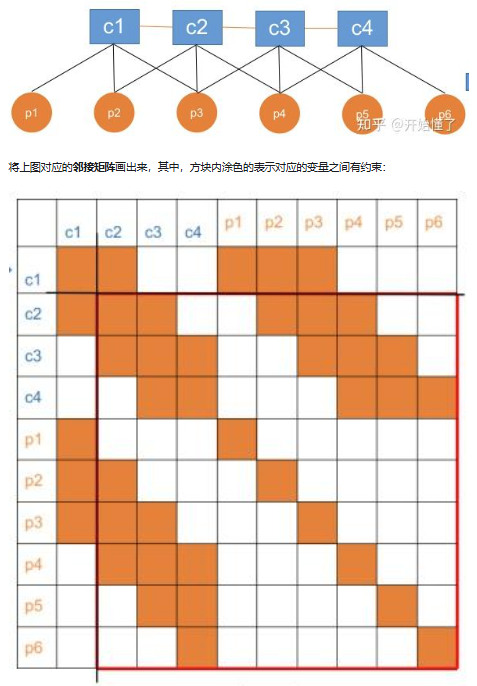
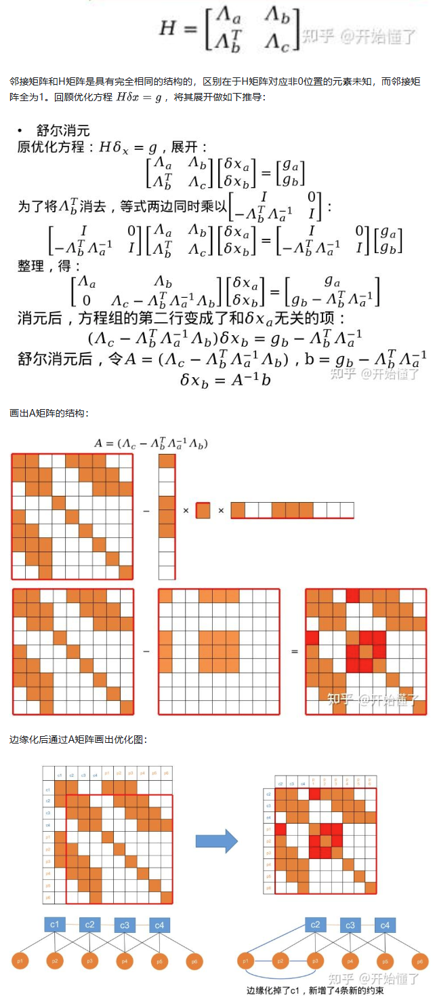

- [求解gauss-newton最小二乘问题时用到的边缘化](#求解gauss-newton最小二乘问题时用到的边缘化)
- [谨慎选择边缘化的变量](#谨慎选择边缘化的变量)

为了计算gauss-newton最小二乘问题$H \Delta x = g$ 的待更新变量$\Delta x$,需要计算H矩阵的逆，求逆运算是费时的，但是H矩阵本身是稀疏的，由此引出 Schur 消元

# 求解gauss-newton最小二乘问题时用到的边缘化

假设当前构建了一个BA问题，总共有相机c1到c4，路标点p1到p6。c1观测到路标点p1～p3;c2观测到了p2～p4;c3观测到了p3～p5;c4观测到p4～p6。路标点和观测帧可形成视觉重投影约束，相邻两帧相机位姿有IMU预积分约束，则可绘制优化图为

- 将C1边缘化后，对应的H矩阵新增了一些非0元素后变的更稠密一些。这种现象称为Fill in现象，反映在优化图上就是新增了一些约束边
- 将$H \Delta x = g$中需要求解大的$\Delta x$问题变成求解$A \delta x_{b}=b$，其中A矩阵是H矩阵的一部分，比H矩阵更稠密
- 边缘化后A矩阵求逆的复杂度取决与边缘化掉的$\delta x_{a}$大小，，如果边缘化掉所有路标点的约束，那最终A会变得很小

# 谨慎选择边缘化的变量

由于边缘化一个变量仅会对与它直接相关变量所在的行列Fill-in，Fill-in现象会增加求解的耗时，所以我们需要慎重地选择需要边缘化的变量，以保持H矩阵的稀疏
假设要边缘化的点是路标，进行讨论

对被边缘化的关键帧x1观测到的y1-y4，存在以下几种情况

- 路标只在x1中观测到，在其余帧中都不出现。那么可以直接丢掉这个路标，不对窗口产生任何影响。这个路标是孤立的
- 路标在x2-x4中看到，但是在未来看不到。（这里只是这样假设，实际取决于前端的实现方式。像vins那种光流前端不会追踪已经丢失的特征点，所以你可以这样子假设。）那么可以把这个路标也同时边缘化。路标边缘化时会产生Pose-Pose部分的先验，所以变成了Pose部分的先验信息
- 路标在x2-x4中看到，并且在将来也可能看到。那么这个路标不应该被边缘化，因为我们之后还需要更新它的估计值。
