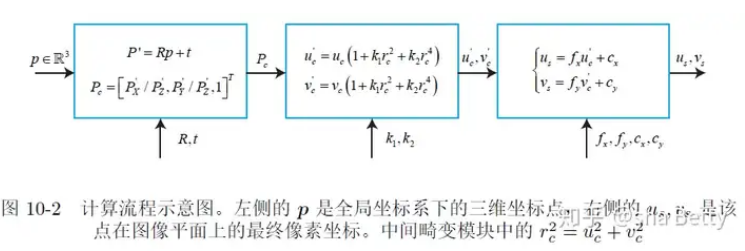
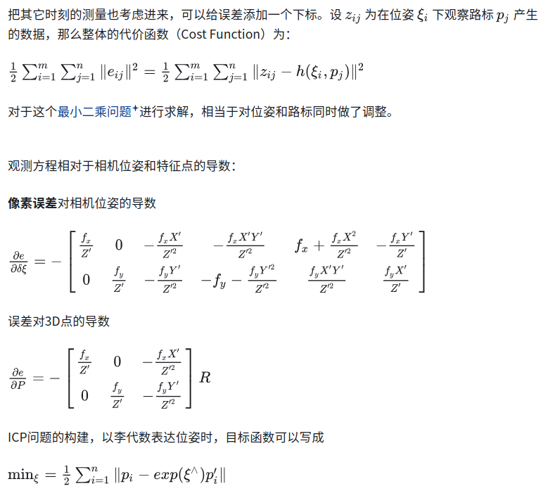
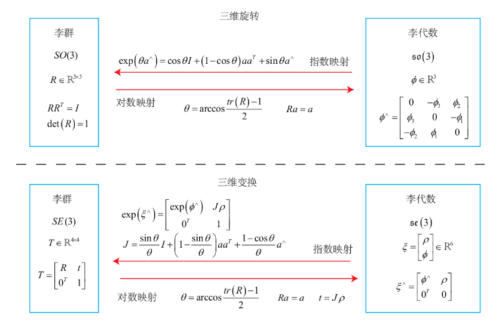

- [针孔相机模型](#针孔相机模型)
- [观测方程](#观测方程)
- [李代数和李群的互相转化](#李代数和李群的互相转化)

参考 [相机误差模型及各种导数](https://zhuanlan.zhihu.com/p/272505070)

## 针孔相机模型

1. 世界坐标系存在3D点P[X,Y,Z]
2. 相机坐标系相对于世界坐标系具有R的旋转，t的平移。那么，在相机坐标系下，该3D点的坐标

$$
P^{'}=[X^{'},Y^{'},Z^{'}]\\
P^{'}=RP+T\\
X_1=T_{12}X_2\\
X_c=T_{cw}X_w
$$

3. 将P'投影到归一化平面，得到归一化坐标

$$
P_c=[u_c,v_c,1]^T=[X^{'}/Z^{'},Y^{'}/Z^{'},1]^T
$$

4. 考虑归一化坐标的畸变情况，得到去畸变前的原始像素坐标,这里得到的还是相机坐标

$$
u^{'}_c=u_c(1+k_1r_c^2++k_2r_c^4)\\
v^{'}_c=v_c(1+k_1r_c^2++k_2r_c^4)\\

r_c=u_c^2+v_c^2
$$

5. 根据内参模型，将归一化坐标转为像素坐标

$$
u_s=f_x * u_c^{'}+c_x\\
v_s=f_y * v_c^{'}+c_y\\
$$

上述过程也可以称为观测方程`z=h(x,y)` x指代此时的相机位姿，外参RT，对应李代数位姿$\xi$ 路标点y对应3D点p,观测数据z则是像素坐标[$u_s$,$v_s$]

## 观测方程

上述以最小二乘的角度看，观测的误差是

$e=z-h(\xi,p)$

## 李代数和李群的互相转化

旋转矩阵对应的李代数是一个三维向量，相机位姿（刚性变换矩阵，没有尺度因子）是一个六维向量

