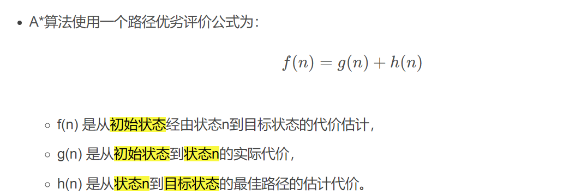
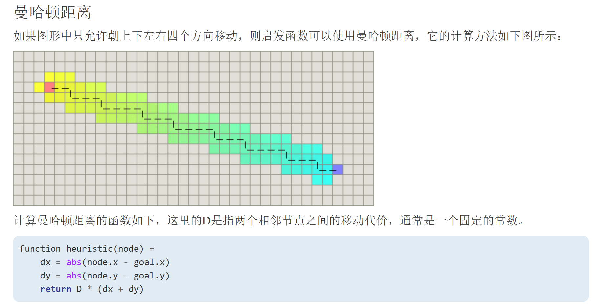
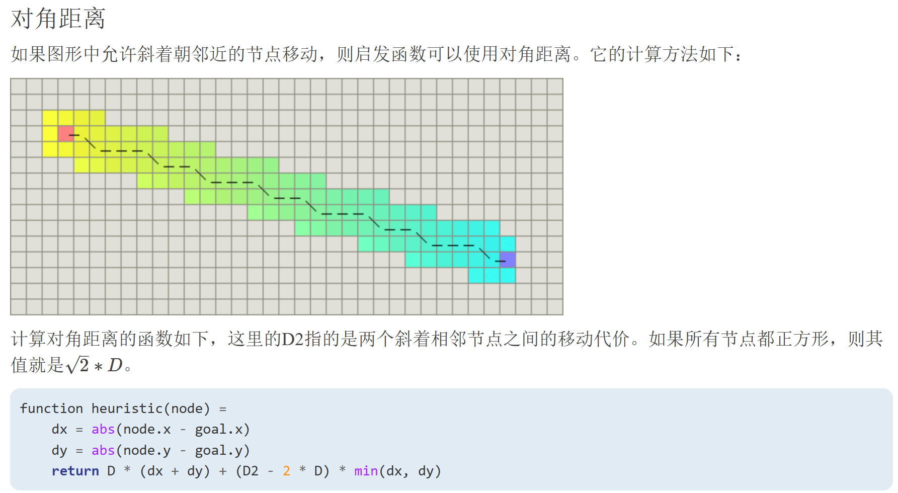
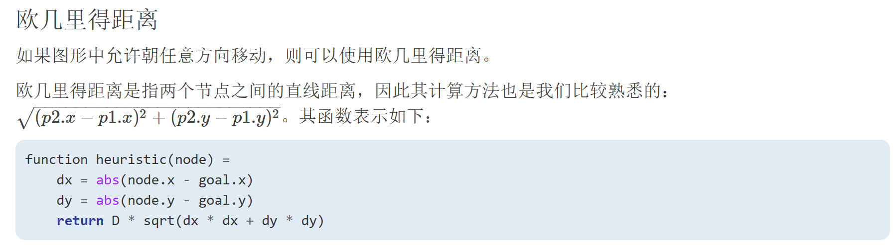

## A-star 算法

- 是一种静态路网中求解最短路径最有效的直接搜索方法，广泛应用于室内机器人路径搜索、游戏动画路径搜索等。它是图搜索算法的一种。
- A* 算法是一种启发式的搜索算法，它是基于深度优先算法(Depth First Search, DFS)和广度优先算法(Breadth First Search, BFS)的一种融合算法
- A* 算法基于启发函数构建了代价函数，既考虑了新结点距离初始点的代价，又考虑了新结点与目标点距离的代价



h(n)是节点n距离终点的预计代价，这也就是A*算法的启发函数

- A*算法在运算过程中，每次从优先队列中选取f(n)值最小（优先级最高）的节点作为下一个待遍历的节点。
- 另外，A*算法使用两个集合来表示待遍历的节点，与已经遍历过的节点，这通常称之为open_set和close_set。

算法描述

```txt
* 初始化open_set和close_set；
* 将起点加入open_set中，并设置优先级为0（优先级最高）；
* 如果open_set不为空，则从open_set中选取优先级最高的节点n：
    * 如果节点n为终点，则：
        * 从终点开始逐步追踪parent节点，一直达到起点；
        * 返回找到的结果路径，算法结束；
    * 如果节点n不是终点，则：
        * 将节点n从open_set中删除，并加入close_set中；
        * 遍历节点n所有的邻近节点：
            * 如果邻近节点m在close_set中，则：
                * 跳过，选取下一个邻近节点
            * 如果邻近节点m也不在open_set中，则：
                * 设置节点m的parent为节点n
                * 计算节点m的优先级
                * 将节点m加入open_set中
```

## 启发函数

启发函数会影响A*算法的行为

- 当启发函数h(n)始终为0，则将由g(n)决定节点的优先级，此时算法就退化成了Dijkstra算法
- 如果h(n)始终小于等于节点n到终点的代价，则A*算法保证一定能够找到最短路径。但是当h(n)的值越小，算法将遍历越多的节点，也就导致算法越慢
- 如果h(n)完全等于节点n到终点的代价，则A*算法将找到最佳路径，并且速度很快。可惜的是，并非所有场景下都能做到这一点。因为在没有达到终点之前，我们很难确切算出距离终点还有多远
- 如果h(n)的值比节点n到终点的代价要大，则A*算法不能保证找到最短路径，不过此时会很快
- 在另外一个极端情况下，如果h(n)相较于g(n)大很多，则此时只有h(n)产生效果，这也就变成了最佳优先搜索（best first）（预先算出每个节点到终点的距离）

对于网格形式的图，可以参考一下启发函数

- 如果图形中只允许朝上下左右四个方向移动，则可以使用曼哈顿距离（Manhattan distance）
- 如果图形中允许朝八个方向移动，则可以使用对角距离
- 如果图形中允许朝任何方向移动，则可以使用欧几里得距离（Euclidean distance）







参考

- [路径规划之 A* 算法](https://paul.pub/a-star-algorithm/#id-%E7%AE%97%E6%B3%95%E4%BB%8B%E7%BB%8D)
- [【路径规划】全局路径规划算法——A*算法（含python实现 | c++实现）](https://blog.csdn.net/weixin_42301220/article/details/125140910)
