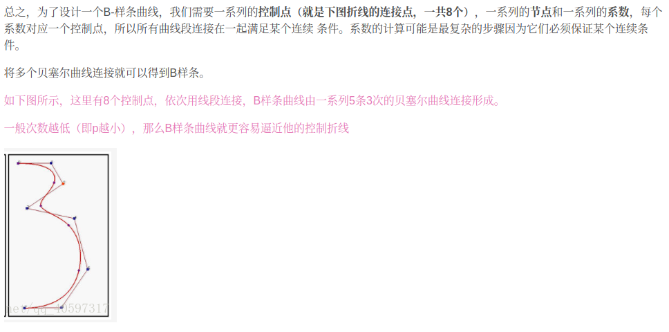
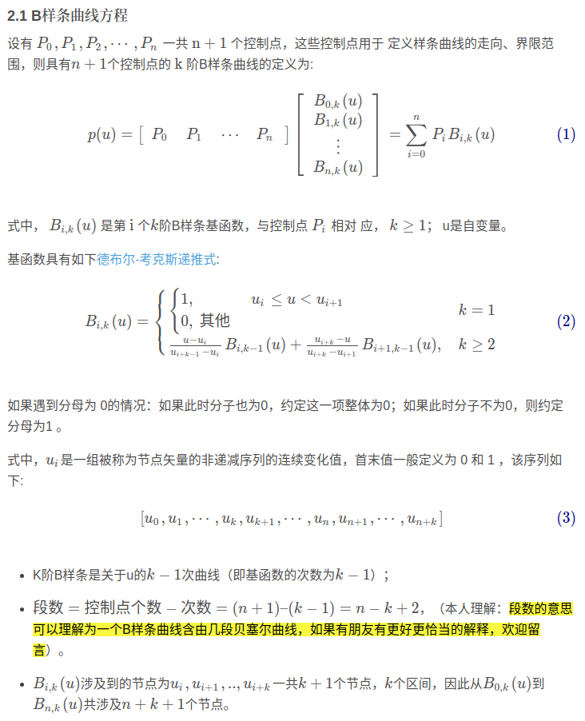
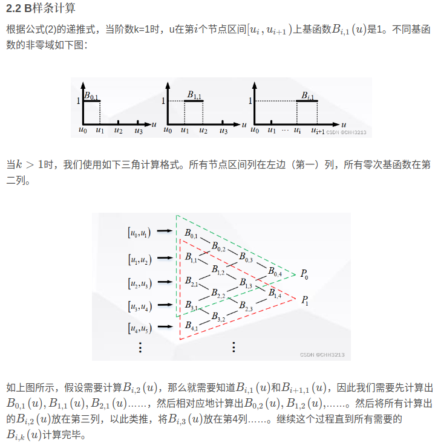
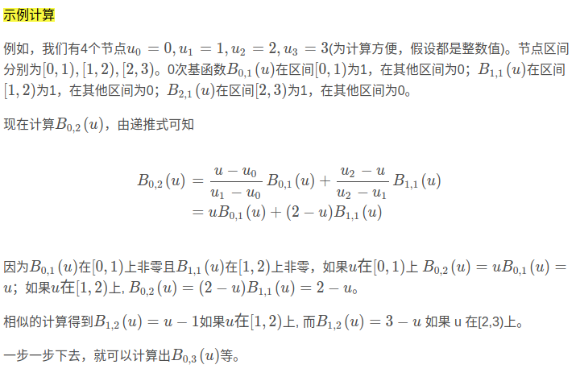
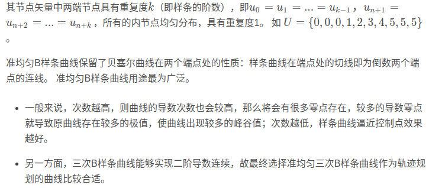
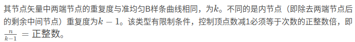
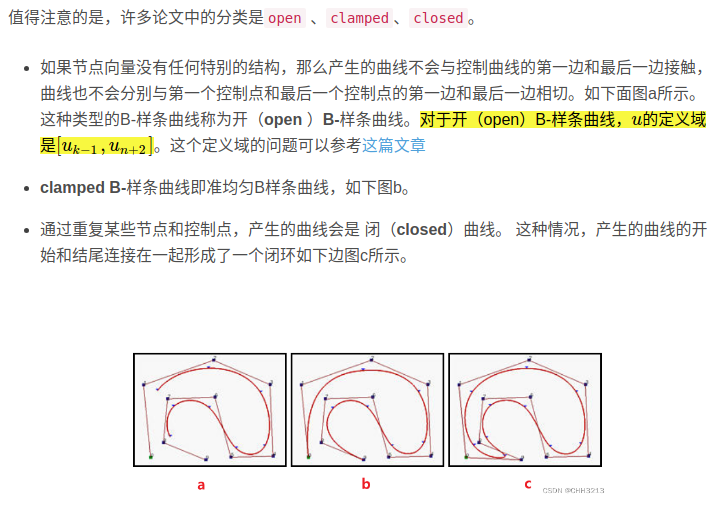

## B-Spline Curve

(感觉B-Spline有点复杂，要去找点视频看)

bezier curve的不足

1. 控制点数决定了bezier曲线的阶次，当顶点数（ n+1 ） 较大时， 曲线的次数较高，曲线的导数次数也会较高，因此曲线会出现较多的峰谷值
2. 贝塞尔曲线无法进行局部修改
3. Bezier曲线/曲面拼接时，满足几何连续条件是十分困难的

B样条曲线除了保持Bezier曲线所具有的优点外，还弥补了上述所有的缺陷

1. 可以指定阶次
2. 移动控制点仅仅改变曲线的部分形状，而不是整体
3. B样条曲线是贝塞尔曲线的一般化，贝塞尔曲线可以认为是B样条曲线的特例

可以说，B-样条曲线是由有多段bezier curve组成

对于分段Bezier曲线，不同的曲线段相互独立，移动控制点只会影响其所在的Bezier曲线段，而其他的Bezier曲线段都不会改变，甚至所有关于Bezier曲线的算法可以同样地适用于分段Bezier曲线

- 用分段低阶多项式通过连续的连接来代替高阶多项式

本文是把k定义为样条的阶数，其它文章是定义成曲线的次数，而曲线的次数=样条的阶数-1

(已经有点看不懂了,代码里面只做了准均匀B样条和分段B样条，先萌混过关)

根据节点u的取值，可以划分以下几种类型

**均匀B样条曲线**

**准均匀B样条曲线**

**分段B样条曲线**

**一般非均匀B样条曲线**

ref

- [CS3621 Introduction to Computing with Geometry Notes 6 chapter](https://pages.mtu.edu/~shene/COURSES/cs3621/NOTES/)
- [局部路径规划算法——B样条曲线法](https://blog.csdn.net/weixin_42301220/article/details/125173884) 
