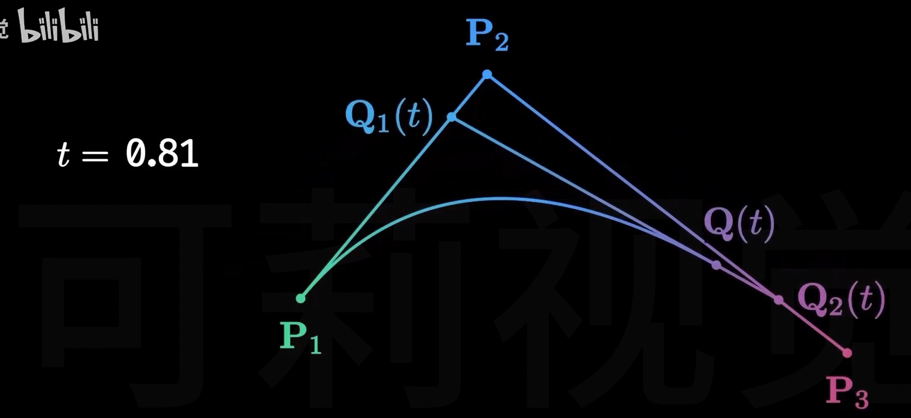

- [bezier curve](#bezier-curve)
  - [一次贝塞尔曲线](#一次贝塞尔曲线)
  - [二次bezier曲线](#二次bezier曲线)
  - [三次bezier curve](#三次bezier-curve)
- [性质](#性质)

## bezier curve

- 贝塞尔曲线是应用于二维图形应用程序的数学曲线，由一组称为控制点的向量来确定，给定的控制点按顺序连接构成控制多边形
- 贝塞尔曲线逼近这个多边形，进而通过调整控制点坐标改变曲线的形状
- 控制点的作用是控制曲线的弯曲程度
- bezier 曲线是参数化曲线，n次贝塞尔曲线由n+1个控制点决定

贝塞尔曲线只需要很少的控制点就能够生成较复杂的平滑曲线。该方法能够保证输入的控制点与生成的曲线之间的关系非常简洁、明确。

### 一次贝塞尔曲线

定义两点P1 P2，在两点连线定义点Q，再定义参数t,表示Q在P1 P2两点距离的百分比，如果t=0,Q点与P1点重合，为1则和P2点重合

借助坐标系定义Q的函数

$$

Q(t)=P_1+t(P_2-P_1)\\

Q(t)=(1-t)P_1+tP_2

$$

也将$Q(t)=(1-t)P_1+tP_2$成为lerp(P_1,P_2,t)函数

### 二次bezier曲线

添加控制点P3,P2 P3中点Q2，再在Q1 Q2连线定义Q(t)

### 三次bezier curve

n阶以此类推

通过上面一阶到三阶的贝塞尔曲线，可以发现贝塞尔点的求解满足递归的性质

## 性质

1. 几何性质不随坐标系变换而变化
2. 曲线起点和终点处切线与多边形第一条边和最后一条边分别相切
3. 至少需要3阶bezier curve 才能生成曲率连续的路径
   1. 曲率连续需要二阶导数连续，三阶贝塞尔曲线求两次导还有变量t，是关于t连续的
> 城市环境下局部路径规划，如贝塞尔曲线能够拟合直道和弯道，在曲率变化较大的地方可以选用两个贝塞尔曲线来拟合。

> 无人驾驶车辆的运动规划，目标轨迹曲率是连续的且轨迹的曲率不超过车辆可行驶轨迹曲率的限制。

ref

- [Animated Bézier Curves](https://www.jasondavies.com/animated-bezier/)

- [贝塞尔曲线-可莉视觉](https://www.bilibili.com/video/BV1qL411B73P/?spm_id_from=333.1391.0.0&vd_source=4d02a316606ea19e315b11bab27432aa)

- [局部路径规划算法——贝塞尔曲线法](https://blog.csdn.net/weixin_42301220/article/details/125167672)
