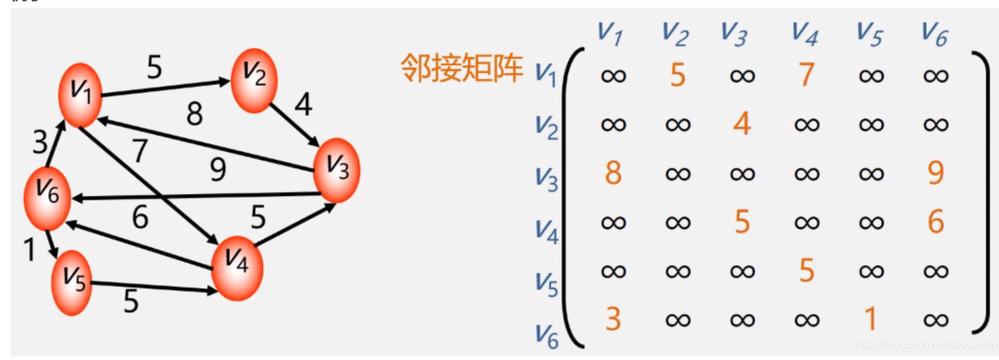
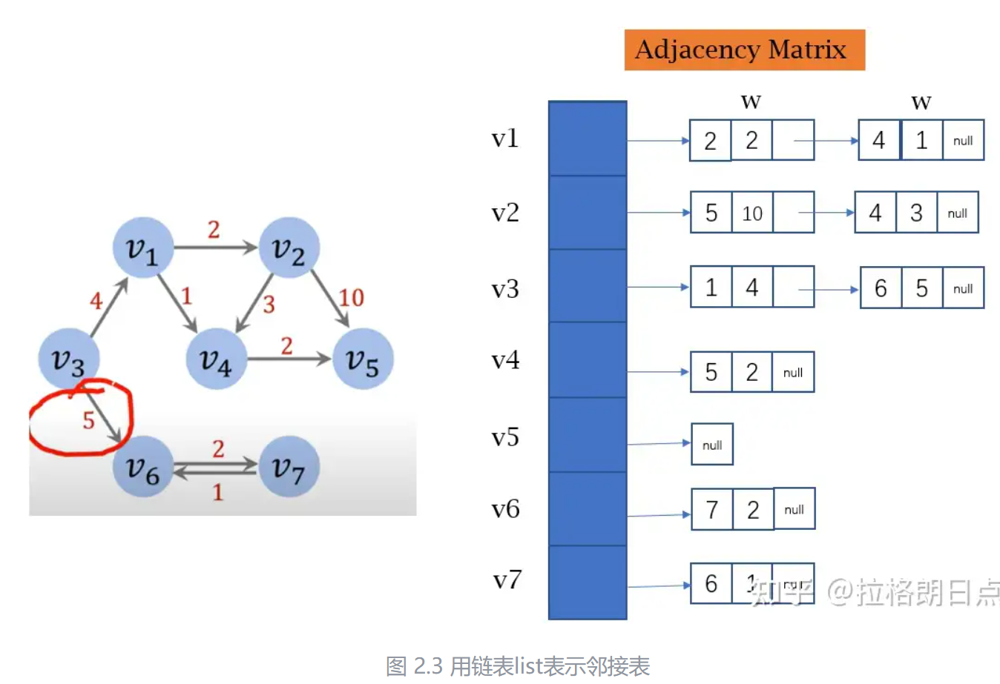
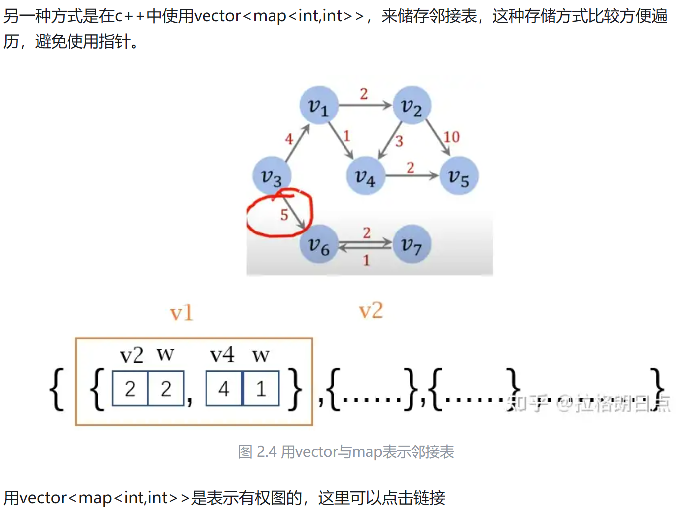
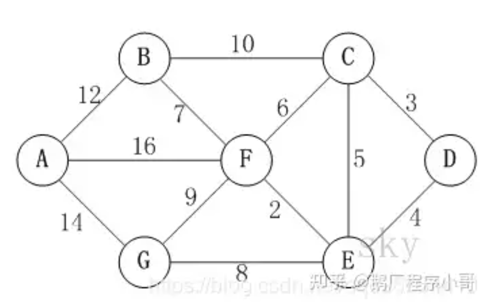
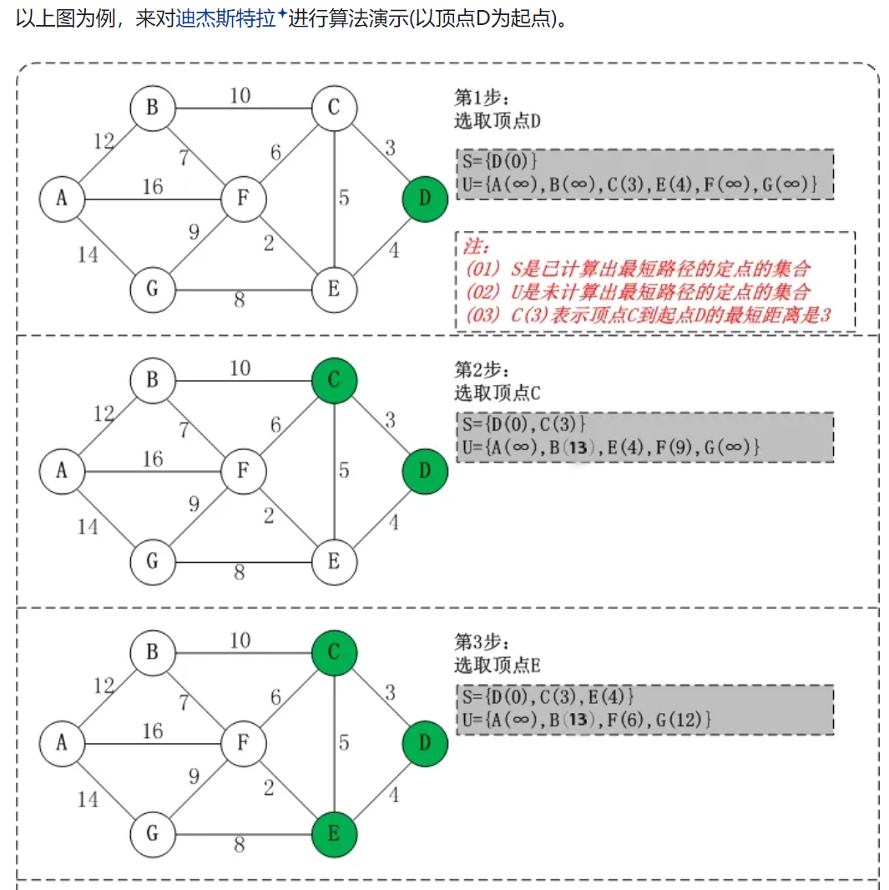
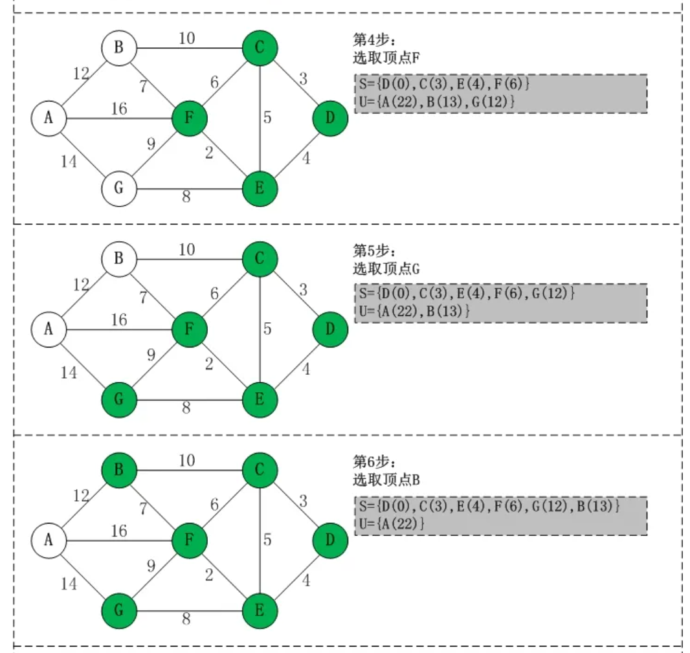
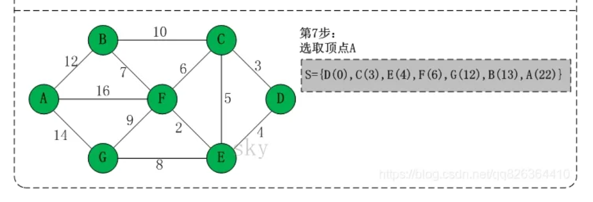

- [图的表示方式](#图的表示方式)
- [dijkstra](#dijkstra)

## 图的表示方式

- 邻接矩阵，邻接表

邻接矩阵表示有向图,数字代表边的权重，顶点没有直接相连则为无穷或者0

邻接表，每一个顶点对应一个链表。链表中的第一个值是指向的节点，第二个值代表权重

vector<map<int,int>>来储存邻接表的方式,这种方式可减少图的存储空间。配合优先队列使用可以降低时间复杂度

邻接矩阵表示图的优缺点

优点

1. 直观
2. 方便检查任意一对顶点间是否存在边
3. 方便找任一顶点的所有“邻接点”(有边直接相连的顶点)
4. 方便计算任一顶点的“度”

缺点

1. 不便于增加和删除顶点
2. 浪费空间——存稀疏图(点很多而边很少)有大量无效元素
3. 浪费时间——统计稀疏图中一共有多少条边

## dijkstra

从图中的某个顶点出发到达另外一个顶点的所经过的边的权重和最小的一条路径，称为最短路径。解决最短路径问题的算法有Dijkstra算法和Floyd(佛洛依德)算法

迪杰斯特拉(Dijkstra)算法是广度优先的最短路径算法，用于计算一个节点到其他节点的最短路径。

- 初始化邻接矩阵，通过Dijkstra计算图G中的最短路径时，需要指定一个起点D(即从顶点D开始计算)
- 此外，引进两个数组S和U，S数组长度为顶点数量, U数组长度为顶点数量-1
  - S的作用是记录已求出最短路径的顶点(以及相应的最短路径长度)
  - U则是记录还未求出最短路径的顶点(以及该顶点到起点D的距离)
- 初始时，数组S中只有起点D；数组U中是除起点D之外的顶点，并且数组U中记录各顶点到起点D的距离。如果顶点与起点D不相邻，距离为无穷大。
- 然后，从数组U中找出路径最短的顶点K，并将其加入到数组S中；同时，从数组U中移除顶点K。接着以K为桥梁，更新并比较，保留数组U中的各顶点到起点D的最短距离。
  - 如果: 起点0—>j(经过k)的距离 < 起点0—>j(不经过k)的距离即dist[j]，则dist[j]= 0—>j(经过k)的距离 = 0->k的距离即dist[k] + k->j的距离( <k,j>的权值 )
- 重复第4步操作，直到遍历完所有顶点

初始状态：S是已计算出最短路径的顶点集合，U是未计算除最短路径的顶点的集合！

- 第1步：将顶点D加入到S中。
此时，S={D(0)}, U={A(∞),B(∞),C(3),E(4),F(∞),G(∞)}。 注:C(3)表示C到起点D的距离是3。

- 第2步：将顶点C加入到S中。
上一步操作之后，U中顶点C到起点D的距离最短；因此，将C加入到S中，同时更新U中顶点的距离。以顶点F为例，之前F到D的距离为∞；但是将C加入到S之后，F到D的距离为9=(F,C)+(C,D)。
此时，S={D(0),C(3)}, U={A(∞),B(13),E(4),F(9),G(∞)}。

- 第3步：将顶点E加入到S中。
上一步操作之后，U中顶点E到起点D的距离最短；因此，将E加入到S中，同时更新U中顶点的距离。还是以顶点F为例，之前F到D的距离为9；但是将E加入到S之后，F到D的距离为6=(F,E)+(E,D)。
此时，S={D(0),C(3),E(4)}, U={A(∞),B(13),F(6),G(12)}。

- 第4步：将顶点F加入到S中。
此时，S={D(0),C(3),E(4),F(6)}, U={A(22),B(13),G(12)}。

- 第5步：将顶点G加入到S中。
此时，S={D(0),C(3),E(4),F(6),G(12)}, U={A(22),B(13)}。

- 第6步：将顶点B加入到S中。
此时，S={D(0),C(3),E(4),F(6),G(12),B(13)}, U={A(22)}。

- 第7步：将顶点A加入到S中。
此时，S={D(0),C(3),E(4),F(6),G(12),B(13),A(22)}。

此时，起点D到各个顶点的最短距离就计算出来了：A(22) B(13) C(3) D(0) E(4) F(6) G(12)

参考

[最短路径算法-迪杰斯特拉(Dijkstra)算法](https://zhuanlan.zhihu.com/p/346558578)