- [Dubin curve](#dubin-curve)
  - [单车车辆运动学模型](#单车车辆运动学模型)
  - [Dubins曲线](#dubins曲线)
  - [CSC轨迹](#csc轨迹)
  - [CCC轨迹](#ccc轨迹)
- [dubins 曲线推导计算](#dubins-曲线推导计算)
  - [CSC轨迹推导计算](#csc轨迹推导计算)
    - [已知圆心位置和半径，求切点](#已知圆心位置和半径求切点)
    - [已知起点终点位姿，求圆心坐标](#已知起点终点位姿求圆心坐标)
- [计算行驶轨迹](#计算行驶轨迹)
  - [CSC类型曲线轨迹求解流程](#csc类型曲线轨迹求解流程)
  - [CCC类型轨迹推导](#ccc类型轨迹推导)
- [总结](#总结)

## Dubin curve

### 单车车辆运动学模型

使用dubin曲线需要先了解车辆运动学模型,以下以单车模型为基础分析

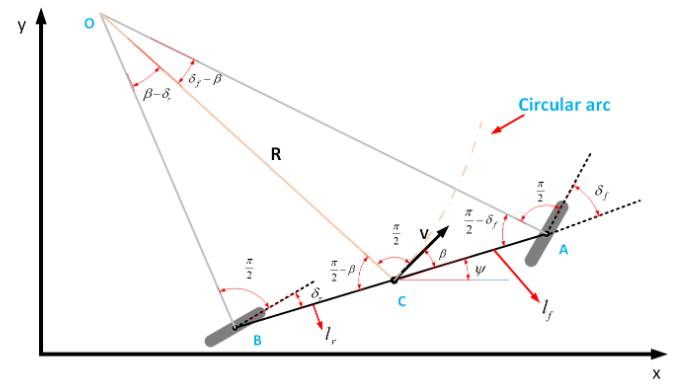

设车辆的转弯半径

$$
R=L/tan(\delta_f)
$$

L是前轴到后轴的长度，$\delta_f$是最大前轮转角

简化的运动学模型方程(两个方向的线加速度和角加速度)可以表示为

$$
\dot{x}=v*cos \theta\\
\dot{y}=v*sin \theta\\
\dot{\theta}=w=v/R
$$

$\theta$是偏航角，v是纵向速度，w角速度

将上述方程离散化

$$
x_{new}=x_{prev}+v*cos(\theta)*dt\\
y_{new}=y_{prev}+v*sin(\theta)*dt\\
\theta_{new}=\theta_{prev}+v/R*dt
$$

令$\Delta s = v*dt$

$$
x_{new}=x_{prev}+\Delta s*cos(\theta)\\
y_{new}=y_{prev}+\Delta s*sin(\theta)\\
\theta_{new}=\theta_{prev}+\Delta s/R
$$

### Dubins曲线

Dubins 曲线不考虑车辆后退（汽车只能朝前开），且不允许出现尖瓣。Dubins曲线是在满足曲率约束和规定的始端和末端的切线方向的条件下，连接两个二维平面（即X-Y平面）的最短路径

Dubins曲线可以表示成3个运动基本动作的组合（即左转L LL、右转R RR、直行S SS），一般将一种组合称之为一种word

|符号|含义|绕单位圆|
|---|---|---|
|L|左转|逆时针|
|R|右转|顺时针|
|S|直走|直走|

dubins 曲线集合

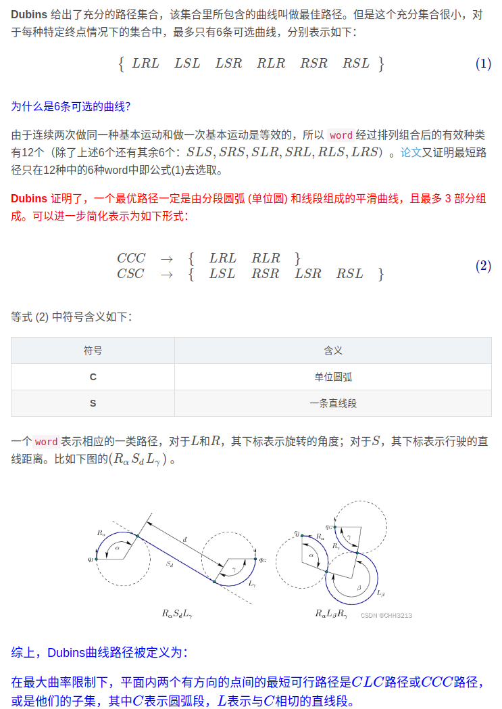

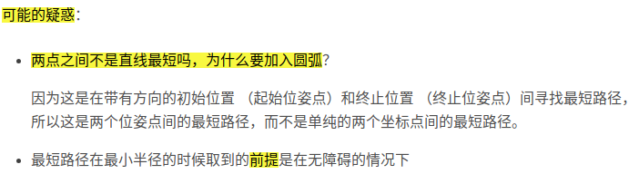

### CSC轨迹

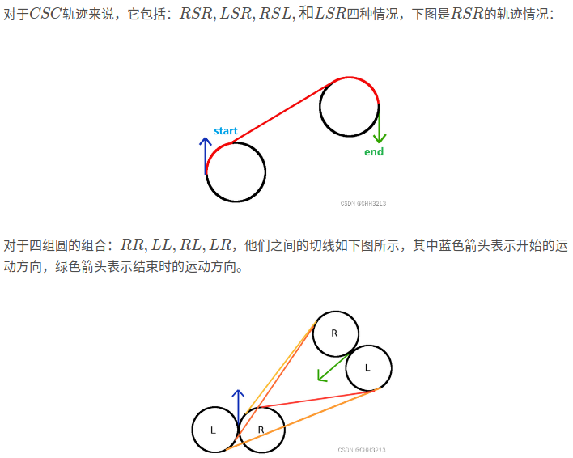

### CCC轨迹

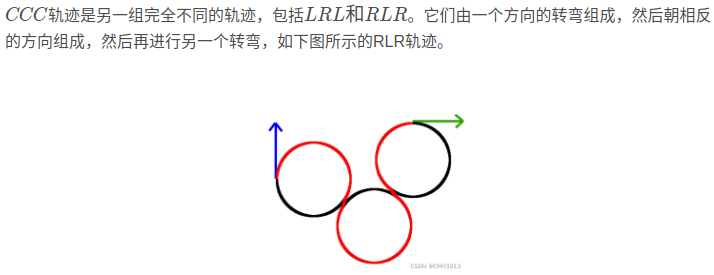

## dubins 曲线推导计算

计算的关键

对于给定的两个圆的圆心位置，如何计算切点位置。

- 对于CSC类型的组合，其关键是根据起终点出发的两个圆，计算出一条切线，由于起终点的方向性，这条切线唯一。
- 对于CCC类型的组合，其关键是计算过渡切圆的位置

### CSC轨迹推导计算

#### 已知圆心位置和半径，求切点

RSR和LSL

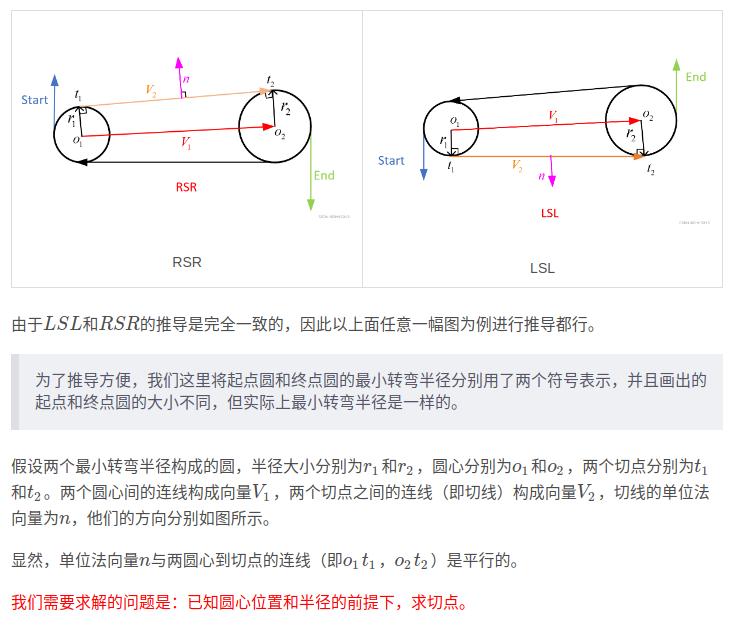

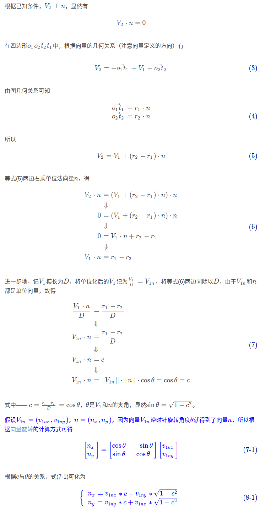

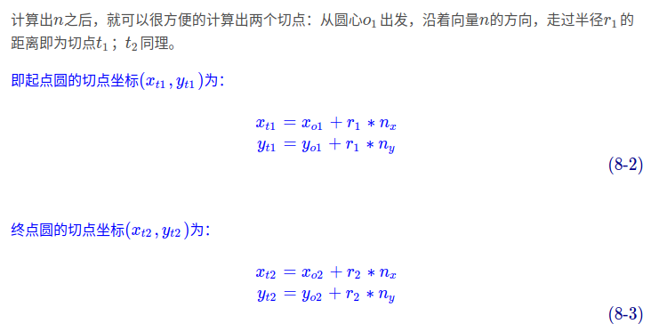

RSL和LSR

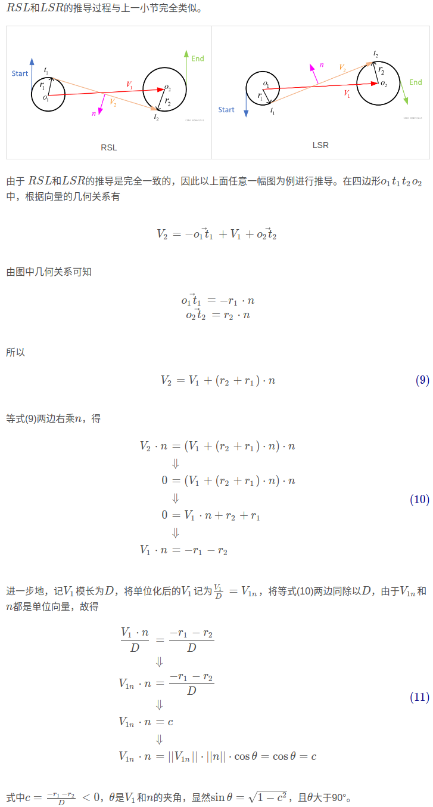

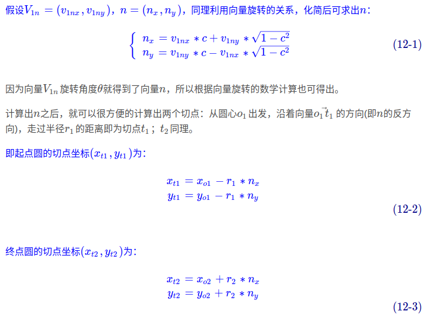

#### 已知起点终点位姿，求圆心坐标

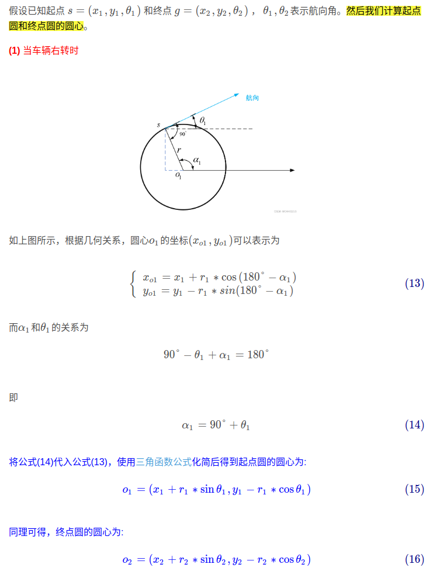

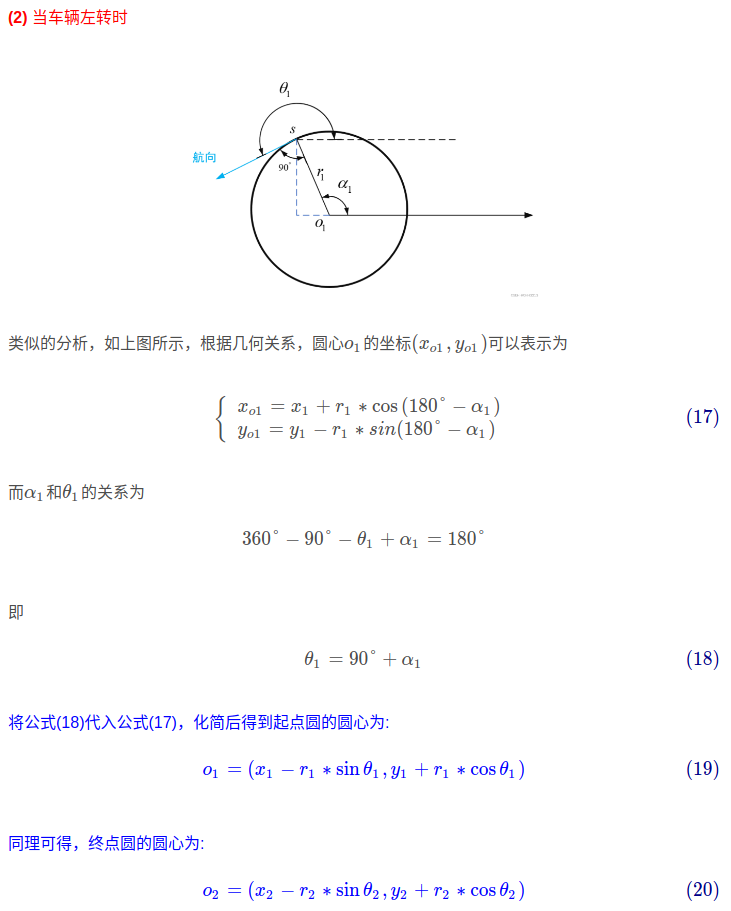

## 计算行驶轨迹

### CSC类型曲线轨迹求解流程

1. 计算起点圆和终点圆的圆心
2. 计算两个圆的切点
3. 计算出切点后，车辆便可以沿着最小转弯半径构成的圆周行驶到第一个圆的切点，然后直行到第二个圆的切点，再沿着最小转弯半径构成的圆周行驶到目的地

CSC轨迹分为三段，start--t1圆周弧;t1--t2圆周弧;t2--end圆周弧

### CCC类型轨迹推导

假设起点圆，终点圆圆心已知，三个圆半径已知

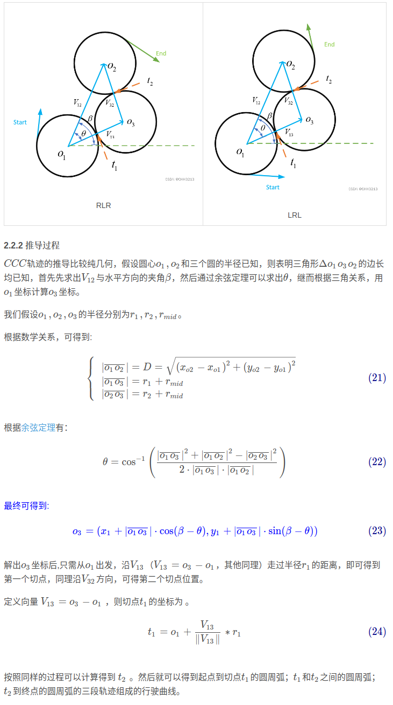

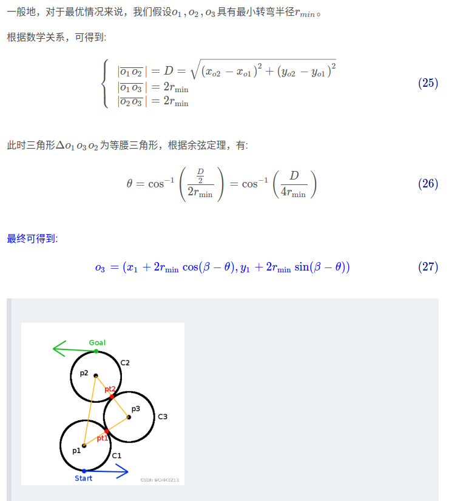

## 总结

1. Dubins曲线是开环的，考虑到实际车辆行驶中的不确定性， Dubins还存在动态性的问题
2. Dubins曲线能够用于RRT等路径规划算法中，在原始RRT中，树枝的生长是直线生长(找到最近点，建立直线连接)，对于汽车来说，不可能一直都能实现沿直线树枝行驶，因此在新节点和整棵随机树的关联上，可以选择使用Dubins曲线，使得各节点之间有一个连续、光滑、满足车辆运动学的连接
3. Dubins曲线是不对称的，从A点到B点的最短距离，并不一定等于B点到A点的最短距离。相对的，Reeds Shepp曲线是对称的

ref

- [路径规划—— Dubins 曲线推导(基于向量的方法)](https://blog.csdn.net/weixin_42301220/article/details/125328823)
- [车辆运动学模型](https://blog.csdn.net/weixin_42301220/article/details/124747072)
