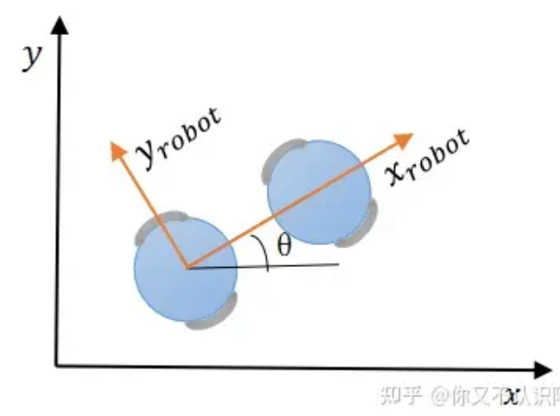

## Dynamic Window Approaches　动态窗口算法

dwa 其原理主要是在速度空间（v,w）中采样多组速度，并模拟出这些速度在一定时间内的运动轨迹，并通过评价函数对这些轨迹进行评价，选取最优轨迹对应的（v,w）驱动机器人运动

优点：

- 计算复杂度低：考虑到速度和加速度的限制，只有安全的轨迹会被考虑，且每次采样的时间较短，因此轨迹空间较小
- 可以实现避障：可以实时避障，但是避障效果一般
- 适用于两轮差分和全向移动模型
缺点：

- 前瞻性不足：只模拟并评价了下一步，如在机器人前段遇见“C”字形障碍时，不能很好的避障
- 动态避障效果差： 模拟运动轨迹断，动态避障效果差
- 非全局最优路径： 每次都选择下一步的最佳路径，而非全局最优路径
- 不适用于阿克曼模型

## 机器人运动模型

### 两轮移动机器人(v,w)

机器人只能向前运动或者旋转；需要注意的是，上图中有两个坐标系，一个是机器人的坐标系，另外一个是世界坐标系（也就是我们的坐标轴），下式中v(t)指的是机器人坐标系中x方向的速度；$t+\Delta t$时刻与t时刻的位置,速度关系如下

$$

\begin{bmatrix}
    x(t+\Delta t)\\
    y(t+\Delta t)\\
    v(t+\Delta t)\\
    \theta(t+\Delta t)\\
    w(t+\Delta t)
\end{bmatrix} = 

\begin{bmatrix}
    x(t)+v(t)*cos(\theta(t))*\Delta t\\
    y(t)+v(t)*sin(\theta(t))*\Delta t\\
    v(t)+a(t)*\Delta t\\
    \theta(t)++w(t)*\Delta t\\
    w(t)+a(t)*\Delta t
\end{bmatrix}

$$

### 全向移动机器人(v_x,v_y)

ref

- [DWA算法总结](https://zhuanlan.zhihu.com/p/519958218)
- [机器人局部避障的动态窗口法(dynamic window approach)](https://heyijia.blog.csdn.net/article/details/44983551?spm=1001.2014.3001.5506)
