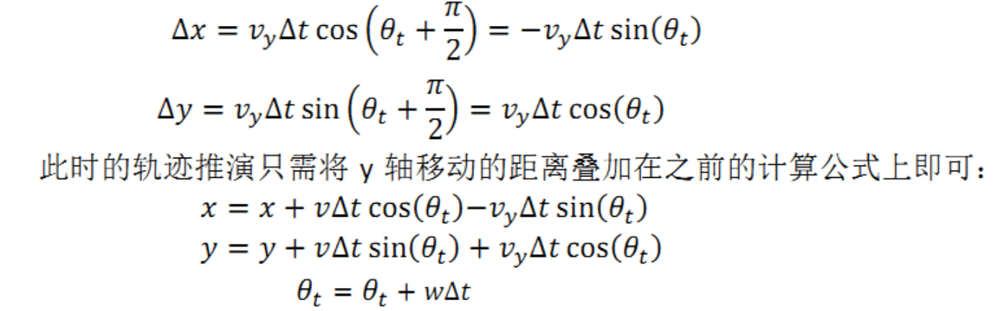
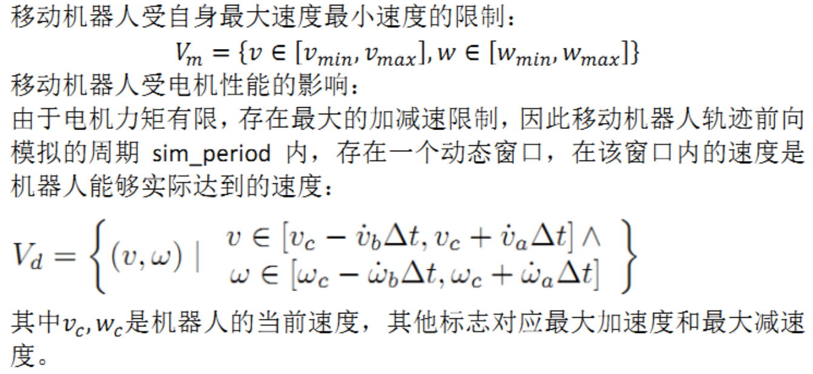
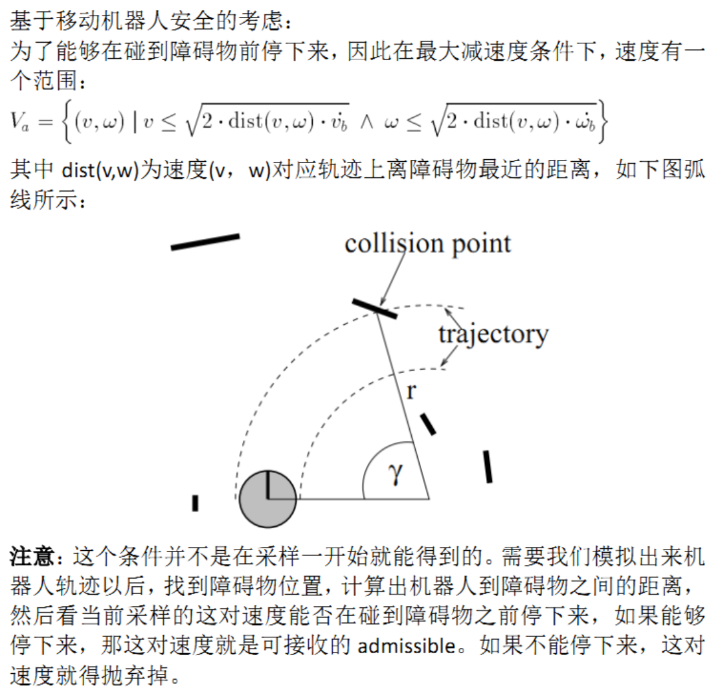
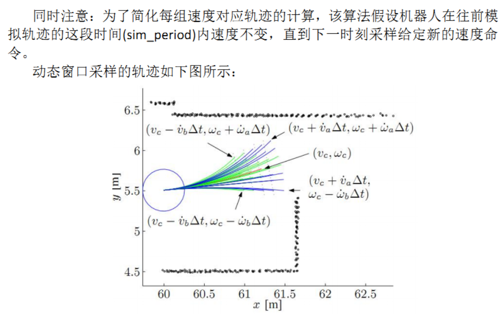
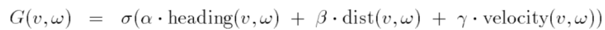
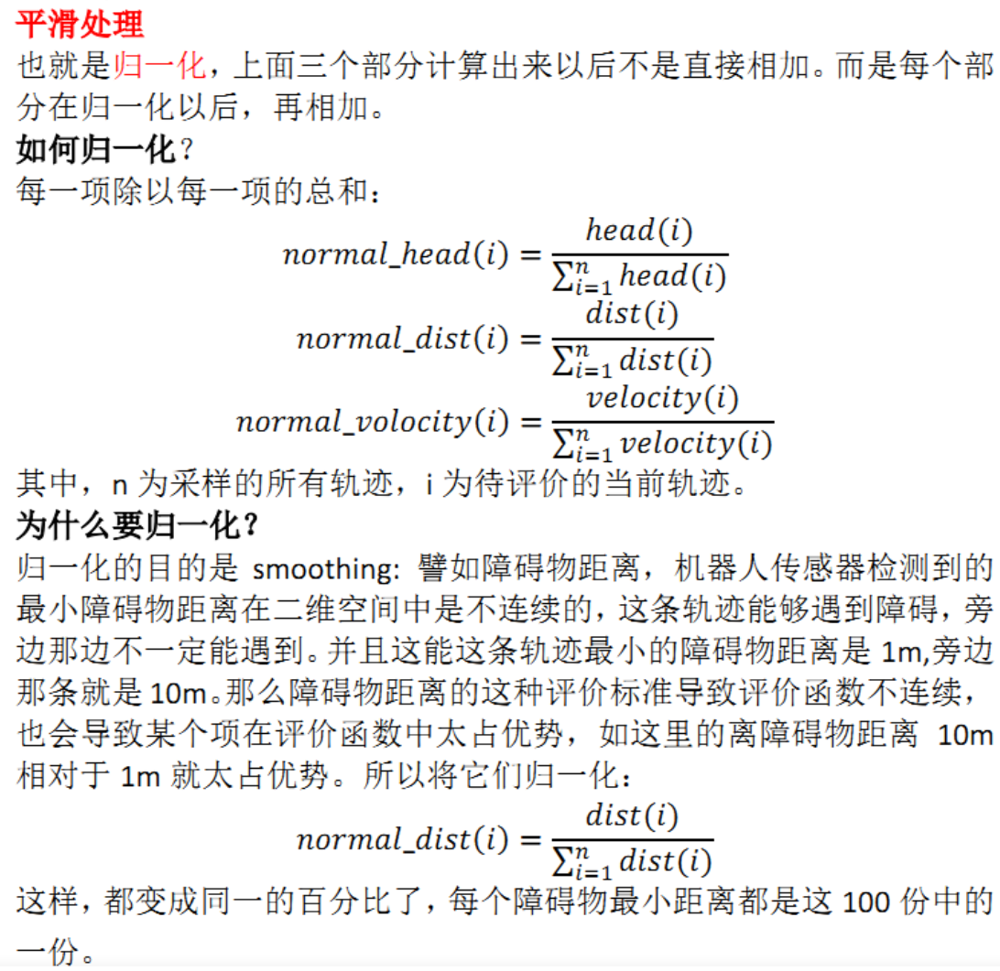

- [Dynamic Window Approaches　动态窗口算法](#dynamic-window-approaches动态窗口算法)
- [机器人运动模型](#机器人运动模型)
  - [两轮移动机器人(v,w)](#两轮移动机器人vw)
  - [全向移动机器人(v\_x,v\_y)](#全向移动机器人v_xv_y)
- [速度采样与速度空间](#速度采样与速度空间)
- [评价函数](#评价函数)


## Dynamic Window Approaches　动态窗口算法

dwa 其原理主要是在速度空间（v,w）中采样多组速度，并模拟出这些速度在一定时间内的运动轨迹，并通过评价函数对这些轨迹进行评价，选取最优轨迹对应的（v,w）驱动机器人运动

- 速度空间（v,w）：速度搜索空间，受到各种限制条件
- 评价函数可以根据自己的需求进行更改，原始论文和ROS中的评价函数不一样

优点：

- 计算复杂度低：考虑到速度和加速度的限制，只有安全的轨迹会被考虑，且每次采样的时间较短，因此轨迹空间较小
- 可以实现避障：可以实时避障，但是避障效果一般
- 适用于两轮差分和全向移动模型
缺点：

- 前瞻性不足：只模拟并评价了下一步，如在机器人前段遇见“C”字形障碍时，不能很好的避障
- 动态避障效果差： 模拟运动轨迹断，动态避障效果差
- 非全局最优路径： 每次都选择下一步的最佳路径，而非全局最优路径
- 不适用于阿克曼模型

## 机器人运动模型


### 两轮移动机器人(v,w)

机器人只能向前运动或者旋转；需要注意的是，上图中有两个坐标系，一个是机器人的坐标系，另外一个是世界坐标系（也就是我们的坐标轴），下式中v(t)指的是机器人坐标系中x方向的速度；$t+\Delta t$时刻与t时刻的位置,速度关系如下

$$

\begin{bmatrix}
    x(t+\Delta t)\\
    y(t+\Delta t)\\
    v(t+\Delta t)\\
    \theta(t+\Delta t)\\
    w(t+\Delta t)
\end{bmatrix} = 

\begin{bmatrix}
    x(t)+v(t)*cos(\theta(t))*\Delta t\\
    y(t)+v(t)*sin(\theta(t))*\Delta t\\
    v(t)+a(t)*\Delta t\\
    \theta(t)++w(t)*\Delta t\\
    w(t)+a(t)*\Delta t
\end{bmatrix}

$$

### 全向移动机器人(v_x,v_y)



$$

\begin{bmatrix}
    x(t+\Delta t)\\
    y(t+\Delta t)\\
    v_x(t+\Delta t)\\
    v_y(t+\Delta t)\\
    \theta(t+\Delta t)\\
    w(t+\Delta t)
\end{bmatrix} = 

\begin{bmatrix}
    x(t)+v_x(t)*cos(\theta(t))*\Delta t - v_y(t)*sin(\theta(t))*\Delta t\\
    y(t)+v_x(t)*sin(\theta(t))*\Delta t + v_y(t)*cos(\theta(t))*\Delta t\\
    v_x(t)+a_x(t)*\Delta t\\
    v_y(t)+a_y(t)*\Delta t\\
    \theta(t)++w(t)*\Delta t\\
    w(t)+a(t)*\Delta t
\end{bmatrix}

$$

ROS base_local_planner的轨迹采样也在使用上述公式 in simple_trajectory_generator.cpp

上述运动模型缺陷：相邻时间段内机器人轨迹并不是直线，而是圆弧

## 速度采样与速度空间

接下来，进行速度采样，进行多组速度采样，推算轨迹，然后评价这些轨迹好不好。速度采样是DWA的第二个点，在(v,w)速度空间中，存在无数组速度，但根据机器人本身的限制和环境限制，可以将采样范围控制在一定范围

机器人电机和本身速度限制





根据以上条件伪代码如下

```txt
首先在V_m∩V_d的范围内采样速度：
allowable_v = generateWindow(robotV, robotModel)
allowable_w  = generateWindow(robotW, robotModel)
然后根据能否及时刹车剔除不安全的速度：
    for each v in allowable_v
       for each w in allowable_w
       dist = find_dist(v,w,laserscan,robotModel)
       breakDist = calculateBreakingDistance(v)//刹车距离
       if (dist > breakDist)  //如果能够及时刹车，该对速度可接收
	如果这组速度可接受，接下来利用评价函数对其评价，找到最优的速度组
```



## 评价函数

在采样的速度组中筛选出若干轨迹，采用评价函数的方式为每条轨迹评价



- heading(v,w)为方位角评价函数：评价机器人在当前的设定的速度下，轨迹末端朝向与目标点之间的角度差距;
- dist(v,w) 主要的意义为机器人处于预测轨迹末端点位置时与地图上最近障碍物的距离，对于靠近障碍物的采样点进行惩罚，确保机器人的避障能力，降低机器人与障碍物发生碰撞的概率；
- velocity(v,w)为当前机器人的线速度，为了促进机器人快速到达目标；
- $\alpha$ $\beta$ $\gamma$ $\sigma$ 是权重



三者构成的评价函数物理意义是，在局部导航过程，使机器人避开障碍，朝着目标快速行驶

dwa demo如下

```
来源:http://adrianboeing.blogspot.com/2012/05/dynamic-window-algorithm-motion.html
BEGIN DWA(robotPose,robotGoal,robotModel)
   laserscan = readScanner()
   allowable_v = generateWindow(robotV, robotModel)
   allowable_w  = generateWindow(robotW, robotModel)
   for each v in allowable_v
      for each w in allowable_w
      dist = find_dist(v,w,laserscan,robotModel)
      breakDist = calculateBreakingDistance(v)
      if (dist > breakDist)  //can stop in time
         heading = hDiff(robotPose,goalPose, v,w) 
          //clearance与原论文稍不一样
         clearance = (dist-breakDist)/(dmax - breakDist) 
         cost = costFunction(heading,clearance, abs(desired_v - v))
         if (cost > optimal)
            best_v = v
            best_w = w
            optimal = cost
    set robot trajectory to best_v, best_w
END
```

ref

- [DWA算法总结](https://zhuanlan.zhihu.com/p/519958218)
- [机器人局部避障的动态窗口法(dynamic window approach)](https://heyijia.blog.csdn.net/article/details/44983551?spm=1001.2014.3001.5506)
