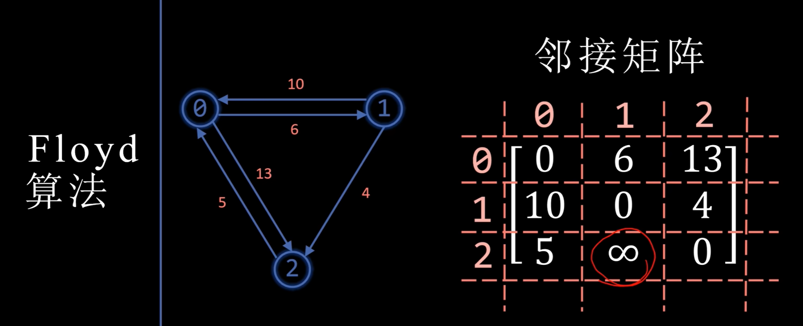
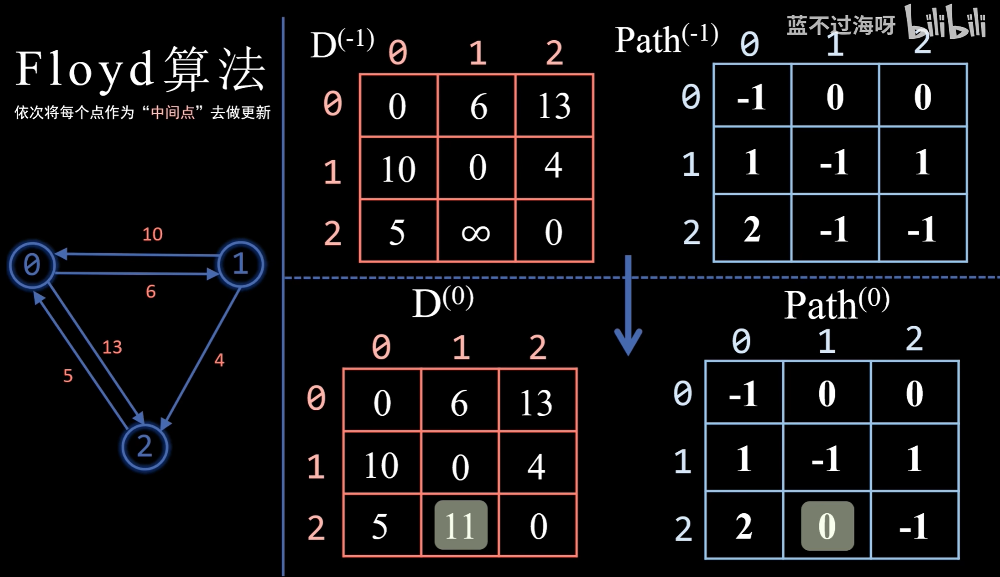
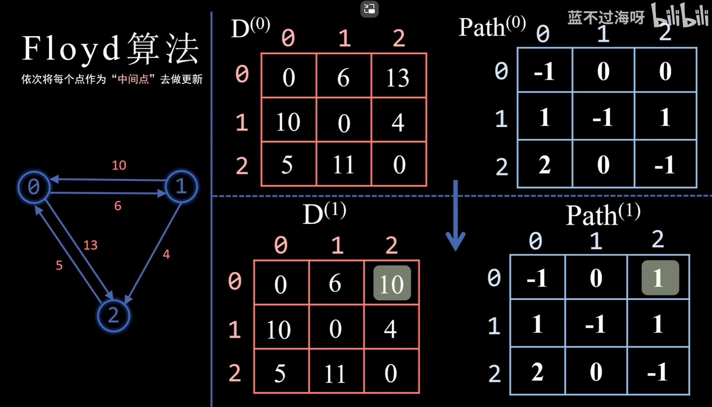
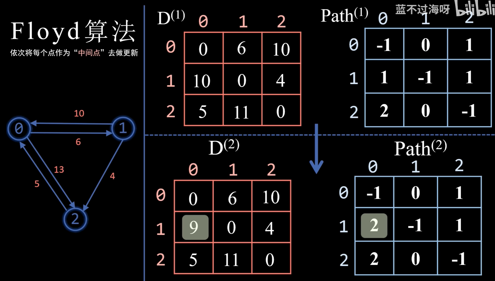
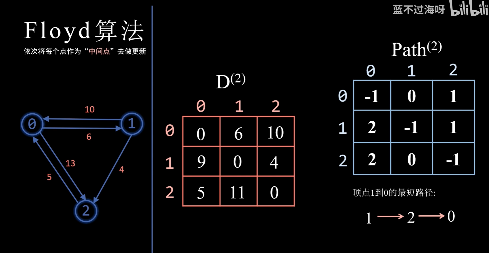

## floyd 弗洛伊德 最短路径算法

- dijkstra 求某一个点到其它点的最短路径
- floyd 求任意两点的最短路径

floyd 算法

- 使用邻接矩阵存图
- 假设有n个顶点，计算$D^{-1} path^{-1}$ 到 $D^{n}path^{n}$
 - 依次将每个点作为“中间点”去更新 

与dijkstra区别

- Dijkstra 算法：每次从「未求出最短路径」的点中 取出 最短路径的点，并通过这个点为「中转站」刷新剩下「未求出最短路径」的距离
- floyd 算法： 依次将每个点作为“中间点”去更新结果

建议观看视频帮助理解

参考

- [图-最短路径-Floyd(弗洛伊德)算法](https://www.bilibili.com/video/BV19k4y1Q7Gj/?spm_id_from=333.788&vd_source=4d02a316606ea19e315b11bab27432aa) 推荐，看完使我脑子旋转
- [Floyd算法详解 通俗易懂](https://zhuanlan.zhihu.com/p/339542626)
