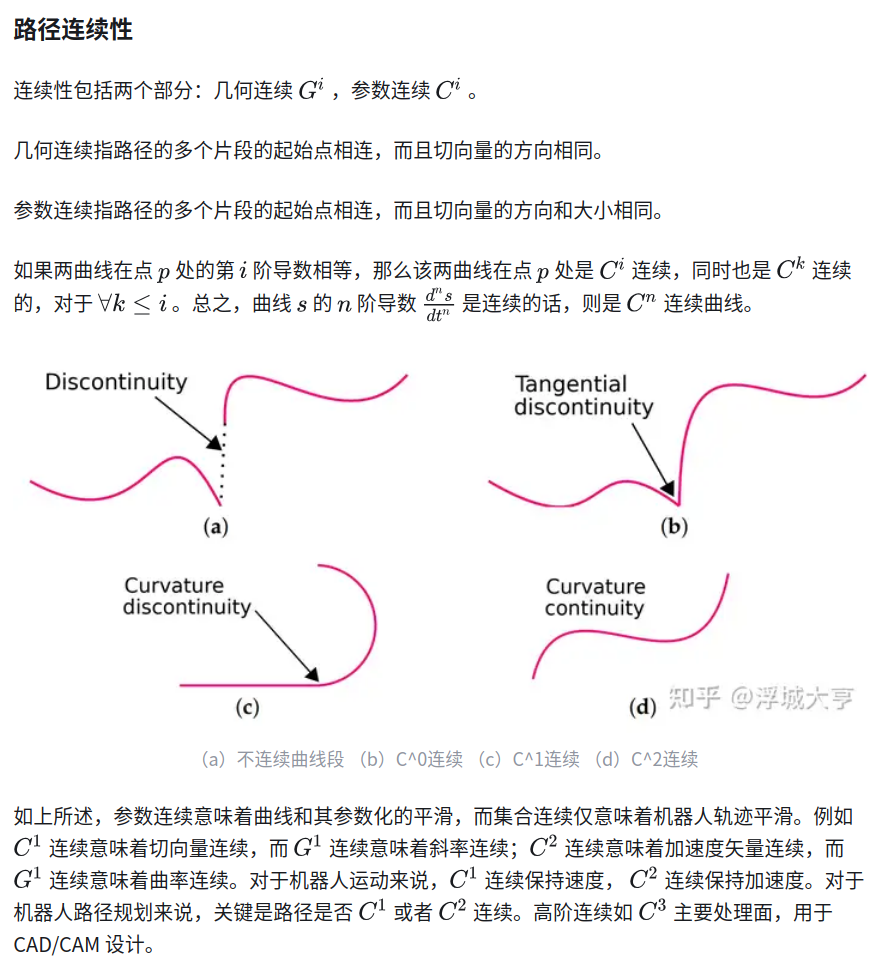

- [path plan](#path-plan)
  - [global path plan](#global-path-plan)
  - [local path plan](#local-path-plan)
  - [基于采样的路径规划](#基于采样的路径规划)
  - [基于曲线插值的局部路径规划](#基于曲线插值的局部路径规划)
    - [多项式曲线路径规划](#多项式曲线路径规划)
  - [路径规划与路径平滑](#路径规划与路径平滑)

## path plan

### global path plan

基于图搜索的路径规划算法，主要用于低维度空间的路径规划，需要对环境进行完整的建模．

- Dijkstra算法
- A*启发式算法

### local path plan

- DWA算法(Dynamic Window Approaches, DWA), DWA)动态窗口法，基于预测控制理论的局部路径规划算法

### 基于采样的路径规划

基于随机采样的路径规划算法又分为单查询算法(single-query path planning)以及渐近最优算法(asymptotically optimal path planning)，前者只要找到可行路径即可，侧重快速性，后者还会对找到的路径进行逐步优化，慢慢达到最优，侧重最优性

单查询方法：

- PRM (Probabilistic Road Map) 概率路图算法,由于采样过程是完全随机的，得到的节点大多数都偏离最终路径，会增加额外的计算量
  - 采样：在地图中随机撒点，剔除在障碍物上的点
  - 生成概率路图，根据点与点之间的距离和是否存在直线通路，将上述采样点进行连接
  - 尝试建立搜索路径：使用图搜索算法（如Dijkstra）在上述路图中搜索出一条从起点到终点的最短路径
  - 采样点的数量和采样点间存在通路的最大距离是路径规划成功与否的关键．采样点太少，可能会导致路径规划失败，采样点数量增加，搜索到的路径会逐渐接近最短路径，但同时搜索效率会降低;采样点间存在通路的最大距离太小，会导致规划失败;距离太大，会降低搜索效率
- RRT (Rapidly-exploring Random Tree) 快速拓展随机树算法,目标是尽可能快的找到一条从起点到终点的可行路径.它的搜索过程类似于一棵树不断生长、向四周扩散的过程，它以起点作为根节点构建一棵搜索树T
  - 全局A* 与局部RRT搭配使用
- RRT-Connect 在RRT的基础上引入了双树扩展环节，分别以起点和目标点为根节点生成两棵树进行双向扩展，当两棵树建立连接时可认为路径规划成功.相较于单树扩展的RRT算法，RRT-Connect加入了启发式步骤，加快了搜索速度，对于狭窄通道也具有较好的效果.但是RRT-Connect和RRT一样，都是单查询算法，最终路径并不是最优的

渐进最优化算法：

- RRT*算法 与RRT算法不同点在于，选择父节点时会有一个重连过程，RRT *在实际使用时可作为全局规划，配合DWA作为局部规划器

### 基于曲线插值的局部路径规划

- 曲线插值的方法是按照车辆在某些特定条件（安全、快速、高效）下， 进行路径的曲线拟合，常见的有多项式曲线、双圆弧段曲线、正弦函数曲线、贝塞尔曲线、 B样条曲线等
- 曲线插值法的核心思想就是基于预先构造的曲线类型，根据车辆期望达到的状态（比如要求车辆到达某点的速度和加速度为期望值），将此期望值作为边界条件代入曲线类型进行方程求解，获得曲线的相关系数
- 曲线所有的相关系数一旦确定，轨迹规划随之完成

#### 多项式曲线路径规划

以五次多项式曲线插值为例

### 路径规划与路径平滑

机器人通过栅格地图进行路径规划时，根据静态障碍物得到全局路径，如 Dijkstra's，A*，D-star，RRT等，规划出的路径都存在直线之间有急剧拐弯（曲率变化大）的问题,尽管通过将八邻域改为更多邻域，如前文所述，能略微改善曲率变化急剧的问题.这样的路径仍然不适于机器人运动模型，尤其是非全向机器人，如阿克曼底盘，所以需要一条符合机器人运动限制的路径.

路径连续性

路径平滑的方法

1. 多项式插值
2. bezier曲线插值
3. 三次样条插值
4. Ｂ样条插值
5. NURBS 曲线

特殊曲线

1. Dubin's 曲线
   1. 给定平面内两点和运动方向，Dubins 用圆弧和线段在给定曲率范围内找到连接各点的最短平滑路径
2. Clothoid 欧拉螺旋线,表示在复平面
3. Hypocycloid
4. Reeds-Shepp Curves，与Dubin相似(TODO:)

ref

- [路径规划 | 随机采样算法：PRM、RRT、RRT-Connect、RRT*](https://zhuanlan.zhihu.com/p/349074802)
- [局部路径规划算法——曲线插值法](https://blog.csdn.net/weixin_42301220/article/details/125153270)
- [路径平滑算法：机器人导航](https://zhuanlan.zhihu.com/p/364421182)
