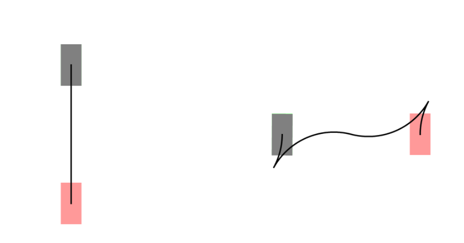

# Reed Shepp

该方法基于 Dubins 算法进行改进，将反向运动（汽车允许后退，挂倒挡）加入到规划中，这就使得在某些情况下可以得出比 Dubins 曲线更优的解。

ref

- [pyReedsShepp](https://github.com/ghliu/pyReedsShepp)
- [Reeds-Shepp和Dubins曲线简介](https://blog.csdn.net/robinvista/article/details/95137143)
