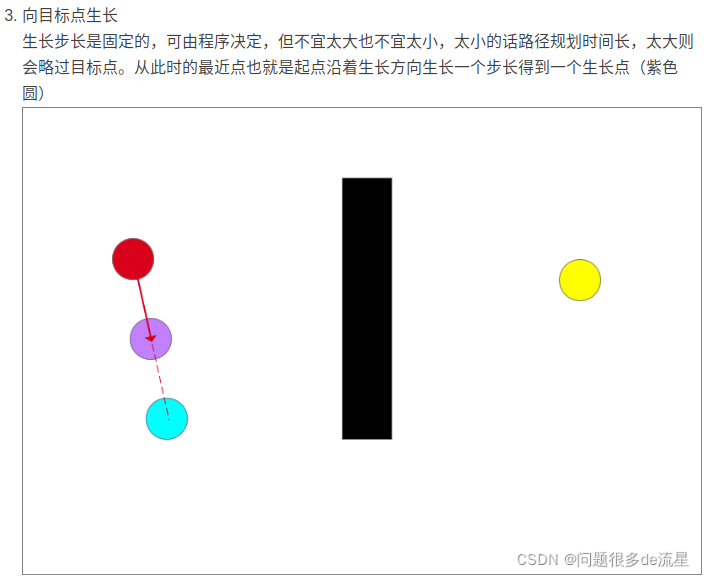
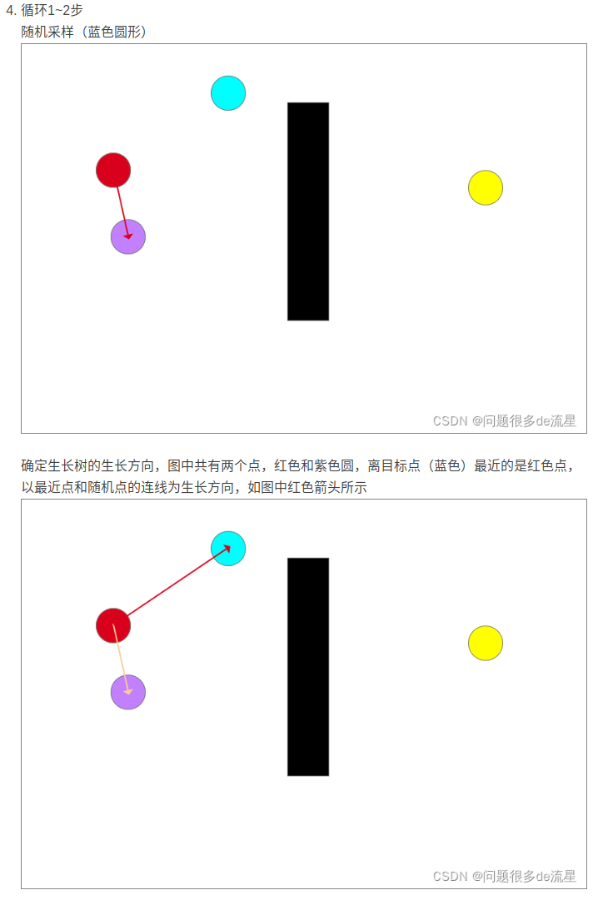
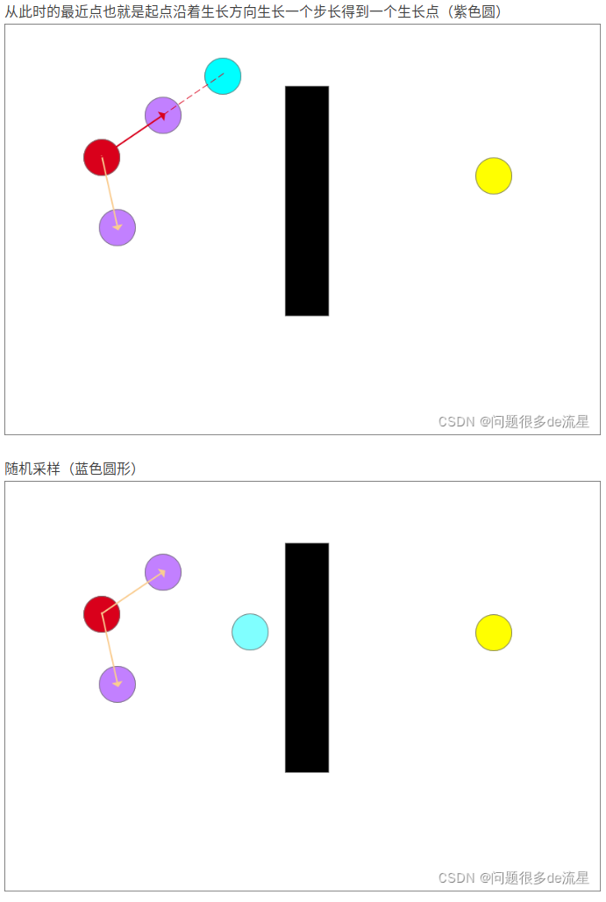
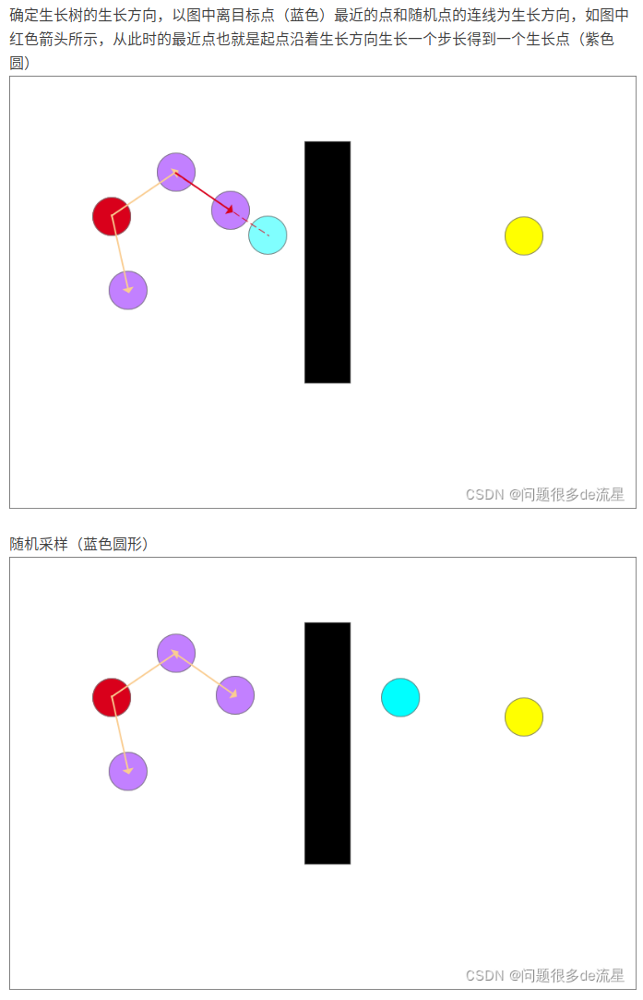
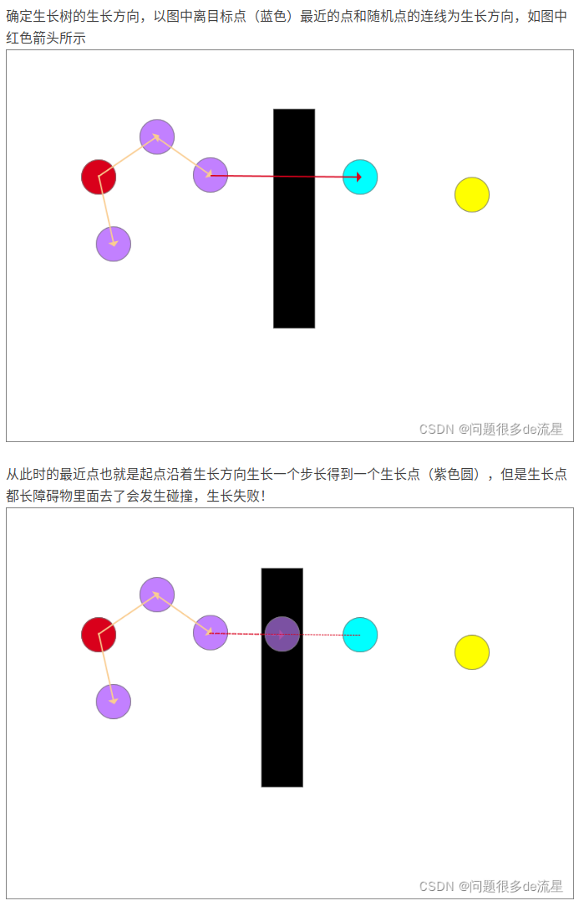
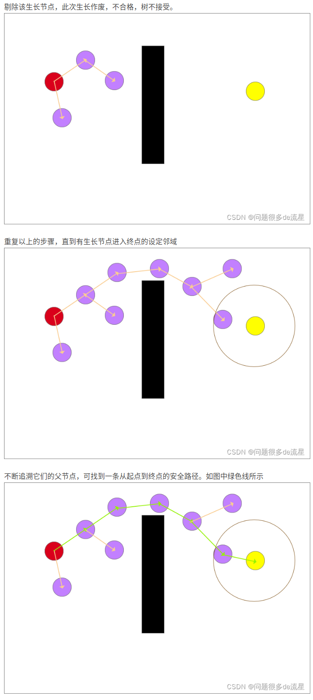
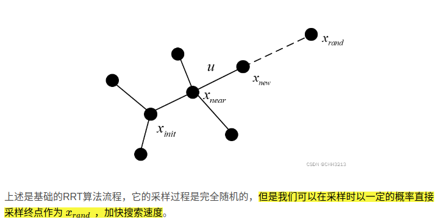
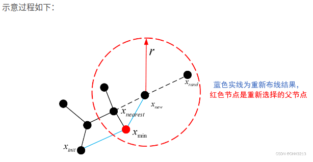
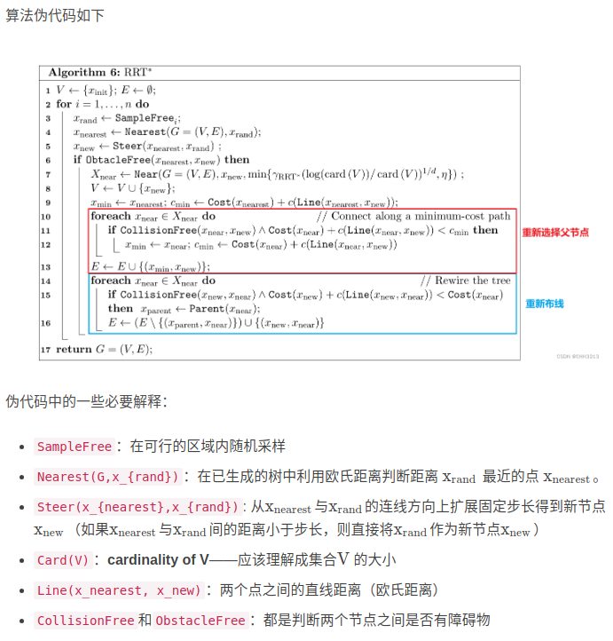

## RRT (rapidly-exploring random tree) 快速拓展随机树算法

一种单查询(single-query)算法，目标是尽可能快的找到一条从起点到终点的可行路径.

实际上就是维护一棵路径树：从起点开始，在空间中随机采样，并找到路径树上与采样点最接近且能与它无障碍地连接的点，连接这个点与采样点，将采样点加入路径树，直至终点附近区域被探索到。这种方式无法保证得到的路径是最优的。

### RRT 主要步骤

1. 算法通常将起点作为根节点$x_{init}$, 加入到随机树的节点集合中
2. 从可行区域内随机选取一个节点$x_{rand}$, 并在已经生成的树中利用欧式距离判断，距离$x_{rand}$最近的点$x_{near}$
3. 从$x_{near}$与$x_{rand}$的连线方向拓展固定步长u,得到新节点$x_{new}$(如果$x_{near}$与$x_{rand}$之间的距离小于步长，则直接将$x_{rand}$作为新节点$x_{new}$)
4. **若$x_{new}$和$x_{near}$之间无障碍物，则将$x_{new}$加入随机树节点集合中，同时将$x_{near}$作为$x_{new}$的父节点，将($x_{near}$,$x_{new}$)加入随机树边集中**
5. 若这两个节点间有障碍物，则重新选择$x_{near}$进行拓展
6. 循环执行以上步骤，直到随机树的叶子节点包含目标节点，并从中找出一条各节点连接成的从起点至终点的无碰撞路径

RRT优点

1. 既能够用于机械臂的运动力学规划，也可用于机器人或无人机等进行路径规划
2. 在使用 RRT算法进行路径规划时，若能够获得全局环境并进行建模，可进行全局路径规划。若无法获得全局环境，如自动驾驶汽车路径规划问题，能够在动态规划中对局部地图进行规划以生成局部路径，也为无人机等高维空间的路径规划提供了可行方案

缺点

1. 在扩展节点时从无障碍区域内随机选择节点，会导致产生部分无用节点，节点利用率低，增加算法随机性的同时也降低了算法的收敛速度
2. 由于随机树扩展时会判断$x_{near}$ $x_{rand}$连线方向上有无障碍物，若有障碍物则会放弃在该方向上扩展节点。 因此当路径中包含障碍物之间形成的狭窄通道时，使用RRT算法规划路径有一定几率无法规划出最优路径

## RRT Connect 

- RRT-Connect算法在RRT的基础上引入了双树扩展环节，分别以起点和目标点为根节点同时扩展随机树从而实现对状态空间的快速搜索
- 当两棵树建立连接时可认为路径规划成功
- 通过一次采样得到一个采样点$q_{rand}$, 然后两颗搜索树同时项采样点方向进行拓展，加快建立连接的速度，相当于加入了启发式步骤．对狭窄通道也具有较好的效果
- **每次迭代中必须考虑两颗树的平衡性，即节点数的多找，或者考虑两颗树的路径长度，交换次序，选择＂小＂的那棵树进行拓展**

RRT Connect 特点

双向的RRT技术具有良好的搜索特性，比原始RRT算法的搜索速度、搜索效率有了显著提高

- Connect算法较之前的算法在扩展的步长上更长，使得树的生长更快
- 两棵树不断朝向对方交替扩展，而不是采用随机扩展的方式，特别当起始位姿和目标位姿处于约束区域时，两棵树可以通过朝向对方快速扩展而逃离各自的约束区域
- 这种带有启发性的扩展使得树的扩展更加贪婪和明确，使得双树RRT算法较之单树RRT算法更加有效

RRT-Connect和RRT一样，都是单查询算法，最终路径并不是最优的

## RRT*

RRT*是一种渐进优化算法，随着迭代次数增加，得出的路径是越来越优化的，因此要想得出相对满意的优化路径，需要一定的运算时间．

与RRT算法流程不同之处

- 首先是重新为$x_{new}$重新选择父节点
  - 不同于RRT中直接选择$x_{nearest}$作为$x_{new}$的父节点，我们需要重新为$x_{new}$选择父节点，使得$x_{new}$到起点的cost最小，cost的定义可以是路径的长度
  - 父节点的选择可以是该节点附近相连的所有点．，一般是在新产生的节点$x_{new}$附近(半径r)内寻找所有的邻近节点$x_{near}$,作为替换$x_{new}$原始父节点$x_{nearest}$的备选
  - 我们需要依次计算起点到每个邻近点$x_{near}$的路径代价，加上邻近节点$x_{near}$到$x_{new}$的路径代价，取路径代价最小的邻近节点$x_{min}$作为$x_{new}$新的父节点
- 其次，在重新选完父节点后，为该节点的所有近邻节点重新布线(rewire)，布线原则是使所有节点到起点的cost最小

ref

- [RRT与RRT*算法具体步骤与程序详解（python）](https://blog.csdn.net/weixin_42875283/article/details/124408158)
- [【自动驾驶】基于采样的路径规划算法——RRT-Connect（含python实现 | c++实现）](https://blog.csdn.net/weixin_42301220/article/details/125267028?spm=1001.2014.3001.5501)
