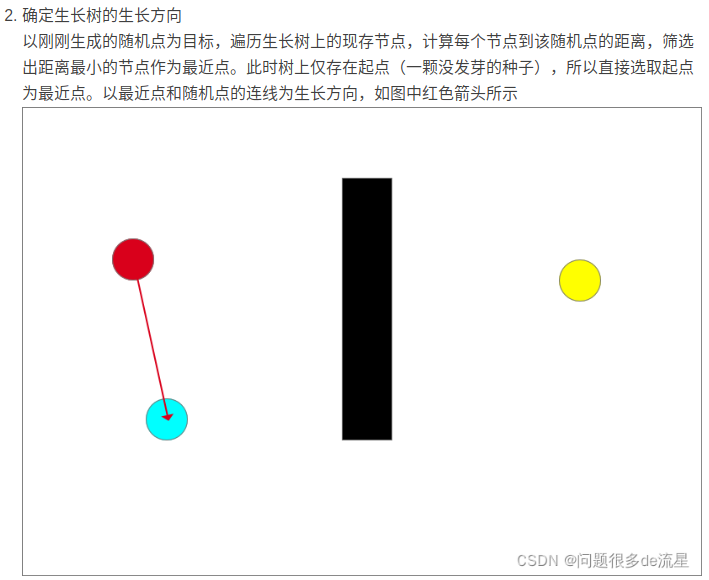

## RRT (rapidly-exploring random tree) 快速拓展随机树算法

一种单查询(single-query)算法，目标是尽可能快的找到一条从起点到终点的可行路径.

实际上就是维护一棵路径树：从起点开始，在空间中随机采样，并找到路径树上与采样点最接近且能与它无障碍地连接的点，连接这个点与采样点，将采样点加入路径树，直至终点附近区域被探索到。这种方式无法保证得到的路径是最优的。

### RRT 主要步骤

1. 算法通常将起点作为根节点$x_{init}$, 加入到随机树的节点集合中
2. 从可行区域内随机选取一个节点$x_{rand}$, 并在已经生成的树中利用欧式距离判断，距离$x_{rand}$最近的点$x_{near}$
3. 从$x_{near}$与$x_{rand}$的连线方向拓展固定步长u,得到新节点$x_{new}$(如果$x_{near}$与$x_{rand}$之间的距离小于步长，则直接将$x_{rand}$作为新节点$x_{new}$)
4. 若$x_{new}$和$x_{near}$之间无障碍物，则将$x_{new}$加入随机树节点集合中，同时将$x_{near}$作为$x_{new}$的父节点，将($x_{near}$,$x_{new}$)加入随机树边集中
5. 若这两个节点间有障碍物，则重新选择$x_{near}$进行拓展
6. 循环执行以上步骤，直到随机树的叶子节点包含目标节点，并从中找出一条各节点连接成的从起点至终点的无碰撞路径

RRT优点

1. 既能够用于机械臂的运动力学规划，也可用于机器人或无人机等进行路径规划
2. 在使用 RRT算法进行路径规划时，若能够获得全局环境并进行建模，可进行全局路径规划。若无法获得全局环境，如自动驾驶汽车路径规划问题，能够在动态规划中对局部地图进行规划以生成局部路径，也为无人机等高维空间的路径规划提供了可行方案

缺点

1. 在扩展节点时从无障碍区域内随机选择节点，会导致产生部分无用节点，节点利用率低，增加算法随机性的同时也降低了算法的收敛速度
2. 由于随机树扩展时会判断$x_{near}$ $x_{rand}$连线方向上有无障碍物，若有障碍物则会放弃在该方向上扩展节点。 因此当路径中包含障碍物之间形成的狭窄通道时，使用RRT算法规划路径有一定几率无法规划出最优路径

ref

- [RRT与RRT*算法具体步骤与程序详解（python）](https://blog.csdn.net/weixin_42875283/article/details/124408158)
