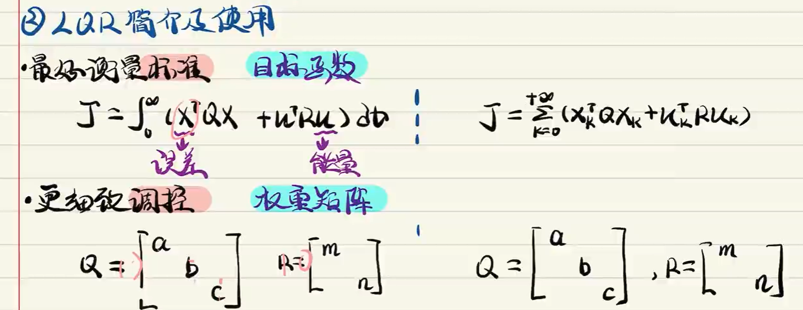

- [LQR Linear Quadratic Regulator](#lqr-linear-quadratic-regulator)
  - [连续系统](#连续系统)
  - [设计代价函数，寻找最优的k](#设计代价函数寻找最优的k)
  - [MATLAB LQR 问题实践](#matlab-lqr-问题实践)
  - [前向欧拉法将连续系统离散化](#前向欧拉法将连续系统离散化)
  - [小结](#小结)
- [基于LQR控制和汽车运动学模型的路径跟踪](#基于lqr控制和汽车运动学模型的路径跟踪)
  - [连续系统实践](#连续系统实践)
  - [离散系统实践](#离散系统实践)

## LQR Linear Quadratic Regulator

Linear Quadratic Regulator 线性二次型调节器

### 连续系统

对于一个系统$\dot{x}=Ax+Bu$, 有一个线性负反馈控制器$u=-kx$,带入

$$

\dot{x}=Ax-Bkx

\dot{x}=(A-Bk)x

$$

众所周知，让系统稳定的条件是闭环状态系数矩阵$(A-Bk)$的特征值$\lambda_i$处于负半平面（实部均为负数），它决定了系统的稳定性和表现。因此可以手动选择几个满足上述条件的特征值，然后反解出k,所以引出问题：该如何选择特征值，让k使系统稳定并满足期望的系统表现?

### 设计代价函数，寻找最优的k

定义代价函数

$$

J=\int_0^\infty (x^T Q x + u^T R u) dt

$$

x是误差，u是能量，Q和R是两个对角矩阵，分别决定了状态向量x和输入向量u每一维的权重，也称权重矩阵，J是个二次型Quadratic

- 权重矩阵中某个对角元素占整个对角元素和的百分比越大，则意味着希望对应状态向量或者输入向量某一维度收敛更快

> 我们希望的是在满足系统稳定的前提下，通过设计合适的k使得代价函数J最小

### MATLAB LQR 问题实践

**连续系统**

- 给定线性误差函数
- 手动设定权重矩阵
- 求解k
- u=-kx 计算控制量u

**离散系统**

- 给定离散化线性误差方程
- 设定权重矩阵Q R
- 求k
  - 求黎卡提方程
  - 令P矩阵等于权重矩阵Q，得到$P_{new}$, 将$P_{new}$带入回之前的P，这样反复迭代
  - 迭代停止条件: 当两次的P小于设定值时，计算k
  - 计算k
- 计算u

### 前向欧拉法将连续系统离散化

### 小结

1. LQR本质是线性负反馈，LQR通过设定标准（目标函数）求出最优的k,来表示最优控制

## 基于LQR控制和汽车运动学模型的路径跟踪

[x-x_r]: 车辆的x位置减去参考x位置，以此类推, 状态量是误差项，控制量是速度与角度的误差项

### 连续系统实践

该过程不需要知道具体的代价函数计算，注意此时计算的u是输入量与参考值的差值，需要转换回输入量。

### 离散系统实践

计算黎卡提方程，求解k,求解u,最后转换回控制量

ref

- [基于LQR控制与运动学模型的路径跟踪](https://www.bilibili.com/video/BV1XV411K7UP?spm_id_from=333.788.player.switch&vd_source=4d02a316606ea19e315b11bab27432aa)
