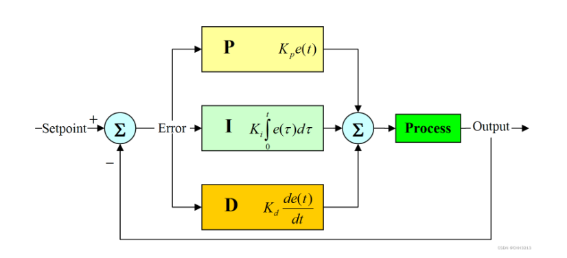
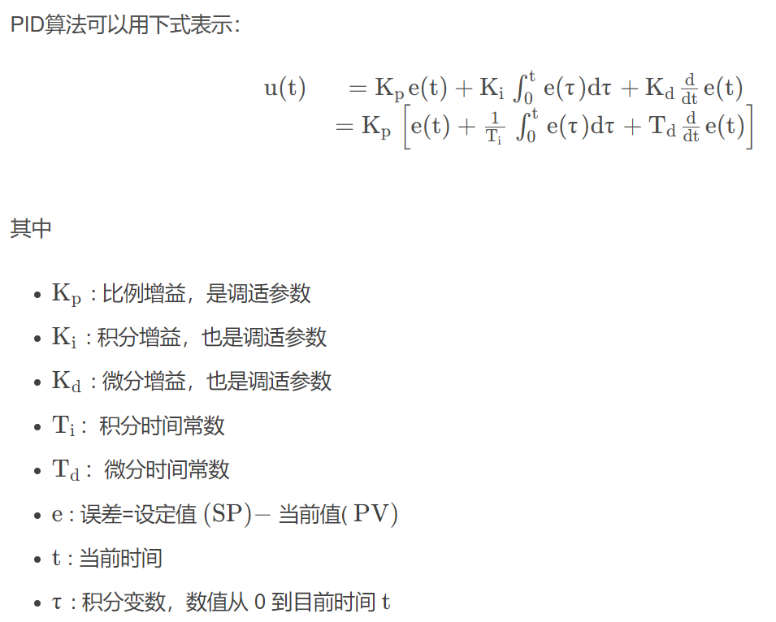
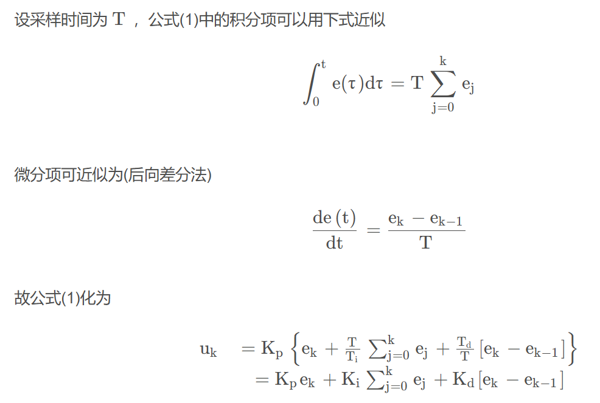
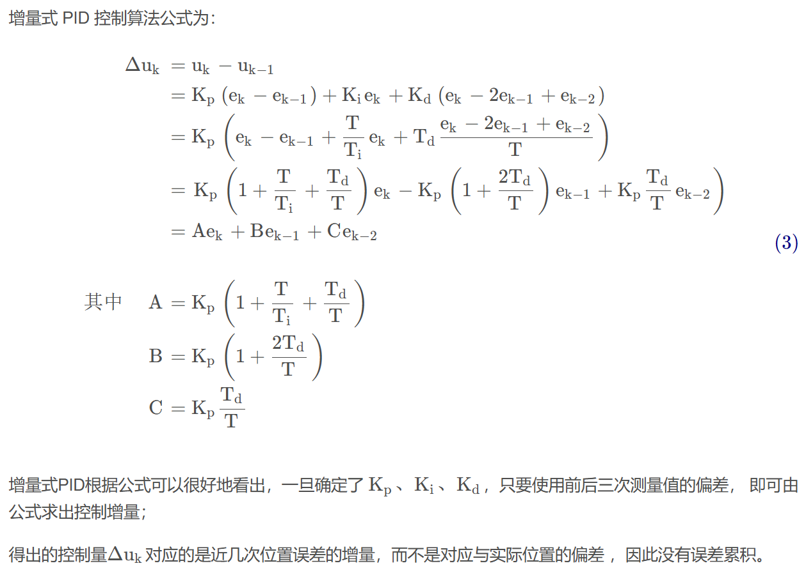

- [PID](#pid)
  - [PID不足](#pid不足)
  - [位置式PID](#位置式pid)
  - [增量式PID](#增量式pid)

## PID

PID( Proportional Integral Derivative) 比例-积分-微分控制器，由比例单元（Proportional）、积分单元（Integral）和微分单元（Derivative）组成。可以透过调整这三个单元的增益$K_p$ $K_i$ $K_d$ 调节系统响应.(之前调割草机的运动用的就是速度PID和位置PID)

当被控对象的结构和参数不能完全掌握，或得不到精确的数学模型时，控制理论的其它技术难以采用时，系统控制器的结构和参数必须依靠经验和现场调试来确定，这时应用PID控制技术最为方便。即当我们不完全了解一个系统和被控对象，或不能通过有效的测量手段来获得系统参数时，最适合用PID控制技术。

PID控制器的比例单元 ( P) 、积分单元(I)和微分单元(D)分别对应目前误差、过去累计误差及未来误差。若是不知道受控系统的特性，一般认为PID控制器是最适用的控制器.

- 增大比例环节将加快系统的响应，它的作用于输出值较快，但不能很好稳定在一个理想的数值，不良的结果是虽较能有效的克服扰动的影响，但有余差出现，过大的比例系数会使系统有比较大的超调，并产生振荡，使稳定性变坏。

- 积分环节能在比例的基础上消除余差，它能对稳定后有累积误差的系统进行误差修整，减小稳态误差。

- 微分环节具有超前作用，对于具有容量滞后的控制通道，引入微分参与控制，在微分项设置得当的情况下，对于提高系统的动态性能指标，有着显著效果，它可以使系统超调量减小，减小震荡，稳定性增加，动态误差减小。

（当时我记得调参顺序基本上是，先给一个比较大的P值，再调D，I值调的很少，调的挺折磨的）

### PID不足

1. 在实际工业生产过程往往具有非线性、时变不确定，难以建立精确的数学模型，常规的PID控制器不能达到理想的控制效果；
2. 在实际生产现场中，由于受到参数整定方法烦杂的困扰，常规PID控制器参数往往整定不良、效果欠佳，对运行工况的适应能力很差。

### 位置式PID

位置式PID是当前系统的实际位置，与你想要达到的预期位置的偏差，进行PID控制

当采样时间足够小时，能够获得最够精确的结果，离散控制过程与连续过程非常接近.位置式PID在积分项达到饱和时,误差仍然会在积分作用下继续累积，一旦误差开始反向变化，系统需要一定时间从饱和区退出，所以在$u(k)$达到最大和最小时，要停止积分，并且要有积分限幅和输出限幅

**一般采用抗积分饱和算法，其思路就是：如果上一次的输出控制量超过了饱和值，饱和值为正，则这一次只积分负的偏差，饱和值为负，则这一次只积分正的偏差，从而避免系统长期留在饱和区**

### 增量式PID

增量式 PID 是指数字控制器的输出只是控制量的增量$\Delta u_k$ 当执行机构需要的控制量是增量，而不是位置量的绝对数值时，可以使用增量式 PID 控制算法进行控制。

ref

- [PID实现轨迹跟踪](https://blog.csdn.net/weixin_42301220/article/details/124793474)
