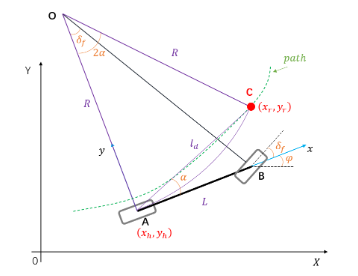

- [pure pursuit](#pure-pursuit)
  - [主要思路](#主要思路)
  - [适用场景](#适用场景)
  - [优化方法](#优化方法)
- [总结](#总结)

## pure pursuit

车辆模型使用单车模型，参考人类驾驶习惯：人在开车的时候想要跟踪一条期望的轨迹，首先确定一个距离本车有一定距离的一个点，然后通过控制方向盘来控制车辆到达那个点，然后再使用同样的方式到达下一个点，当所有的点都跟踪上之后，也就完成了轨迹跟踪。

pure pursuit 纯追踪算法的实现和这个比较类似

### 主要思路

- 使用车辆后轮为中心的单车模型，再参考路径path上向$l_d$的距离匹配一个预瞄点C，并假设车辆后轮中心A可以按照一定转弯半径R行驶抵达该预瞄点
- 然后根据预瞄距离$l_d$, 转弯半径$R$, 车辆坐标系下预瞄点的朝向角$\alpha$之间的关系来确定前轮转角$\delta_f$

**算法优点**

- 对外界鲁棒性较好

**算法缺点**

- 预瞄点位置靠前于车辆位置，其横向误差为零不能保证车辆位置横向误差为零
- 纯跟踪算法可以看做是，以车辆后轴中心相对于预瞄点的横向位置误差比例控制器，而比例控制器决定了控制品质上限不高；
- 纯跟踪算法可以缩小车辆与期望轨迹的位置偏差，但是对角度偏差束手无策，因为数学原理上根本就没有考虑角度偏差；
- 要求轨迹多帧连续性好，因预瞄的特性无法对变化轨迹（尤其是预瞄距离内）进行响应；
- 要求轨迹性能稳定，因为标定系数是按照轨迹性能进行标定的，如果轨迹性能变化，可能导致车辆转弯内切等现象；

### 适用场景

低速场景，速度过高容易产生转弯内切以及超调

### 优化方法

关于预瞄距离$l_d$

可以参考autoware的纯跟踪算法

## 总结

纯跟踪算法是假设车辆做定圆运动，其本质是P控制，这也就意味着算法的上限不会很高，智能通过方法去优化

ref: [纯跟踪算法（Pure Pursuit）](https://blog.csdn.net/WaiNgai1999/article/details/132062188)
