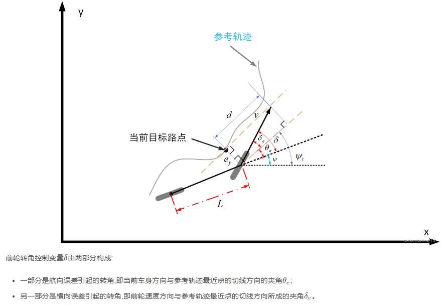
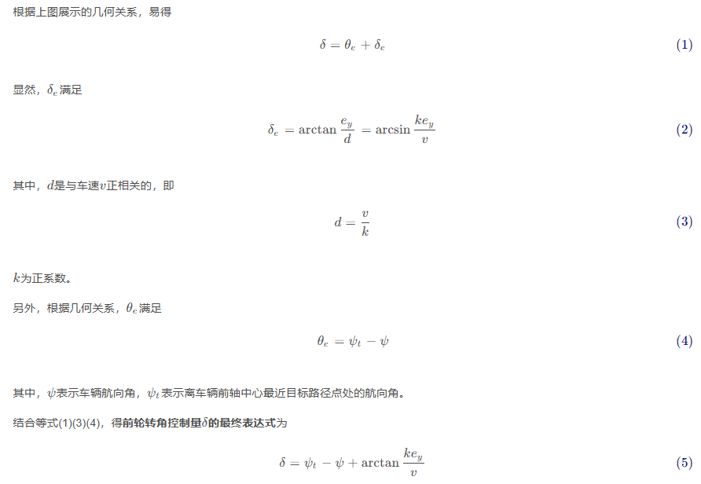
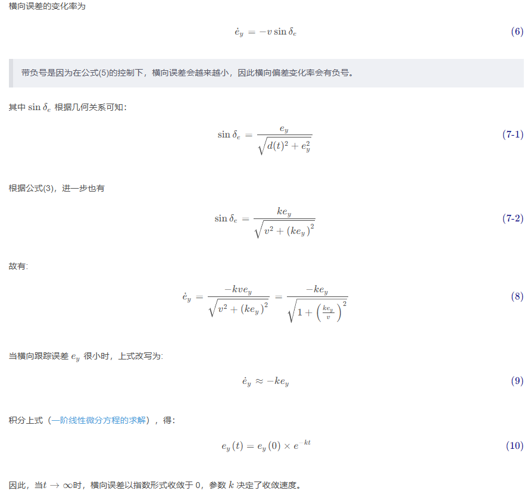
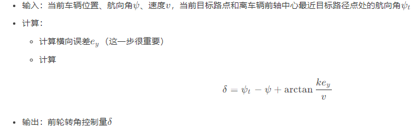

- [Stanley 前轮反馈控制(Front wheel feedback)](#stanley-前轮反馈控制front-wheel-feedback)
  - [与pure pursuit比较](#与pure-pursuit比较)

## Stanley 前轮反馈控制(Front wheel feedback)

是一种基于横向跟踪误差（**前轴中心到最近路径点的距离**，注意，这里横向跟踪误差的定义与前文pure pursuit和PID中的轨迹跟踪定义的不太一样，后两者是基于后轴中心定义的）的非线性反馈函数,并且能实现横向跟踪误差指数收敛于0。

算法原理推导

$y = e(x)$是一阶微分方程的通解

### 与pure pursuit比较

1. Pure pursuit 与 Stanley 两个方法都是基于对前轮转角进行控制来消除横向误差
2. Pure pursuit算法的关键在于预瞄点的选取
3. Stanley 算法的控制效果取决于控制增益, 它缺少Pure pursuit算法的规律性，需要花时间调试
4. 由于这两种算法实际都是基于运动学模型的纯几何跟踪方法,只适合中低速场景

参考 [stanley_control](https://blog.csdn.net/weixin_42301220/article/details/124899547)
