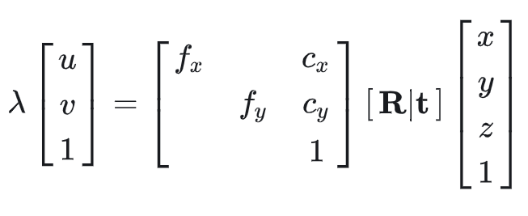
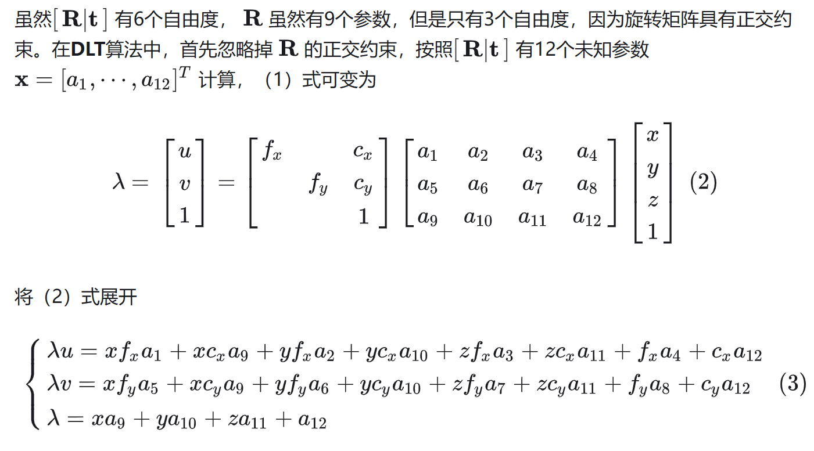
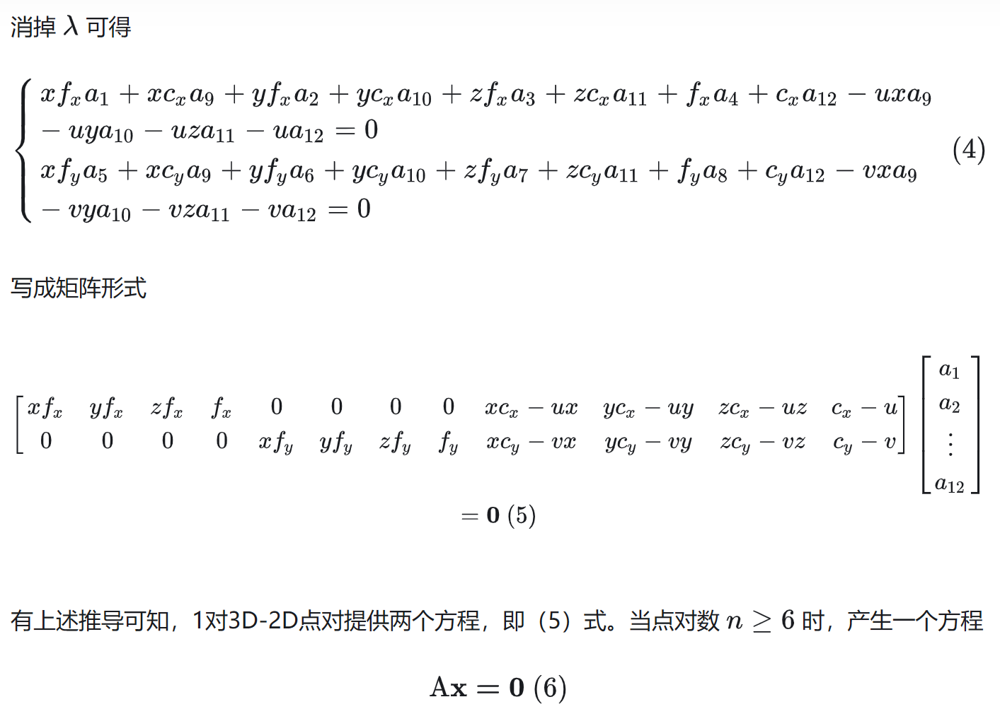

## DLT pnp

pnp(perspective n points)是求解3D到2D点对运动的方法。描述了当已知n个3D空间点以及其投影位置时，如何求解相机位姿。

- 在双目，RGBD视觉里程计中可以直接使用PNP估计相机运动
- 在单目视觉里程计中必须先进行初始化，才能使用PNP
- 3D-2D方法不需要使用对极约束

## DLT PNP

例子可以参考`algorithm/test/dlt_camera_calibration`,这里就复习下整体步骤以及怎么从投影矩阵分解出 K R T 矩阵
[参考](https://github.com/palash16/CV_Camera_Calibration)

1. 假定3D点[X,Y,Z]到像素坐标系[u,v]可以表示为

2. 求解AX=0方程：使用SVD分解直接取 V矩阵的最后一列作为方程的解，得到投影矩阵

3. 已知内参矩阵和旋转矩阵都是3*3，所以投影矩阵的第四列就是外参。那么还需要将投影矩阵3*3部分分解为K*R。这里使用QR分解
