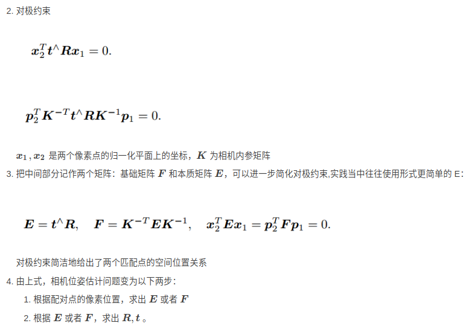

- [对极几何](#对极几何)
  - [对极约束](#对极约束)
    - [尺度不确定性](#尺度不确定性)
  - [8点法求解基础矩阵](#8点法求解基础矩阵)
    - [ransac 迭代求解最优基础矩阵](#ransac-迭代求解最优基础矩阵)
  - [计算本质矩阵](#计算本质矩阵)
  - [从E中进行运动恢复RT](#从e中进行运动恢复rt)
- [单应矩阵Homogeneous](#单应矩阵homogeneous)

## 对极几何

根据图像二维平面信息来估计单目相机帧间运动或双目相机相对位姿关系，在单目SLAM初始化的时候用到。




F基础矩阵的物理意义，表达了一对特征点（图像坐标系下的像素点对）对的映射关系。
- 像素点到另一幅图上极线的映射

### 对极约束

#### 尺度不确定性

**对极约束是等式为0的约束，所以E乘任意非零常数仍然满足，称为E在不同尺度下是等价的，也叫单目SLAM尺度不确定性。**
- 因此，我们通常把t进行归一化，让它的长度等于1。或者让场景中特征点的平均深度等于1
- 分解E的过程中，如果相机发生的是纯旋转，导致t为零，那么，得到的E也将为零。这个时候可以使用单应矩阵恢复运动

### 8点法求解基础矩阵

基础矩阵F是一个3×3的矩阵，总共有9个未知元素。
然而，上面的公式中使用的齐次坐标，齐次坐标在相差一个常数因子下是相等，F FF也就只有8个未知元素，也就是说，只需要8对匹配的点对就可以求解出两视图的基础矩阵F

8点法求解基础矩阵


求解上述方程的就可以解矩阵F的各个系数，这里选择用SVD算法求解，但是由于噪声、错误匹配点等因素影响，可能导致(7)公式求解得到的基础矩阵不稳定，所以基于此选择 ransac 算法对其进行改进得到最优的F矩阵。

#### ransac 迭代求解最优基础矩阵

RANSAC，它作为一种安全机制，保证了在有噪声的数据中可以提取到正确的模型，但是比较耗时

1. 从匹配的点对中选择8个点，使用归一化8点法估算出基础矩阵F
2. 计算其余点对到其对应极线的距离D，若D大于阈值d,则定义为内点，否则为外点，记录内点数量
3. 对内点采用最小二乘等方法重新计算新的基础矩阵F
4. 迭代k次或某次内点数量占比满足条件，则停止，选择此时的结果作为最优基础矩阵

- 这里面涉及到的一个问题就是如何评价一个点是不是内点，误差度量指标是什么。
- 在第一张影像中给定一个点，利用基础矩阵F可以算出其在第二张影像中的极线。
- 理论上来说第二张影像中的对应点应该在这条极线上，所以检查第二张影像中的对应点是否在极线或指定阈值范围(一般而言阈值取1到2个像素)内即可判断是否是内点。
- 当然按照“重投影误差”的思路也是可以的，
- 有了F和第一张影像中的像素坐标，解算第二张影像中的对应坐标，并计算它与提取的对应点之间的欧氏距离，小于阈值即认为是内点。

```python
#8点法
def compute_fundamental(x1, x2):
   n = x1.shape[1]
   if x2.shape[1] != n:
       raise ValueError("Number of points don't match.")
   A = np.zeros((n, 9))
   for i in range(n):
       A[i] = [x1[0, i] * x2[0, i], x1[0, i] * x2[1, i], x1[0, i] * x2[2, i],
               x1[1, i] * x2[0, i], x1[1, i] * x2[1, i], x1[1, i] * x2[2, i],
               x1[2, i] * x2[0, i], x1[2, i] * x2[1, i], x1[2, i] * x2[2, i]]
   U, S, V = np.linalg.svd(A)
   F = V[-1].reshape(3, 3)
   U, S, V = np.linalg.svd(F)
   S[2] = 0
   F = np.dot(U, np.dot(np.diag(S), V))

   return F / F[2, 2]
# 归一化
 def compute_fundamental_normalized(x1, x2):
    n = x1.shape[1]
    if x2.shape[1] != n:
        raise ValueError("Number of points don't match.")
    # normalize image coordinates
    x1 = x1 / x1[2]
    mean_1 = np.mean(x1[:2], axis=1)
    S1 = np.sqrt(2) / np.std(x1[:2])
    T1 = np.array([[S1, 0, -S1 * mean_1[0]], [0, S1, -S1 * mean_1[1]], [0, 0, 1]])
    x1 = np.dot(T1, x1)
    x2 = x2 / x2[2]
    mean_2 = np.mean(x2[:2], axis=1)
    S2 = np.sqrt(2) / np.std(x2[:2])
    T2 = np.array([[S2, 0, -S2 * mean_2[0]], [0, S2, -S2 * mean_2[1]], [0, 0, 1]])
    x2 = np.dot(T2, x2)
   
    # compute F with the normalized coordinates
    F = compute_fundamental(x1, x2)
    # print (F)
    # reverse normalization
    F = np.dot(T1.T, np.dot(F, T2))

    return F / F[2, 2]

```

### 计算本质矩阵

若已知相机内参，可以通过基础矩阵F求本质矩阵E


### 从E中进行运动恢复RT

这里的“运动”就是第二帧相机相对于第一帧相机的运动变化

- 本质矩阵在相差一个尺度因子的情况下恢复出摄像机投影矩阵的四个可能解，然后从四个解中选择一个正确解的方法
- 对E进行SVD分解


## 单应矩阵Homogeneous

平面的单应性即为一个平面到另一个平面的映射。这个平面可以是图像平面，也可以是三维世界中的平面(z=0)

1. 表述真实世界中一个平面与他对应图像的透视变换
2. 通过透视变换实现图像从一个视图变换到另一个视图的转换


- 两图像间的对极约束和场景的结构无关，可以理解对极约束对于任意场景结构的两幅图像都是成立的，约束是不能给出两幅图像上的像点的一一对应关系，但是可以给出点对应的必要条件，另一幅图像上对应的像点位于对应的对极线上。基础矩阵F描述的实际是一种点和直线的映射关系，而不是一种点对点的约束关系，并不能给出另一个点的确切位置。
- 平面间的单应矩阵，并不像对极约束完全不需要场景的结构信息，它对场景的结构有了要求，场景的点必须在同一个平面上，因此单应矩阵H也就能够对两图像上对应点的提供更多的约束，知道了某点在一幅图像的像点位置后，可以通过单应矩阵，求得其在另一幅图像中像点的确切位置。
- 单应矩阵的应用场景是相机只有旋转而无平移的时候，两视图的对极约束不成立，基础矩阵F为零矩阵，这时候需要使用单应矩阵H，场景中的点都在同一个平面上，可以使用单应矩阵计算像点的匹配点。 相机的平移距离相对于场景的深度较小的时候，也可以使用单应矩阵H。
