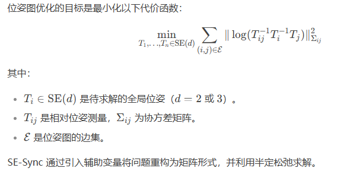
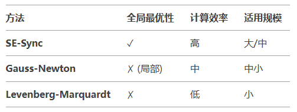

- [SE-Sync](#se-sync)
  - [核心思想](#核心思想)
  - [算法优势](#算法优势)
  - [数学形式](#数学形式)
  - [应用场景](#应用场景)
  - [对比传统方法](#对比传统方法)

因为目前网上 SE-Sync姿角较少，下面引用于deepseek

# SE-Sync

SE-Sync（Synchronization over Special Euclidean group）是一种用于位姿图优化（Pose Graph Optimization, PGO）的高效算法，专门解决机器人SLAM（同时定位与地图构建）、运动结构恢复（SfM）等领域中的全局姿态同步问题。它通过半定规划（SDP）和黎曼流形优化技术，显著提升了求解的全局收敛性和计算效率

## 核心思想

SE-Sync 将位姿图优化问题转化为特殊欧氏群（Special Euclidean Group, SE(d)）上的同步问题，即通过测量值（如相对位姿约束）恢复一组全局一致的绝对位姿。其创新点在于：

1. 凸松弛技术：将非凸的位姿图优化问题转化为半定规划（SDP）问题，避免局部极小值。
2. 黎曼优化：在流形上使用梯度下降或信任域方法，保证迭代过程的高效性和数值稳定性。
3. 全局最优性验证：通过凸对偶理论验证解是否全局最优。

## 算法优势

1. 全局收敛性：相比传统方法（如Gauss-Newton、Levenberg-Marquardt），SE-Sync 更可能找到全局最优解，避免陷入局部极小。
2. 高效性：利用矩阵分解和流形优化，计算复杂度低于直接求解SDP。
3. 鲁棒性：对噪声和 outlier 具有较强鲁棒性，尤其在闭环检测场景中表现优异。
4. 理论保证：在满足一定条件下（如测量噪声足够小），可证明收敛到全局最优。

## 数学形式

## 应用场景

- 机器人SLAM：大规模环境下的位姿优化（如GPS-denied场景下的无人机或自动驾驶车辆）。
- 多传感器融合：整合视觉、激光雷达、IMU等传感器的位姿估计
- 三维重建：从多视角图像中恢复相机姿态和场景结构

## 对比传统方法

SE-Sync 是近年来位姿图优化领域的重要进展，尤其适合对全局一致性要求严苛的应用场景
