- [reference](#reference)
- [位姿优化误差函数介绍](#位姿优化误差函数介绍)
- [误差函数对于位姿的雅可比矩阵](#误差函数对于位姿的雅可比矩阵)
- [Jacobian matrix](#jacobian-matrix)
  - [J0](#j0)
    - [直接法](#直接法)
    - [特征点法](#特征点法)
  - [J1](#j1)
  - [J2](#j2)
  - [J3](#j3)
- [总结](#总结)

## reference

- [视觉SLAM 十四讲——3D-2D:PnP求解——BA](https://www.cnblogs.com/bokeyuan-dlam/articles/15078888.html)
- [视觉SLAM位姿优化时误差函数雅克比矩阵的计算](https://blog.csdn.net/u011178262/article/details/85016981)
- [SLAM优化位姿时，误差函数的雅可比矩阵的推导。](https://blog.csdn.net/zhubaohua_bupt/article/details/74011005)
- [Bundle Adjustment 重投影误差模型及相应雅克比公式推导](https://zhuanlan.zhihu.com/p/482540286)

## 位姿优化误差函数介绍

在SLAM优化问题中，我们一般使用 李代数 ξ 来表示 旋转和平移。

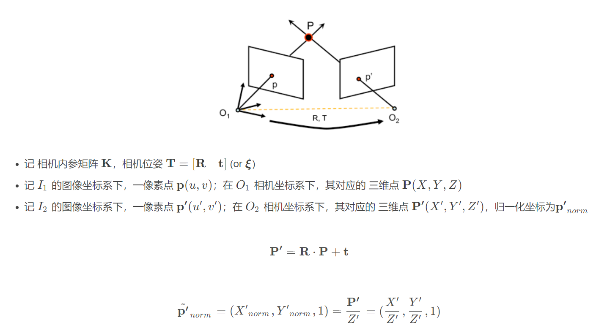

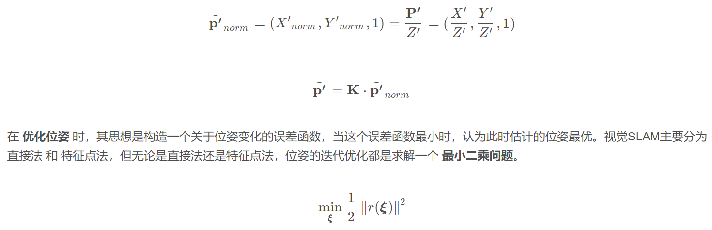

那么误差函数可以表示为：

- 直接法，最小化光度误差。

这里的误差函数是关于像素值的函数
灰度不变假设：同一个空间点的像素灰度，在各个图像中是固定不变的。

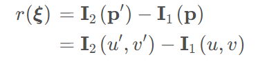

- 特征点法
最小化 重投影误差，即地图点到当前图像投影点与匹配点的坐标误差

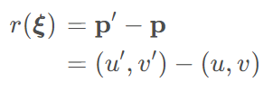

## 误差函数对于位姿的雅可比矩阵

误差函数对于位姿的 雅可比矩阵(Jacobian Matrix)，决定着下一步最优迭代估计时 位姿增量的方向

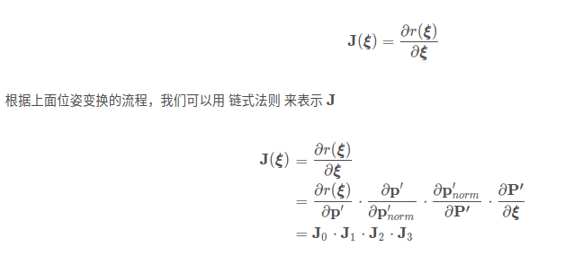

- J0: 误差函数对特征点的像素差值求导
- J1: 像素点对归一化相机坐标系点求导
- J2: 归一化相机坐标系点对RT变换后的世界坐标系下三维点求导
- J3: RT变换后的世界坐标系下三维点对李代数位姿求导

由此，直接法 与 特征点法 雅克比矩阵 只区别于 J0

## Jacobian matrix

### J0

#### 直接法

在直接法中，单像素点的误差函数是关于像素值的函数，即光度误差

$$
\gamma(\xi) = I_2(u^`, v^`) - I_1(u^`, v^`)
$$

对于一个特定的像素点, I1(p)是关于$\xi$的常量，所以上式里后一项为常数则

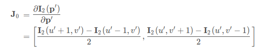

为 图像 I2在p点处的像素梯度

#### 特征点法

在直接法中，单像素点的误差函数是关于像素坐标的函数

$$
\gamma(\xi) = p^` - p
$$

对于一个特定的像素点，p是关于$\xi$的常量，所以

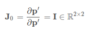

### J1

计算像素坐标(u,v)对归一化坐标(xnorm, ynorm,1)求导。K为相机内参

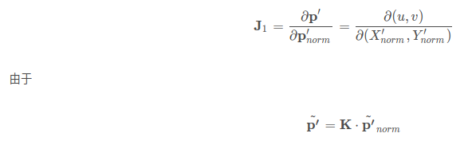

$$
J_1 = \begin{bmatrix}
   d(u)/d(x) & d(u)/d(y) \\
   d(v)/d(x) & d(v)/d(y) \\
  \end{bmatrix}
$$

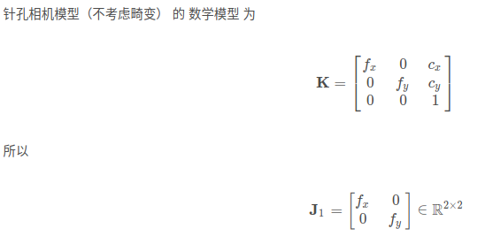

### J2

将归一化坐标对相机坐标系坐标求导

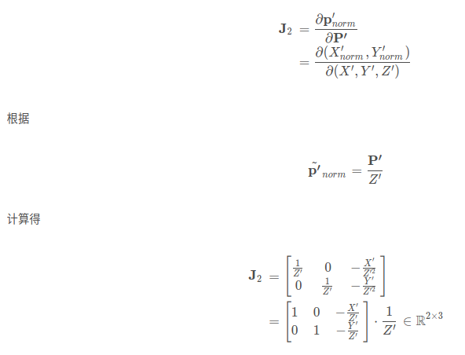

### J3

这里需要将RT等价于SE(3)李群,利用李群左乘或者右乘扰动模型，对SE(3)进行求导
- 通过指数映射将SE(3)变为se(3)
- 使用李代数加法对李代数求导，计算Jacobian

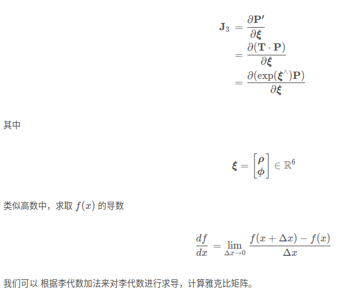

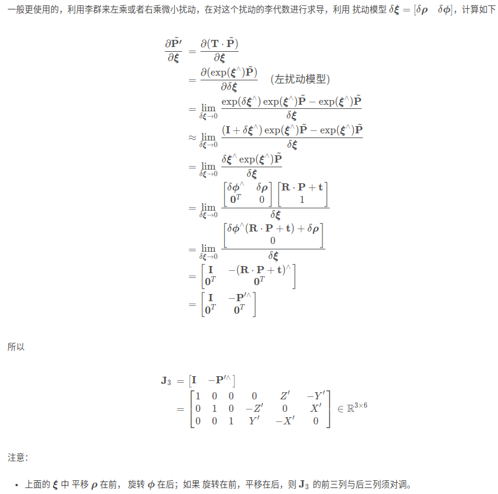

> 按照定义，左乘一个扰动，然后令扰动趋于零，求目标函数相对于扰动的变化率，作为导数来使用。同时，在优化过程中，用这种导数算出来的增量，以左乘形式更新在当前估计上，于是使估计值一直在SO(3)或SE(3)上。这种手段称为“流形上的优化”。

## 总结

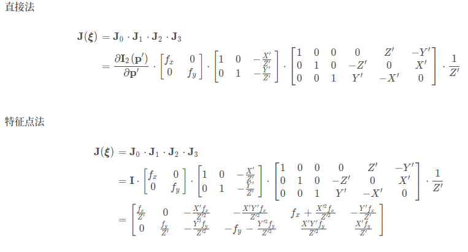

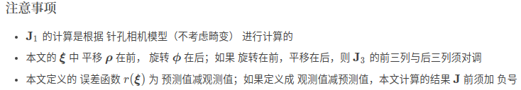
