- [reference](#reference)
- [李群李代数的引入](#李群李代数的引入)
- [李群 李代数](#李群-李代数)
- [李群](#李群)
  - [李代数的引出](#李代数的引出)
- [李代数](#李代数)
  - [李代数so(3)](#李代数so3)
  - [李代数se(3)](#李代数se3)
- [指数映射和对数映射](#指数映射和对数映射)
- [SO(3)上的指数映射](#so3上的指数映射)
- [SE(3)上的指数映射](#se3上的指数映射)
- [使用扰动模型求李群上的导数](#使用扰动模型求李群上的导数)

## reference

- [Lie-Group](https://normaluhr.github.io/2020/09/25/Lie-Group/)
- [视觉SLAM中的数学基础 第三篇 李群与李代数](https://www.cnblogs.com/gaoxiang12/p/5137454.html)
- [SLAM优化位姿时，误差函数的雅可比矩阵的推导](https://blog.csdn.net/zhubaohua_bupt/article/details/74011005)

## 李群李代数的引入

- 当我们估计出相机姿态[R,t]了以后，估计的结果和实际的相机姿态肯定会有一些不一致性，因而我们需要对估计出来的结果进行优化
- 优化方法一般都采用迭代优化的方法，每次迭代都更新一个位姿的增量Δ，使得目标函数最小
- 这个Δ就是通过误差函数对T或者R求微分得到的，也就是说我们需要对变换矩阵T以及旋转矩阵R求导

但是旋转矩阵并没有良好定义的加法，即R1和R2是都是旋转矩阵，但是R1+R2并不符合旋转矩阵的定义：
- RR^T^=I 且 det(R)=1 即行列式值为1的正交矩阵

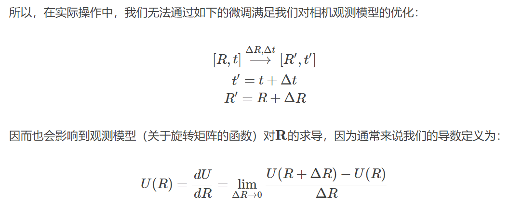

没有良好定义的加法——没有传统意义上的导数定义。 因此，**李群和李代数的作用就是间接对R进行求导**。

## 李群 李代数

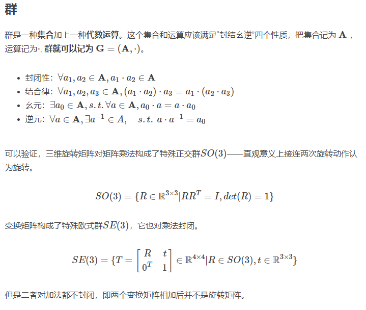

## 李群

李群（Lie group）是具有群结构的光滑微分流形，其群作用与微分结构相容从抽象上来说，李群就是具有光滑或连续性质的群。
- 对应到我们的问题上，由于三维机器人在空间中移动必然是连续地运动，不可能发生“瞬移”的情形，因而SO(3)和SE(3)都是李群。

### 李代数的引出

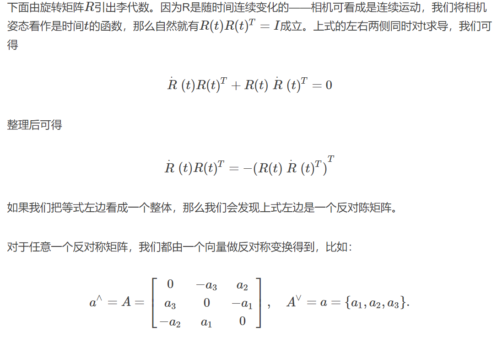

`^`符号: 表示向量转换为矩阵

`∨`符号: 表示矩阵转换为向量

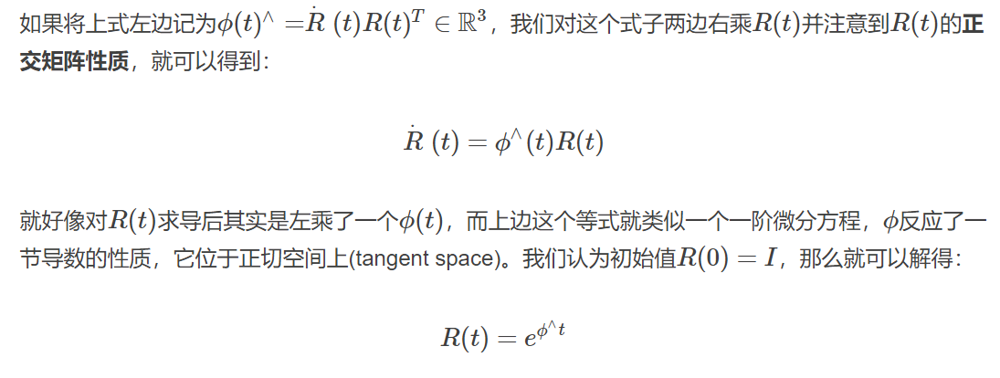

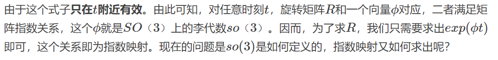

## 李代数

**每个李群都有与之对应的李代数**，李代数描述了李群的局部性质。在这个局部正切空间里，一些我们可以找到一些比较好的性质，比如良好定义的加法，从而我们有了良好定义的导数——将李群的导数转化为李代数上的导数，求出来后再转化回去，这就是我们处理李群导数相关内容的基本思路

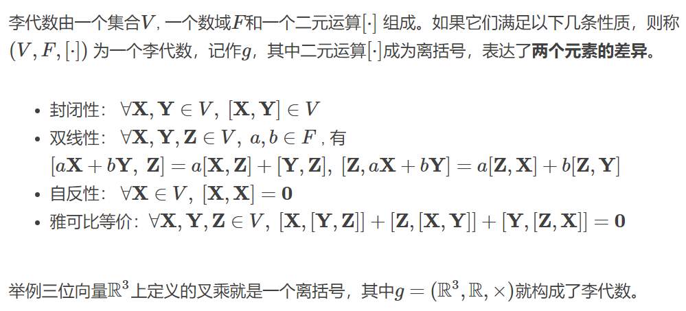

### 李代数so(3)

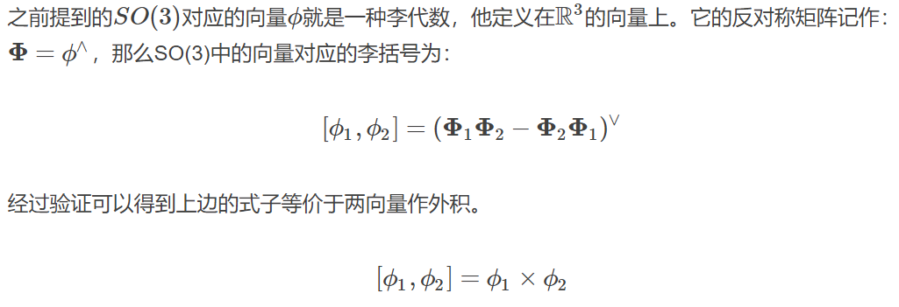

### 李代数se(3)

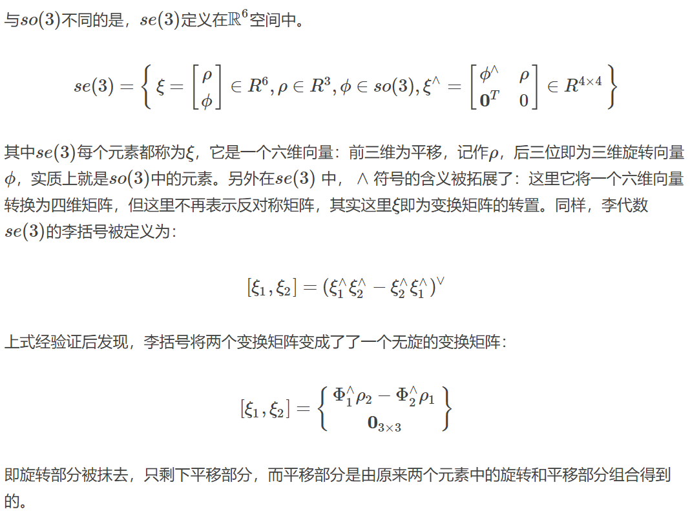

## 指数映射和对数映射

- 李群 ---> 李代数 对数映射
- 李代数 ---> 李群 指数映射

## SO(3)上的指数映射

- 李群 ---> 李代数 对数映射: 给定旋转矩阵，就可以求李代数

```cpp
Sophus::SO3 SO3_V(0, 0, M_PI / 2); // 从旋转向量构造李群
std::cout << "SO(3) from vector: " << SO3_V << std::endl;

// 使用对数映射获得它的李代数
Eigen::Vector3d so3 = SO3_R.log();
std::cout << "so3 = " << so3.transpose() << std::endl;
// hat 为向量到反对称矩阵
std::cout << "so3 hat=\n" << Sophus::SO3::hat(so3) << std::endl;
// 相对的，vee为反对称到向量
std::cout << "so3 hat vee= "
          << Sophus::SO3::vee(Sophus::SO3::hat(so3)).transpose()
          << std::endl;
```

- 李代数 ---> 李群 指数映射

so(3)实际上就是由所谓的旋转向量组成的空间。特别地，当转轴取一定顺序时so(3)还会变为对应的欧拉角。通过罗德里格斯公式或者指数映射，可以把一个向量对应到一个SO(3)中的3D旋转
**指数映射即是罗德里格斯公式。旋转向量可以视为旋转矩阵的导数，指导如何在旋转矩阵中进行微积分运算。**

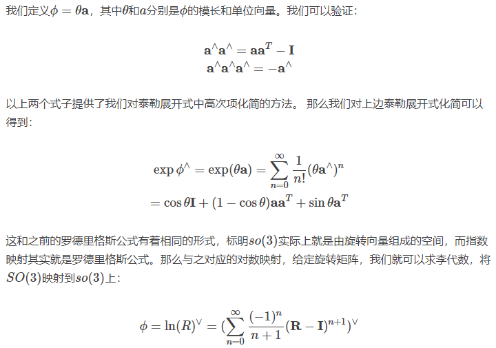

## SE(3)上的指数映射

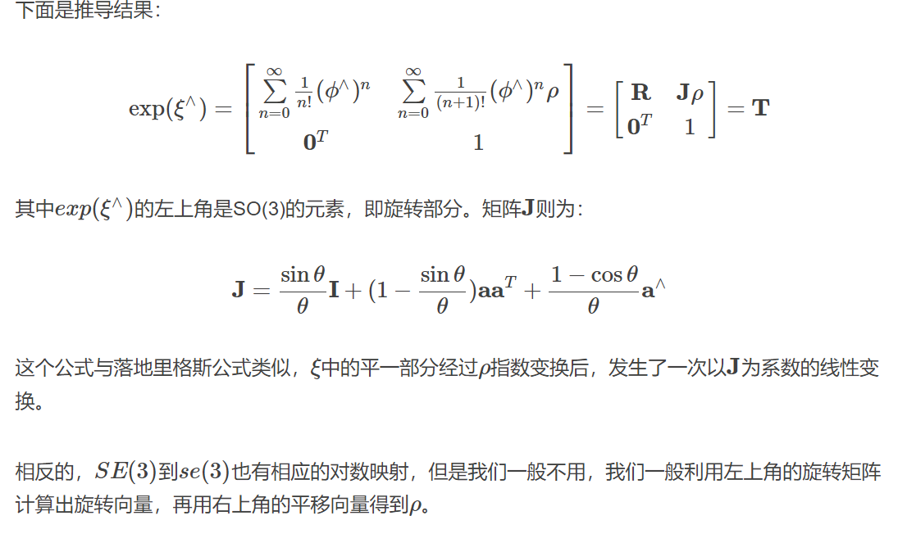

## 使用扰动模型求李群上的导数

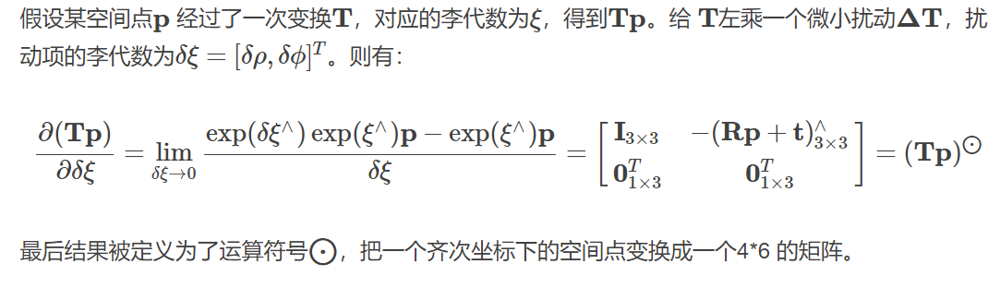
