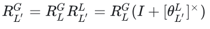
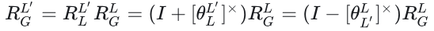

- [旋转的左扰动和右扰动](#旋转的左扰动和右扰动)
  - [小旋转的右扰动形式](#小旋转的右扰动形式)
  - [小旋转的左扰动形式](#小旋转的左扰动形式)
  - [小旋转定义在世界坐标系呢](#小旋转定义在世界坐标系呢)

# 旋转的左扰动和右扰动

定义Global坐标系为固定坐标系，如导航中常用的东北天坐标系；local坐标系为绑定在运动体上的坐标系，是随动的。

一般旋转误差状态的定义是在机体local坐标系上添加一个小的旋转$\theta_{L^{'}}^L$, 误差状态的旋转角比较小，可以保证比较好的线性而且避免奇异性,即$R_{L^{'}}^L=exp((\theta_{L^{'}}^L)^{x})$ (这里指数映射比较难写，就用这种形式代替了)

状态估计系统的状态和误差状态有不同的定义方式，他们通过不同的状态叠加方式保持自洽

## 小旋转的右扰动形式

1. 定义状态: 定义系统旋转状态为globally形式，那么$R_{L}^G$，即pose表达在Global坐标系(基于固定坐标系的旋转，左乘)
2. 定义误差状态: 选状的误差状态为$\theta_{L^{'}}^L$，这里是定义在local坐标系上的小扰动，可以记绕local自身的小旋转，那么就是右乘
3. 那么可以它这样的扰动模型记作右扰动模型
4. 状态的叠加方式: 根据旋转的链式法则,叠加了扰动的旋转为

扰动的叠加形式是右扰动形式，在gaussian newton 过程中: 

1. jacobian矩阵计算旋转矩阵求导使用的是右扰动形式
2. 状态量的更新量($\delta$)也是对应右乘，进行更新

## 小旋转的左扰动形式

1. 定义状态: 定义系统旋转状态为local形式，那么$R_{L}^G$，pose表达在local坐标系(绕自身坐标系旋转，右乘)
2. 定义误差状态: 选状的误差状态为$\theta_{L^{'}}^L$，这里是定义在local坐标系上的小扰动，换个角度此时local坐标系相当于固定坐标系，那么这个扰动可以看作是一种左乘
3. 可以把这样的扰动模型记作左扰动模型
4. 确认状态的叠加方式：根据旋转的链式法则，叠加了扰动的旋转为:

扰动的叠加形式是左扰动形式，在gaussian newton 过程中:

1. jacobian矩阵计算旋转矩阵求导使用的是左扰动形式
2. 状态量的更新量($\delta$)也是对应左乘，进行更新

## 小旋转定义在世界坐标系呢

物理上意义是认为body系没有误差，世界系在波动，以上的扰动叠加形式又会发生变化,可以发现，左右扰动由状态定义和误差状态定义形式确定，且和对应的扰动叠加形式实现自洽.扰动的叠加方式是手写后端雅可比时经常会出错的地方，这里的关键是梳理清楚系统的状态和误差状态的定义。

reference

- [旋转的左扰动和右扰动](https://zhuanlan.zhihu.com/p/108478399)
- [李群李代数](https://sjtu-robotics.com/blog/2024/hello-jacobian/)
